# MediaCMS 模块化项目介绍：后端架构、数据模型与业务流程

本文面向后端开发、架构评审和二次开发接手人员，重点说明 MediaCMS 的后端模块划分、数据库表结构、核心业务模型和主要业务流程。内容基于当前仓库代码整理，关键入口包括 `cms/settings.py`、`cms/urls.py`、`files/`、`users/`、`uploader/`、`rbac/`、`identity_providers/`、`saml_auth/`、`lti/` 和 `actions/`。

## 1. 项目定位

MediaCMS 是一个以媒体管理和播放为核心的开源 CMS。后端使用 Django、Django REST Framework、Celery、PostgreSQL、Redis，并通过 FFmpeg、Bento4、Whisper 等外部工具完成媒体分析、转码、HLS 生成、缩略图生成和自动字幕。

核心能力包括：

- 媒体上传、分类、标签、检索、播放、嵌入和管理。
- 视频转码、多分辨率编码、HLS 自适应播放、缩略图和精灵图生成。
- 用户、频道、播放列表、评论、评分、点赞、浏览、举报。
- 私有/公开/未列出发布状态，以及审核后才进入公开列表的工作流。
- 直接共享权限、RBAC 分类权限、SAML 身份源映射、LTI 1.3/LMS 集成。
- REST API、Swagger/ReDoc 文档、Django Admin 管理后台。

## 2. 后端总体架构

### 2.1 运行时组件

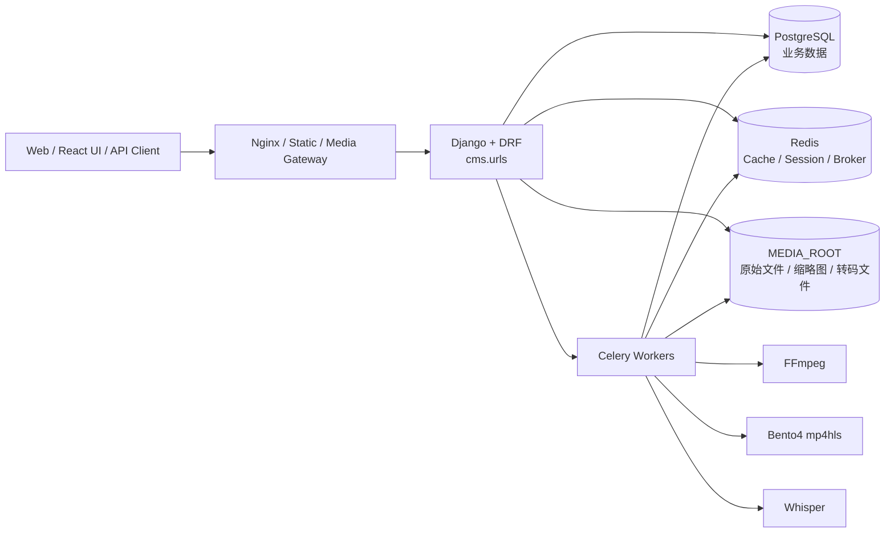

后端同步请求由 Django 处理；耗时任务由 Celery 处理。数据库默认使用 PostgreSQL，缓存、Session 和 Celery broker/result backend 默认使用 Redis。媒体文件、编码产物、字幕、缩略图等存储在 Django 文件存储配置对应的位置。

### 2.2 Django 应用模块

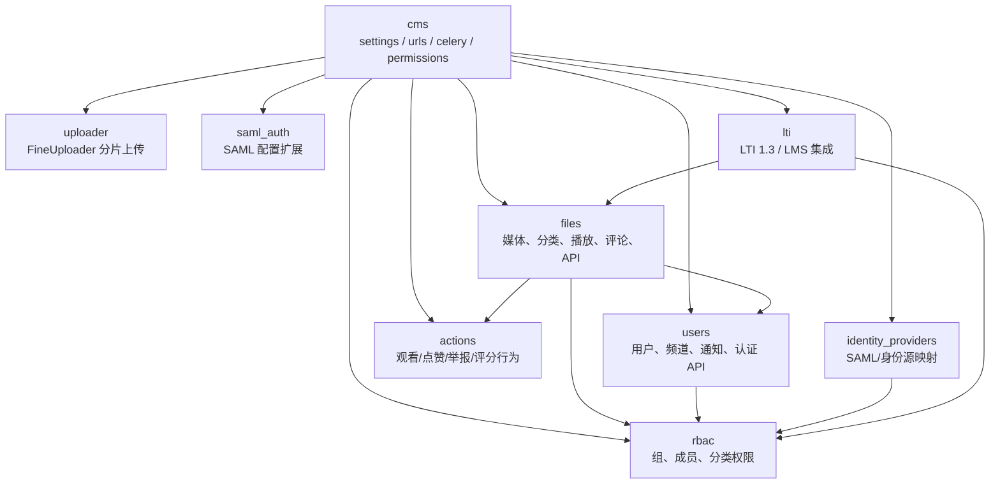

| 模块 | 责任 |
| --- | --- |
| `cms` | 全局配置、URL 汇总、Celery 应用、分页、权限类、Swagger/ReDoc。 |
| `files` | 核心业务域：媒体、分类、标签、编码、字幕、评论、播放列表、页面、媒体权限、API 与后台管理视图。 |
| `users` | 自定义用户、频道、订阅、通知、用户资料与登录/token/whoami API。 |
| `uploader` | FineUploader 分片上传和合并，最终创建 `Media` 记录。 |
| `actions` | 媒体行为流水：watch、like、dislike、report、rate。 |
| `rbac` | RBACGroup、RBACMembership，按分类授予 member/contributor/manager 权限。 |
| `identity_providers` | 身份源角色/分类映射，和 RBAC 组、分类联动。 |
| `saml_auth` | SAML 配置模型，基于 allauth SocialApp 扩展。 |
| `lti` | LTI 平台、资源链接、用户映射、角色映射、启动日志、工具密钥。 |

## 3. 请求入口与 API 分层

顶层 URL 由 `cms/urls.py` 汇总：

- `files.urls`：站点首页、媒体页面、搜索、上传入口、播放列表、管理页、媒体相关 API。
- `users.urls`：用户主页、频道页、用户编辑、用户 API。
- `allauth.urls`：账号、社交登录、SAML 登录流程。
- `lti.urls`：LTI 1.3 OIDC login、launch、JWKS、Deep Linking。
- `api-auth/`：DRF 登录。
- `admin/`：Django Admin，实际路径由 `settings.DJANGO_ADMIN_URL` 控制。
- `swagger/`、`docs/api/`：API 文档。

主要业务 API 在 `files/urls.py`：

| API | 处理对象 |
| --- | --- |
| `GET/POST /api/v1/media` | 媒体列表、创建媒体。 |
| `GET/PUT/DELETE /api/v1/media/{friendly_token}` | 单个媒体详情、编辑、删除。 |
| `GET /api/v1/search` | 媒体搜索。 |
| `POST /api/v1/media/{friendly_token}/actions` | 观看、点赞、点踩、举报、评分。 |
| `GET/POST /api/v1/media/{friendly_token}/comments` | 评论树。 |
| `POST /api/v1/media/{friendly_token}/share` | 媒体共享权限。 |
| `GET /api/v1/categories` | 分类列表。 |
| `GET /api/v1/tags` | 标签列表。 |
| `GET/POST /api/v1/playlists` | 播放列表。 |
| `GET /api/v1/tasks` | Celery/任务状态视图。 |
| `GET /api/v1/media-auth` | 媒体文件访问鉴权。 |

用户 API 在 `users/urls.py`：

| API | 处理对象 |
| --- | --- |
| `GET /api/v1/whoami` | 当前登录用户信息。 |
| `GET /api/v1/user/token` | 用户 token。 |
| `POST /api/v1/login` | 登录。 |
| `GET /api/v1/users` | 用户列表。 |
| `GET /api/v1/users/{username}` | 用户详情。 |

## 4. 数据库库表与业务模型

Django 默认表名遵循 `app_label_modelname` 规则。例如 `files.Media` 对应 `files_media`，`users.User` 对应 `users_user`。ManyToMany 字段如果没有显式 through 表，会由 Django 自动生成中间表；显式 through 表包括 `files_playlistmedia` 和 `rbac_rbacmembership`。

### 4.1 核心 ER 图

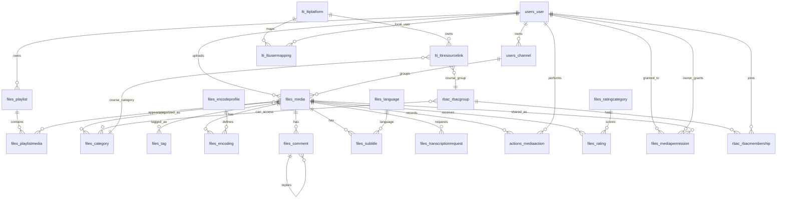

### 4.2 媒体域表

| Django 模型 | 数据表 | 说明 |
| --- | --- | --- |
| `files.Media` | `files_media` | 核心媒体表，保存标题、描述、文件路径、状态、类型、编码状态、统计、缩略图、HLS、搜索向量等。 |
| `files.Category` | `files_category` | 分类，可全局/用户私有，可作为 RBAC 分类，也可映射 LMS 课程。 |
| `files.Tag` | `files_tag` | 标签，带媒体数量与列表缩略图缓存。 |
| `files.License` | `files_license` | 媒体许可证。 |
| `files.EncodeProfile` | `files_encodeprofile` | 转码配置，如扩展名、分辨率、编码器、是否启用。 |
| `files.Encoding` | `files_encoding` | 单个媒体在某个转码配置下的任务和产物，记录状态、进度、日志、worker、文件路径。 |
| `files.Subtitle` | `files_subtitle` | 字幕文件，关联媒体、语言和上传用户。 |
| `files.Language` | `files_language` | 字幕语言。 |
| `files.TranscriptionRequest` | `files_transcriptionrequest` | Whisper 自动转写/翻译请求。 |
| `files.Comment` | `files_comment` | 媒体评论，使用 MPTT 支持树形回复。 |
| `files.RatingCategory` | `files_ratingcategory` | 评分维度。 |
| `files.Rating` | `files_rating` | 用户对媒体某个评分维度的分数，`user + media + rating_category` 唯一。 |
| `files.Playlist` | `files_playlist` | 用户播放列表。 |
| `files.PlaylistMedia` | `files_playlistmedia` | 播放列表与媒体的显式中间表，保存排序。 |
| `files.MediaPermission` | `files_mediapermission` | 直接媒体共享权限：viewer、editor、owner。 |
| `files.EmbedMediaCourse` | `files_embedmediacourse` | LTI 课程嵌入媒体审计，不直接改变媒体分类。 |
| `files.VideoChapterData` | `files_videochapterdata` | 视频章节数据。 |
| `files.VideoTrimRequest` | `files_videotrimrequest` | 视频裁剪请求及状态。 |
| `files.Page` | `files_page` | CMS 自定义页面。 |
| `files.TinyMCEMedia` | `files_tinymcemedia` | TinyMCE 页面编辑上传媒体。 |

### 4.3 用户、权限与集成表

| Django 模型 | 数据表 | 说明 |
| --- | --- | --- |
| `users.User` | `users_user` | 自定义用户，继承 Django `AbstractUser`，扩展头像、简介、角色标记、审核状态、媒体计数等。 |
| `users.Channel` | `users_channel` | 用户频道；用户创建时自动创建默认频道。 |
| `users.Notification` | `users_notification` | 用户通知配置。 |
| `actions.MediaAction` | `actions_mediaaction` | 用户或匿名 Session 的 watch、like、dislike、report、rate 行为流水。 |
| `rbac.RBACGroup` | `rbac_rbacgroup` | RBAC 组，可绑定身份源和多个分类。 |
| `rbac.RBACMembership` | `rbac_rbacmembership` | 用户在 RBAC 组中的角色：member、contributor、manager。 |
| `identity_providers.IdentityProviderUserLog` | `identity_providers_identityprovideruserlog` | SAML/身份源登录映射日志。 |
| `identity_providers.IdentityProviderGroupRole` | `identity_providers_identityprovidergrouprole` | 身份源组角色到 RBAC 组角色的映射。 |
| `identity_providers.IdentityProviderGlobalRole` | `identity_providers_identityproviderglobalrole` | 身份源角色到 MediaCMS 全局角色的映射。 |
| `identity_providers.IdentityProviderCategoryMapping` | `identity_providers_identityprovidercategorymapping` | 身份源组属性到分类的映射，并联动 RBACGroup.categories。 |
| `identity_providers.LoginOption` | `identity_providers_loginoption` | 登录页展示的登录选项。 |
| `saml_auth.SAMLConfiguration` | `saml_auth_samlconfiguration` | allauth SocialApp 的 SAML 配置扩展。 |
| `lti.LTIPlatform` | `lti_ltiplatform` | LTI 1.3 平台配置。 |
| `lti.LTIResourceLink` | `lti_ltiresourcelink` | LMS 课程/资源链接，映射分类和 RBAC 组。 |
| `lti.LTIUserMapping` | `lti_ltiusermapping` | LTI 用户 sub 到本地用户的映射。 |
| `lti.LTIRoleMapping` | `lti_ltirolemapping` | LTI 角色到 MediaCMS 全局角色/RBAC 组角色的映射。 |
| `lti.LTILaunchLog` | `lti_ltilaunchlog` | LTI 启动审计日志。 |
| `lti.LTIToolKeys` | `lti_ltitoolkeys` | LTI 签名使用的 RSA/JWK 密钥。 |

## 5. 核心业务模型

### 5.1 Media：媒体生命周期聚合根

`files.Media` 是最核心的模型。它同时承担：

- 媒体元数据：`title`、`description`、`duration`、`size`、`media_type`、`media_info`。
- 文件引用：`media_file`、`thumbnail`、`poster`、`sprites`、`uploaded_poster`、`uploaded_thumbnail`、`hls_file`、`preview_file_path`。
- 发布状态：`state`、`is_reviewed`、`listable`。
- 转码状态：`encoding_status`。
- 统计：`views`、`likes`、`dislikes`、`reported_times`。
- 关联：上传用户、频道、分类、标签、许可证、评分维度、评论、字幕、编码任务、共享权限。

`listable` 是列表可见性的核心派生字段。当前逻辑为：

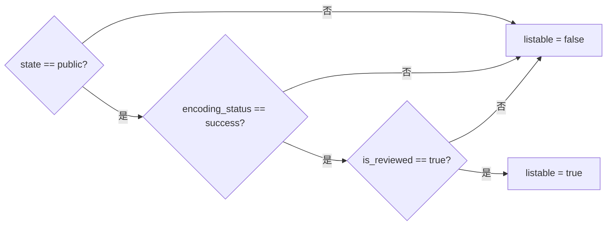

### 5.2 权限模型

媒体可见性由多层规则叠加：

1. 公开列表：`Media.listable = true` 的内容对所有用户可见。
2. 所有者：媒体上传用户拥有完整访问权。
3. 直接共享：`MediaPermission` 授予指定用户 viewer/editor/owner。
4. RBAC 分类：用户属于某个 `RBACGroup`，该组绑定媒体所属分类。
5. 全局角色：编辑、管理员、manager 等角色可进入管理视图或查看更多内容。

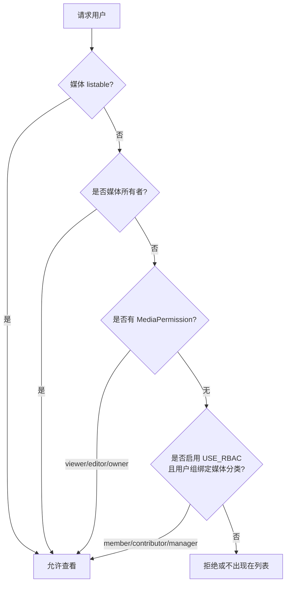

RBAC 角色含义：

| 角色 | 能力侧重点 |
| --- | --- |
| `member` | 可访问组绑定分类下的媒体。 |
| `contributor` | 可访问并作为贡献者参与分类媒体。 |
| `manager` | 分类级管理权限，通常等价于拥有者级别操作。 |

### 5.3 用户与频道

`users.User` 继承 Django 用户体系，扩展了站点角色和个人资料。用户创建后，`post_user_create` 信号自动创建一个名为 `default` 的 `Channel`。媒体可选关联到一个频道，频道有订阅者关系。

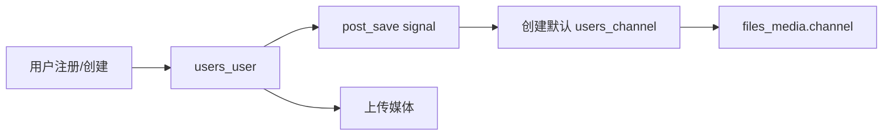

## 6. 主要业务流程

### 6.1 媒体上传与初始化

上传入口在 `uploader.views.FineUploaderView`。它负责权限检查、分片保存、分片合并，并最终创建 `Media` 记录。`Media` 创建后，`post_save` 信号调用 `media.media_init()`，完成媒体类型识别、缩略图、转码等后续处理。

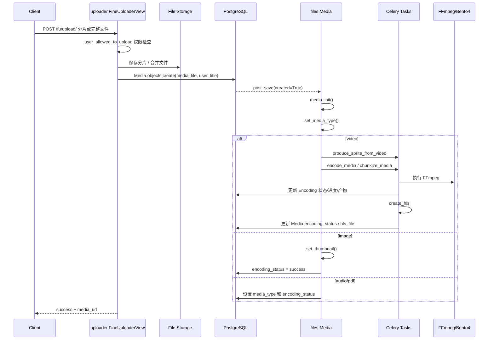

### 6.2 视频转码流程

视频初始化时调用 `Media.encode()`：

1. 读取启用的 `EncodeProfile`。
2. 如果视频时长超过 `CHUNKIZE_VIDEO_DURATION`，先 `chunkize_media` 切片，再对每个片段和 profile 生成 `Encoding`。
3. 普通视频按 profile 直接创建 `Encoding`。
4. Celery 执行 `encode_media`，用 FFmpeg 生成目标文件并更新进度。
5. 成功后调用 `post_encode_actions()`，聚合媒体级 `encoding_status`。
6. h264/mp4 成功后触发 `create_hls` 生成 HLS master playlist。

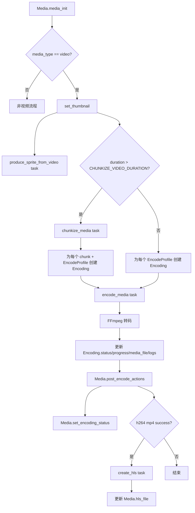

### 6.3 搜索流程

`Media.search` 是 PostgreSQL `SearchVectorField`，用于全文搜索。搜索内容来自媒体 token、标题、上传者、邮箱、姓名、描述、标签和字幕文本。字幕保存后会异步触发搜索向量更新。

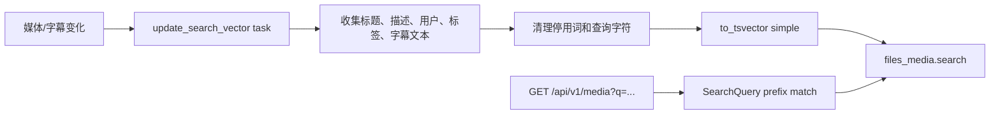

### 6.4 用户行为流程

用户行为通过 `save_user_action` Celery 任务入库。行为类型来自 `actions.USER_MEDIA_ACTIONS`：`like`、`dislike`、`watch`、`report`、`rate`。

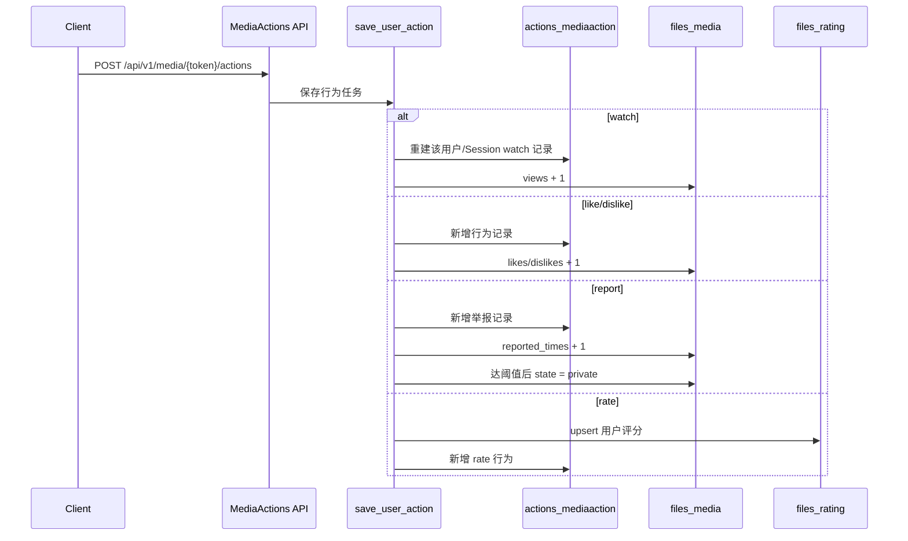

### 6.5 评论、字幕与播放列表

- 评论：`Comment` 使用 MPTT 树结构，支持父子评论。保存前会去除 HTML，并限制长度。
- 字幕：`Subtitle` 关联媒体、语言和用户，保存后触发搜索向量更新。Whisper 自动转写通过 `TranscriptionRequest` 记录状态。
- 播放列表：`Playlist` 属于用户，通过 `PlaylistMedia` 关联媒体，并保存排序字段。

### 6.6 SAML / 身份源 / RBAC 映射

身份源映射以 allauth `SocialApp` 为基础：

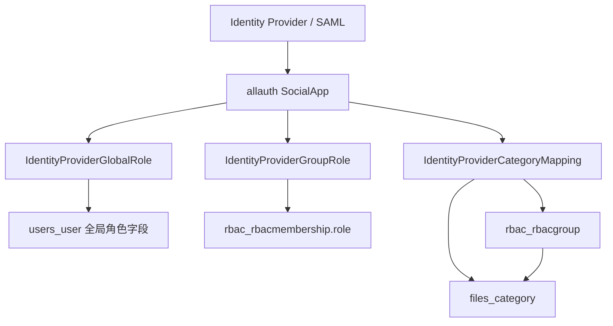

`IdentityProviderCategoryMapping.save()` 会查找同一身份源下 `uid = name` 的 `RBACGroup`，并把映射分类加入该组。`RBACGroup.categories` 变化时也会反向维护身份源分类映射。

### 6.7 LTI 1.3 / LMS 流程

LTI 模块把外部 LMS 课程和 MediaCMS 分类、RBAC 组连接起来：

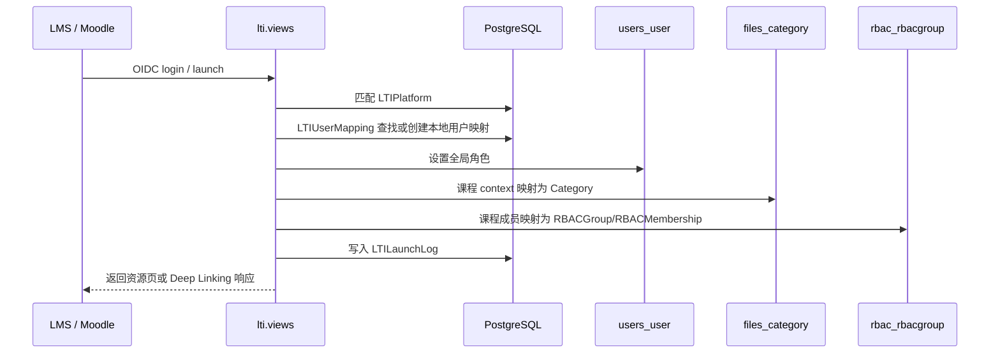

LTI 嵌入媒体时，`EmbedMediaCourse` 用于记录媒体曾被嵌入某课程；如果需要给课程成员访问权，可通过 `MediaPermission` 的 `source = lti_embed` 标记来源。

## 7. 状态机

### 7.1 媒体发布状态

`Media.state` 来自 `MEDIA_STATES`，常见状态包括 `public`、`private`、`unlisted`。默认状态由 `helpers.get_default_state()` 和站点工作流配置决定。

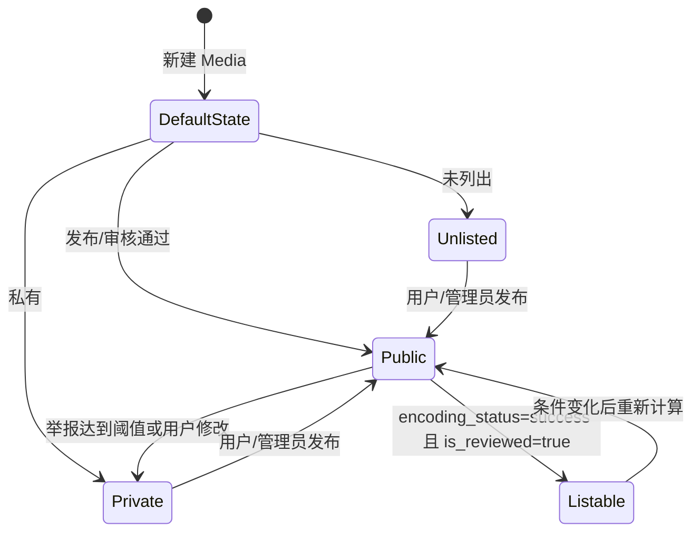

### 7.2 编码状态

`Media.encoding_status` 是媒体级聚合状态，`Encoding.status` 是 profile/任务级状态。

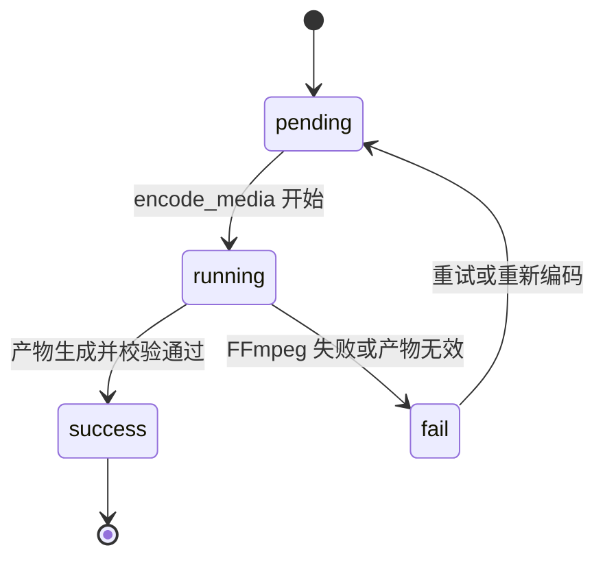

媒体级状态由 `Media.set_encoding_status()` 根据 mp4/webm 编码结果聚合：

- 没有 mp4/webm 编码记录：`pending`
- 任一 mp4/webm 成功：`success`
- 任一 mp4/webm 运行中：`running`
- 其他情况：`fail`

## 8. 后端配置要点

| 配置项 | 当前默认/说明 |
| --- | --- |
| `INSTALLED_APPS` | 包含 Django、allauth、DRF、files、users、actions、rbac、identity_providers、lti、uploader、saml_auth、tinymce 等。 |
| `DATABASES.default` | PostgreSQL，默认库名/用户/密码为 `mediacms`，host 为 `127.0.0.1:5432`。 |
| `REDIS_LOCATION` | 默认 `redis://127.0.0.1:6379/1`。 |
| `CACHES.default` | `django_redis.cache.RedisCache`。 |
| `SESSION_ENGINE` | Redis cache session。 |
| `BROKER_URL` | Redis，Celery broker。 |
| `CELERY_RESULT_BACKEND` | Redis，Celery result backend。 |
| `CELERY_BEAT_SCHEDULE` | 定时清理 Session、热门媒体列表、分类/标签列表缩略图。 |
| `DO_NOT_TRANSCODE_VIDEO` | 为 true 时视频不转码，直接使用原文件作为播放源。 |
| `GLOBAL_LOGIN_REQUIRED` | 为 true 时全站需要登录访问。 |

## 9. 二次开发建议

### 9.1 新增媒体属性

优先判断属性属于哪类：

- 展示/检索元数据：加到 `Media`，同步更新 serializer 和搜索向量。
- 编码产物或任务状态：优先考虑 `Encoding` 或独立任务表，不要继续膨胀 `Media`。
- 用户交互行为：优先进入 `MediaAction` 或独立行为表。
- 权限/共享：优先扩展 `MediaPermission`、RBAC 或 LTI/IDP 映射，不要把权限逻辑硬编码到视图。

### 9.2 新增异步媒体处理任务

建议遵循现有模式：

1. 在模型上保存用户可见开关或请求记录。
2. 创建独立请求/任务状态表，避免只靠 Celery task id 追踪业务状态。
3. Celery 任务读取 `friendly_token`，而不是直接传大对象。
4. 任务过程更新状态、日志、进度。
5. 成功后更新 `Media` 的派生字段或关联产物。

### 9.3 新增列表筛选

媒体列表逻辑集中在 `files.views.media.MediaList`。新增筛选时需要同时考虑：

- 匿名用户只能看到 `listable`。
- 登录用户可看到直接共享给自己的媒体。
- 启用 RBAC 后，用户可看到所属 RBAC 分类下的媒体。
- 媒体所有者和 MediaCMS editor 有更宽访问范围。
- 查询参数应与排序、分页、搜索条件兼容。

## 10. 快速定位索引

| 目标 | 文件 |
| --- | --- |
| 全局配置 | `cms/settings.py` |
| 顶层路由 | `cms/urls.py` |
| Celery 应用 | `cms/celery.py` |
| 媒体模型 | `files/models/media.py` |
| 分类/标签 | `files/models/category.py` |
| 编码模型 | `files/models/encoding.py` |
| 评论 | `files/models/comment.py` |
| 字幕/转写 | `files/models/subtitle.py` |
| 播放列表 | `files/models/playlist.py` |
| 媒体 API | `files/views/media.py` |
| API serializer | `files/serializers.py` |
| 媒体任务 | `files/tasks.py` |
| 分片上传 | `uploader/views.py`、`uploader/fineuploader.py` |
| 用户/频道 | `users/models.py` |
| RBAC | `rbac/models.py` |
| 身份源映射 | `identity_providers/models.py` |
| SAML 配置 | `saml_auth/models.py` |
| LTI 模型/路由 | `lti/models.py`、`lti/urls.py` |
