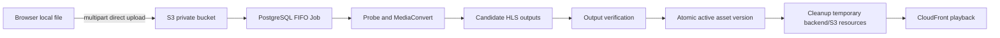

# MediaCMS AWS Integration Handoff

**Date:** 2026-08-02  
**Branch:** `feat/aws-backend-integration`  
**Purpose:** hand off the current backend, AWS, frontend authorization, testing, and remaining implementation work.

## 1. Executive status

The project is moving from the legacy local-media pipeline to an AWS data plane with Django/PostgreSQL as the control plane.

The following path is implemented and has passed the real dev acceptance run:



Implemented now:

- Domain models, migrations, Media/Job/Attempt/Checkpoint separation.
- FIFO PostgreSQL processing lease; only one heavy task may run.
- Browser multipart upload with resume and reconciliation.
- HLS package inventory/upload validation.
- MediaConvert versioned templates, QVBR-oriented submission, idempotency intent, polling, cancellation and cleanup.
- Candidate output verification and atomic `MediaAssetVersion` activation.
- YouTube single-video URL validation, Python `yt-dlp` wrapper, encrypted Cookie model, Cookie failure classification, Resume flow and queue integration.
- WebVTT parsing, normalization, Chinese/English selection and bilingual merging.
- CloudFront signed-cookie Bootstrap/logout endpoints.
- Versioned CloudFront asset URL generation for AWS HLS, poster, thumbnail and subtitle assets.
- Frontend global authorization Bootstrap and single-flight renewal helper.

Not complete:

- Full YouTube subtitle fetch/publish to S3 and legacy `Subtitle` compatibility association.
- Complete CloudFront browser 403 recovery wiring into every image, HLS and WebVTT request.
- Task Center/history API migration from the legacy task endpoint.
- Playback progress persistence and resume position API.
- Unified Add Media frontend for all four sources.
- Full responsive player/quality/subtitle UI integration.
- Production deployment, Cloudflare Tunnel/custom-domain validation and final end-to-end acceptance.

## 2. Source of truth documents

Read these in order:

1. `docs/superpowers/specs/aws-backend-integration/README.md`
2. `01-domain-and-single-admin.md`
3. `02-aws-infrastructure-and-storage.md`
4. `03-browser-upload-and-hls-import.md`
5. `04-media-processing-orchestration.md`
6. `04a-mediaconvert-core-orchestration.md`
7. `05-youtube-and-subtitles.md`
8. `06-cloudfront-playback.md`
9. `08-frontend-experience.md`
10. `09-frontend-layout.md`
11. `10-test-and-deployment-plan.md`
12. `docs/superpowers/plans/2026-08-02-aws-integration-roadmap.md`

When implementation and design differ, update the design first or record the deviation here before extending the code.

## 3. Important commits

| Commit | Content |
| --- | --- |
| `a9810a5` | Remaining backend roadmap update |
| `32cb871` | MediaConvert core orchestration verification |
| `64dc153` | AWS processing tick orchestration |
| `4e3e4a9` | Cancellation and cleanup |
| `90dd28a` | Atomic candidate publication |
| `34fc579` | MediaConvert output closure verification |
| `f22dd04` | Provider polling/reconciliation |
| `280aa3e` | Submission intent recovery |
| `d41f19c` | Idempotent MediaConvert gateway |
| `5bf4fa0` | YouTube and subtitle service layer |
| `927bdbf` | YouTube Job/Runner/Resume integration |
| `61f1294` | CloudFront signed-cookie backend endpoints |
| `c3bc295` | Versioned CloudFront asset URLs |
| `be6b793` | Frontend authorization Bootstrap/renewal |

The working branch is clean except for `frontend/yarn.lock`, which was modified by `npm install` because the local npm registry rewrote resolved URLs and dependency entries. Do not commit that lockfile change unless intentionally standardizing the frontend lockfile.

## 4. Runtime architecture and invariants

- Django/DRF and PostgreSQL are the authoritative control plane.
- Redis is only the Celery broker; it is not a state store.
- Cloudflare Tunnel carries pages and APIs only.
- Browser uploads large local files directly to private S3 using presigned multipart requests.
- MediaConvert reads private S3 originals and writes candidate HLS outputs.
- CloudFront with OAC is the only playback read path.
- Backend local storage is temporary only; yt-dlp files are deleted after S3 upload.
- Processing is globally FIFO and strictly serial.
- No local video transcoding is allowed for AWS media.
- `Media` state is separate from `MediaIngestionJob.status` and cleanup status.
- A candidate is never exposed until its complete `MediaAssetVersion` is atomically activated.
- AWS resources are independent MediaCMS resources; do not reuse `media-platform` resources.
- The top-level S3 bucket name is `mediacms-${AWS::AccountId}-us-east-1` when deployed by the approved CloudFormation stack.

## 5. Data model handoff

Core models are in `files/models/` and migrations `0021` onward:

- `Media.storage_backend`, `Media.processing_status`, `Media.active_asset_version`.
- `MediaIngestionJob`: logical import, source type, progress, safe error, cleanup status.
- `MediaJobAttempt`: retry execution, provider job ID, template version, client token and evidence.
- `MediaJobCheckpoint`: named idempotent checkpoints and evidence.
- `AttemptArtifact`: exact S3 object ledger and cleanup status.
- `MediaAssetVersion`: candidate/active/retired complete resource set.
- `MediaAsset`: versioned object kind, key, checksum and content type.
- `YouTubeCookieVersion`: encrypted Netscape Cookie payload, checksum, status and timestamps.

Job and Attempt statuses are provider-independent:

```text
Job:     queued / running / failed / canceled / completed
Attempt: queued / running / failed / canceled / completed
Cleanup: pending / running / failed / completed
Media:   draft / queued / processing / ready / failed
```

MediaConvert provider status is stored separately in `provider_status` and `provider_phase`.

## 6. AWS and environment handoff

Use the AWS CLI default profile explicitly:

```bash
aws --profile default --region us-east-1 sts get-caller-identity
aws --profile default --region us-east-1 cloudformation describe-stacks \
  --stack-name mediacms-dev
```

CloudFormation workflow:

```bash
cfn-lint infra/aws/*.yaml
aws --profile default --region us-east-1 cloudformation validate-template \
  --template-body file://infra/aws/mediacms.yaml
```

Only CloudFormation Stack/Change Set operations may create or update AWS resources. Do not manually create buckets, IAM users, CloudFront distributions, or MediaConvert templates outside the stack.

Relevant Django environment variables include:

```text
AWS_REGION=us-east-1
AWS_MEDIA_BUCKET=mediacms-<account-id>-us-east-1
AWS_MEDIACONVERT_ROLE_ARN=...
AWS_MEDIACONVERT_VIDEO_TEMPLATE=...
AWS_MEDIACONVERT_AUDIO_TEMPLATE=...
AWS_MEDIACONVERT_TEMPLATE_VERSION=h264-hls-qvbr-v1
AWS_ENVIRONMENT=dev|prod
AWS_CLOUDFRONT_DOMAIN=dxxxxx.cloudfront.net
AWS_CLOUDFRONT_KEY_PAIR_ID=...
AWS_CLOUDFRONT_PRIVATE_KEY=<secret, never log>
AWS_CLOUDFRONT_COOKIE_DOMAIN=...
AWS_CLOUDFRONT_COOKIE_TTL_SECONDS=3600
```

Do not put AWS secrets, CloudFront private keys or YouTube Cookie contents in Git, Docker images, job tags, `userMetadata`, logs or browser storage.

## 7. Backend entry points

Upload APIs are under `/api/v1/aws/uploads/` and are implemented in `files/views/aws_uploads.py` and `files/services/upload_sessions.py`.

CloudFront authorization:

```text
GET  /api/v1/media-auth/bootstrap
POST /api/v1/media-auth/logout
```

YouTube service modules:

- `files/services/youtube.py`
- `files/services/youtube_cookies.py`
- `files/services/youtube_import.py`
- `files/services/youtube_jobs.py`

Processing entry points:

- `files/services/processing_runner.py`
- `files/services/processing_queue.py`
- `files/services/processing_submission.py`
- `files/services/processing_polling.py`
- `files/services/processing_cleanup.py`
- `files/tasks.py` Celery reconciliation wiring

CloudFront asset URLs are generated by `files/services/asset_urls.py` and consumed by AWS-aware `Media` properties.

## 8. Frontend handoff

Frontend source is under `frontend/src/static/js/`.

Implemented:

- `utils/contexts/MediaAuthorizationContext.js`
- `utils/services/mediaAuthorization.js`
- `utils/renderer.js` wraps all normal pages with `MediaAuthorizationProvider`.

Current behavior:

- Authenticated pages automatically call CloudFront Bootstrap.
- Renewal is scheduled before expiry.
- Concurrent renewal calls share one Promise.
- `retryAfterMediaAuthorization()` supports one-time image cache-busting.

Still required:

- Add Axios/fetch response integration so protected 403s invoke the single-flight refresh automatically.
- Add Video.js HLS reload after refresh.
- Add image and WebVTT retry behavior in the actual components.
- Add active-version media API fields to the Add Media, media detail and media list components.
- Add quality selection, subtitle selection, audio mode and resume position UI.
- Add global Task Center, historical summary and single-task progress spinner.

All new frontend labels and resource names must remain English. Existing MediaCMS legacy pages and CRUD behavior must remain compatible.

## 9. Testing evidence

Frontend dependencies were installed manually with:

```bash
cd frontend
npm install
npm test -- --runInBand
npm run dist
```

Latest frontend result:

```text
31 test suites passed
204 tests passed
Production build completed with bundle-size warnings
```

Backend focused tests that can run without PostgreSQL:

```bash
.venv/bin/pytest tests/aws_domain/test_youtube_subtitles.py -q -k 'not cookies'
.venv/bin/pytest tests/aws_domain/test_cloudfront_auth.py tests/aws_domain/test_asset_urls.py -q
```

The latest results were successful. Database-backed tests currently require the PostgreSQL test container to be running on `127.0.0.1:55432`.

Start the test database manually:

```bash
docker run --detach --name mediacms-aws-test-postgres \
  --restart unless-stopped \
  --publish 127.0.0.1:55432:5432 \
  --env POSTGRES_DB=mediacms_test \
  --env POSTGRES_USER=mediacms_test \
  --env POSTGRES_PASSWORD=mediacms_test_local_only \
  --health-cmd='pg_isready -U mediacms_test -d mediacms_test' \
  --health-interval=5s --health-timeout=3s --health-retries=20 \
  --volume mediacms-aws-test-pgdata:/var/lib/postgresql/data \
  postgres:17.2-alpine
```

Run AWS-domain tests:

```bash
POSTGRES_HOST=127.0.0.1 POSTGRES_PORT=55432 \
POSTGRES_NAME=mediacms_test POSTGRES_USER=mediacms_test \
POSTGRES_PASSWORD=mediacms_test_local_only \
.venv/bin/pytest tests/aws_domain -q
```

The earlier full AWS suite reached `293 passed` before the YouTube/CloudFront additions. Repeat the full suite after the database container is restored.

Real dev acceptance already passed for one short video and one short audio through MediaConvert, including output verification and exact cleanup. The acceptance command and evidence are in `docs/superpowers/plans/2026-08-02-mediaconvert-core-orchestration.md` and `docs/superpowers/specs/aws-backend-integration/07-deployment-and-acceptance.md`.

## 10. Known issues and risks

### P0 — must complete before production

- Verify CloudFront signed-cookie implementation against the deployed distribution and key group. The backend currently assumes CloudFront configuration is present.
- Complete stable asset routing so CloudFront paths map to the underlying versioned S3 keys. The URL contract is implemented, but distribution behavior/origin mapping needs real AWS verification.
- Complete YouTube subtitle download and S3 publication; currently the optional subtitle checkpoint can be marked unavailable.
- Add API-level authorization tests for the unique administrator and CloudFront Bootstrap/logout.
- Run migrations on a clean PostgreSQL database and confirm no legacy media/database is reused.
- Complete production CloudFormation, GHCR image delivery, protected env file, backup and rollback procedure.

### P1 — required for approved MVP UX

- Unified Add Media source selector: local video, local audio, HLS ZIP and YouTube.
- Task Center with current task, historical tasks, stage/progress/error and Resume.
- Browser upload resume after refresh and clear byte/object progress bars.
- Video.js HLS quality selector, subtitle selector and audio-only mode.
- Playback progress persistence and resume on the same Media/version.
- Cookie upload UI showing last upload date, missing-cookie warning and retry/resume action.
- Browser 403 single-flight refresh and image recovery.

### P2 — non-blocking optimization

- Reduce frontend bundle size and split large commons chunks.
- Add richer MediaConvert quality telemetry and optional probe diagnostics.
- Add CloudFront key rotation automation after the two-key deployment path is exercised.
- Add performance dashboards only if operational load justifies them; CloudWatch alerting was intentionally removed from MVP cost scope.

## 11. Cloudflare handoff gate

Cloudflare Console work is required only for final external-domain validation, not for local backend/frontend development.

Required manual information/configuration:

- Actual application domain and media domain.
- Cloudflare Tunnel route to the lightweight Django service.
- DNS records for the application and media hostname.
- HTTPS mode and origin certificate behavior.
- CORS origin value matching the final application origin.
- CloudFront custom-domain ACM DNS validation records, if a custom CloudFront hostname is used.

Until this information is available, use the default CloudFront distribution hostname for API and browser contract tests.

## 12. Handoff checklist

The next developer/operator should:

1. Confirm `git status` and decide whether to discard the npm-generated `frontend/yarn.lock` changes.
2. Start PostgreSQL and run migrations against a clean test database.
3. Run backend AWS-domain tests and frontend Jest/build.
4. Verify CloudFormation stack outputs and CloudFront distribution behavior with default profile.
5. Implement YouTube subtitle fetch/publish and API endpoints before expanding UI.
6. Implement Task Center and Add Media API contracts.
7. Wire automatic frontend 403 recovery and player reload.
8. Execute short local video, audio, HLS ZIP, YouTube-without-Cookie and Cookie-Resume tests.
9. Record all AWS Job IDs, template versions, asset version IDs and cleanup evidence.
10. Obtain explicit approval before deleting old AWS resources, old containers, old media or any production data.

## 13. Safety rules

- Never log Cookie contents, CloudFront private keys, presigned URLs or complete YouTube command lines.
- Never bypass CloudFormation for AWS resource creation or deletion.
- Never run concurrent MediaConvert or yt-dlp jobs in the MVP.
- Never expose candidate S3 keys directly to the frontend.
- Never mark a Media ready before output verification and atomic asset activation.
- Never remove Django apps from `INSTALLED_APPS` without a dependency/migration audit.
