# MediaCMS AWS 后端整合设计

**日期：** 2026-08-01

**状态：** 完整设计草案，待用户书面复核

**开发分支：** `feat/aws-backend-integration`

## 1. 目标

将参考项目 `media-platform` 中已验证的 AWS 媒体处理能力迁入 MediaCMS，使 MediaCMS 成为唯一业务系统，并保持现有 Django 页面、React 前端、Video.js 播放体验和媒体元数据 CRUD 能力。

核心原则是：MediaCMS 后端只承担轻量控制、元数据管理与任务协调；大文件上传、长期资源保存、视频转码和媒体分发交给 AWS。

## 2. 已确认的产品与技术决策

- 采用“Django 控制面 + AWS 数据面”架构，不保留独立 FastAPI、SQLAlchemy 模型或第二套业务数据库。
- 保留现有 MediaCMS Django + React/Video.js 前端，不引入参考项目的 Next.js/Vercel 前端。
- MediaCMS 页面与 API 经 Cloudflare Tunnel 暴露；媒体文件不经过 Tunnel。
- 系统采用单管理员模式。保留底层 `User` 和媒体 owner 关系以兼容现有代码，但关闭注册、多用户、频道/关注、评论、分享、评分、点赞、RBAC、LTI、SAML 等入口。
- 使用全新数据库初始化，不迁移旧用户、媒体或历史业务数据；首次部署创建唯一管理员。
- 在 `us-east-1` 为 MediaCMS 创建独立的 S3、MediaConvert IAM Role、CloudFront Distribution 和 CloudFront Key Group。开发测试验收后，另行确认并清理旧项目 AWS 资源。
- CloudFormation 创建的 S3 Bucket 默认物理名称为 `mediacms-{AWS账号ID}-us-east-1`；部署参数可以覆盖，但仍必须满足 S3 全球唯一命名规则。
- S3 保持私有并启用 Block Public Access；CloudFront 通过 Origin Access Control 读取。
- 播放使用有效期 60 分钟的 CloudFront 签名 Cookie，播放期间自动续期，管理员退出时清除。
- 浏览器使用 S3 Multipart Upload 直传本地视频；导入 HLS ZIP 时由浏览器流式读取 ZIP，并将其中的清单和分片按原相对路径直接上传 S3。两种方式都支持暂停、断点续传、刷新页面后恢复和取消。
- MVP 的 URL 导入仅支持 YouTube 单视频，不支持播放列表。
- 可选上传 Netscape `cookies.txt`；Cookie 经格式校验后加密保存。YouTube 任务默认直接使用最近一次有效上传版本，仅在 Worker 运行时解密到权限为 `0600` 的临时文件，用后立即删除。没有历史 Cookie 时，提交界面必须显示警告。
- yt-dlp 在来源可用时保存中文、英文原始 WebVTT，并在中英文都存在时基于 JSON3 时间轴生成中英双语 WebVTT。中文字幕、英文字幕和全部字幕都允许缺失，不阻止视频发布。
- 手工字幕首期支持 SRT 和 WebVTT；SRT 规范化为 WebVTT 后保存到 S3 并关联 MediaCMS 字幕模型。
- 本地允许 `ffprobe` 探测、SRT/WebVTT 转换和必要时的单帧截取，但禁止 FFmpeg/Bento4 生成视频编码、HLS 清单或视频分片。
- MediaConvert 是唯一视频转码器，负责自适应 HLS、多清晰度、缩略图和封面生成。
- 提交导入时立即创建 Media 草稿；管理员可在处理期间持续编辑元数据，自动探测结果不得覆盖管理员已经修改的字段。
- 后端临时资源必须按检查点主动清理。yt-dlp 下载的视频在 S3 原件完成校验后即可删除；其余字幕中间文件、探测输出和临时工作目录在媒体发布成功后统一清理。HLS ZIP 不进入后端主机，也不在后端解包。
- 所有可观测阶段都必须在前端显示清晰进度。界面同时展示当前阶段、阶段进度、总体进度、已处理字节或项目数、可执行操作和错误信息；不得使用与真实工作无关的定时递增伪进度。
- 支持单个视频或音频文件。音频由 MediaConvert 生成私有音频 HLS，并使用管理员上传、来源提供或系统默认的音频封面。
- 全系统重任务严格串行。新任务进入 FIFO 等待队列；数据库全局执行租约和 Celery Worker `concurrency=1` 共同保证任何时刻只有一个任务执行处理链。
- 现有 `Media.state` 继续表示 `private/public/unlisted` 发布可见性；新增 `processing_status` 表示 AWS 媒体就绪状态。Job执行、清理和 MediaConvert供应商状态分别保存，不混用一套枚举。
- MediaConvert MVP 通过 `GetJob` 每 10–15 秒轮询状态；不引入 EventBridge。`COMPLETE` 仅表示 AWS 输出已写入 S3，之后仍须验证并原子激活资源。

## 3. 方案选择

### 3.1 方案 A：Django 控制面 + AWS 数据面（已批准）

将参考实现中的领域边界和已验证算法迁入 MediaCMS，但按 Django 的模型、DRF API 和 Celery 任务结构重新实现：

- Django 管理媒体草稿、导入任务、检查点、字幕、元数据和播放授权。
- 浏览器直接分片上传 S3。
- Celery 负责 yt-dlp 下载协调、轻量校验、AWS API 调用、任务轮询和结果发布。
- MediaConvert 承担视频转码、多清晰度 HLS、缩略图和封面生成。
- S3 保存原文件、HLS、字幕、图片和临时上传。
- CloudFront 承担私有媒体分发。
- PostgreSQL 是任务状态和检查点的权威来源；Redis 只作为 Celery Broker。

该方案符合轻量后端原则，并保留现有 MediaCMS 前端、元数据和 CRUD。参考代码不能机械复制：FastAPI/SQLAlchemy 模型需要转换为 Django 模型和 DRF API。

### 3.2 未采用的方案

**原样嵌入参考后端：** 初期迁移较快，但会同时存在 Django 与 FastAPI 风格的配置、模型和异常体系，长期形成双后端内核。

**AWS Step Functions/Lambda 编排：** 后端更轻，但引入首期未要求的 AWS 组件；yt-dlp 长任务也不适合普通 Lambda，基础设施与调试成本过高。

### 3.3 从参考项目迁移的能力边界

- S3 Multipart、MediaConvert Job、资源清单和发布契约。
- YouTube URL 规范化、探测、格式选择、Cookie 和下载流程。
- 任务状态机、持久化检查点、恢复、重试、取消和清理逻辑。
- 字幕发现、规范化、双语合并、S3 发布和 MediaCMS 关联。
- HLS 清晰度选择与远端资源字段。

不迁移 FastAPI、SQLAlchemy、独立数据库、Next.js 或 Vercel 代码。

## 4. 总体架构

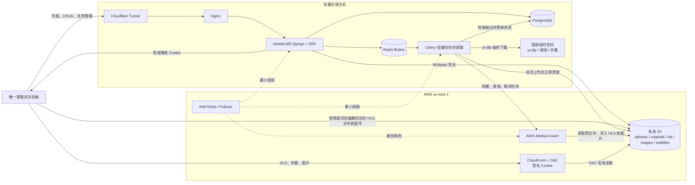

### 4.1 组件职责

- **MediaCMS 是唯一业务系统：** 媒体、标签、分类、字幕、任务和管理员均使用 Django/PostgreSQL。
- **浏览器负责大文件上行：** Django 只签发受约束的 Multipart 上传凭证，不代理视频数据。
- **Celery 是协调器：** 执行 yt-dlp、ffprobe、字幕转换、HLS 清单安全校验和 AWS API 调用，不执行视频转码，也不下载或解包 HLS ZIP。
- **MediaConvert 是唯一视频转码器：** 输出 HLS、多清晰度、缩略图和封面，且不得放大低分辨率源。
- **CloudFront 是唯一播放出口：** 浏览器通过签名 Cookie 访问，S3 不提供公开读取。
- **Cloudflare Tunnel 不承载媒体流量：** 仅暴露 MediaCMS 页面和 API。
- **本地主机只使用受限临时空间：** yt-dlp 下载完成并验证 S3 上传后立即清理，不长期保存媒体。

## 5. 领域模型

`Media` 继续作为元数据聚合根。AWS 资源和处理过程使用独立模型，避免将任务细节继续堆入 `Media`。

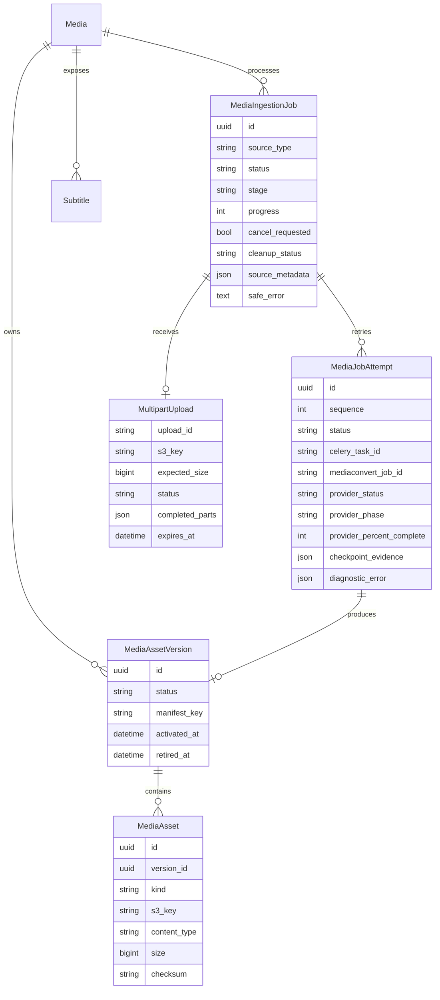

### 5.1 模型约束

- `Media` 在提交时立即以草稿创建，可持续编辑标题、描述、标签和分类。
- `Media.state` 保留现有 `private/public/unlisted` 语义；新增 `processing_status=draft/queued/processing/ready/failed`。现有 `encoding_status` 作为兼容投影维护：`draft/queued → pending`、`processing → running`、`ready → success`、`failed → fail`。
- `MediaIngestionJob` 表示一次逻辑导入；重试或恢复不得创建重复媒体。
- `MediaJobAttempt` 保存每次实际执行记录，用于审计、诊断和恢复。
- `MediaAssetVersion` 聚合一次 Attempt 的完整候选资源集，状态为 `candidate/active/retired`。
- `MediaAsset` 归属于版本并保存精确 S3 Key，不依赖扫描 Bucket，也不把临时签名 URL写入数据库；不再维护逐资源 `active` 布尔字段。
- `Media.active_asset_version` 是唯一播放指针。候选版本验证完成后，通过一次数据库事务切换外键并把旧版本标为 retired。
- 管理员修改过的元数据字段需要记录人工修改状态；自动探测只补充尚未人工确认的字段。

## 6. 状态模型

### 6.1 Media处理状态

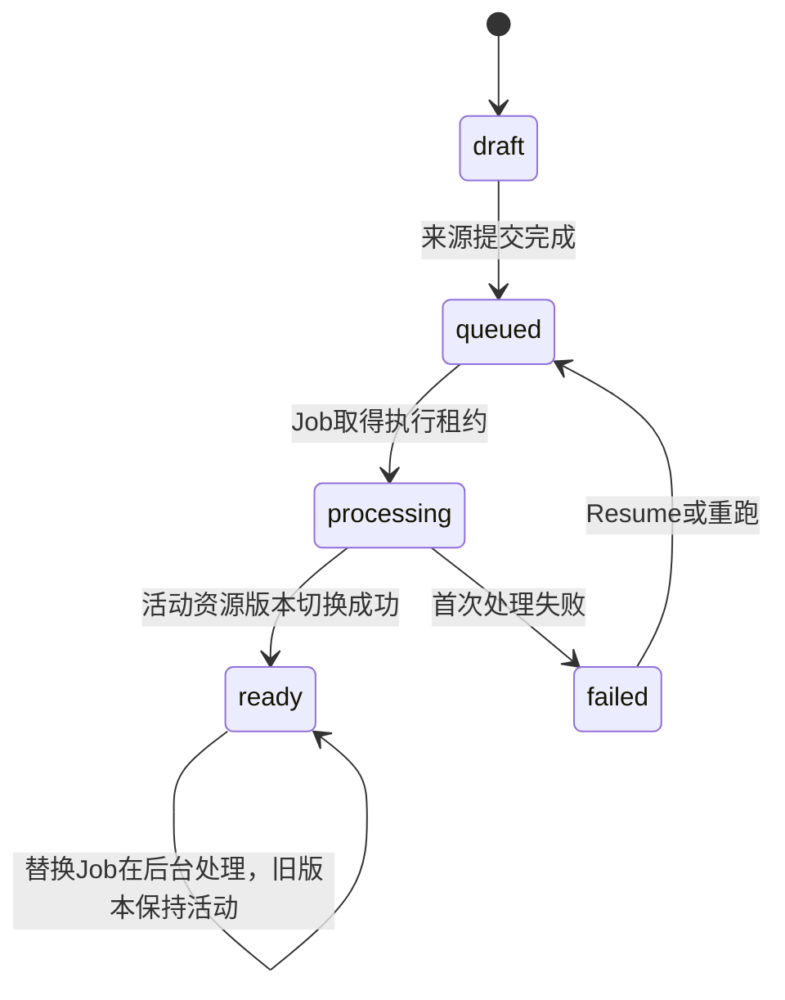

`Media.state` 的 `private/public/unlisted` 发布工作流独立存在，不出现在上图。已有列表逻辑继续使用 `state + encoding_status + is_reviewed`；AWS处理状态通过兼容投影更新 `encoding_status`。

### 6.2 Job执行与清理状态

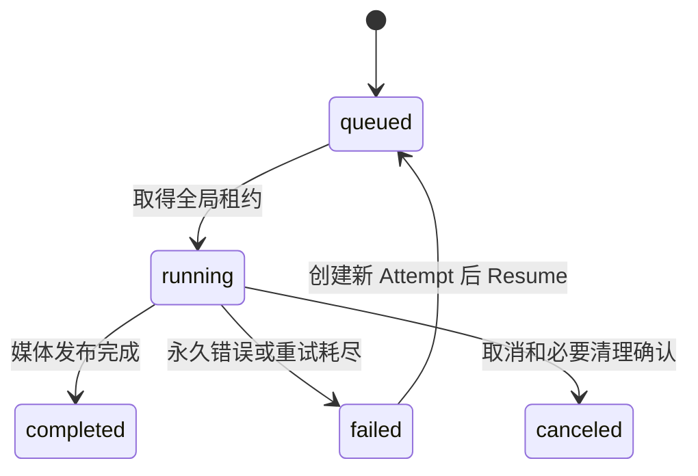

`cleanup_status` 独立为 `pending/running/failed/completed`。媒体激活后保持 `ready`，Job可进入 `completed`；后续清理失败只改变 `cleanup_status`，不撤销媒体可播放状态。

### 6.3 MediaConvert供应商状态

MediaConvert API的核心 Job状态为 `SUBMITTED/PROGRESSING/COMPLETE/CANCELED/ERROR`。`PROGRESSING` 期间的 `currentPhase` 为 `PROBING/TRANSCODING/UPLOADING`。EventBridge 的 `INPUT_INFORMATION`、`STATUS_UPDATE`、`NEW_WARNING` 和 `QUEUE_HOP` 是事件类型，不写入 `provider_status`。

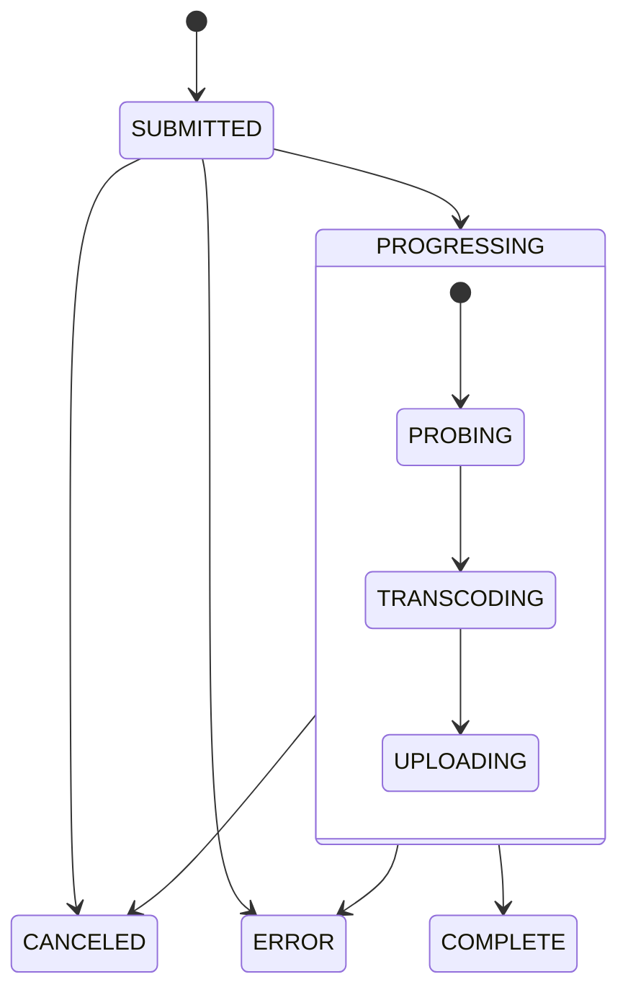

| MediaConvert状态 | 本地 Job阶段 | 处理 |
| --- | --- | --- |
| `SUBMITTED` | `mediaconvert_waiting` | 显示等待；不伪造百分比 |
| `PROGRESSING/PROBING` | `mediaconvert_probing` | 显示探测阶段 |
| `PROGRESSING/TRANSCODING` | `mediaconvert_transcoding` | 使用非空 `jobPercentComplete` |
| `PROGRESSING/UPLOADING` | `mediaconvert_uploading` | 等待 AWS 完成 S3 写入 |
| `COMPLETE` | `verifying_outputs` | 继续验证，不能直接发布 |
| `ERROR` | `failed` | 保存脱敏错误并允许从转码节点重试 |
| `CANCELED` | `canceled` 或 `failed` | 有本地取消意图时为 canceled，否则视为异常失败 |

MVP由短时 Celery轮询任务每 10–15 秒执行 `GetJob` 后立即返回，不占住 Worker进程；逻辑 Job继续持有全局执行租约。`jobPercentComplete` 为空时前端显示不确定进度。EventBridge保留为未来扩展，不进入 MVP。

AWS官方参考：

- [Monitoring MediaConvert job progress](https://docs.aws.amazon.com/mediaconvert/latest/ug/how-mediaconvert-jobs-progress.html)
- [MediaConvert Job API](https://docs.aws.amazon.com/mediaconvert/latest/apireference/jobs-id.html)
- [MediaConvert EventBridge event list](https://docs.aws.amazon.com/mediaconvert/latest/ug/mediaconvert_event_list.html)

`jobPercentComplete` 只是估算值，并可能对部分输入返回空；数据库不得据此判断完成，终态只认 `status`，完成后再验证 S3输出。

## 7. 持久化检查点与恢复

检查点按来源形成有向图，不强制所有任务经过一条线性序列：

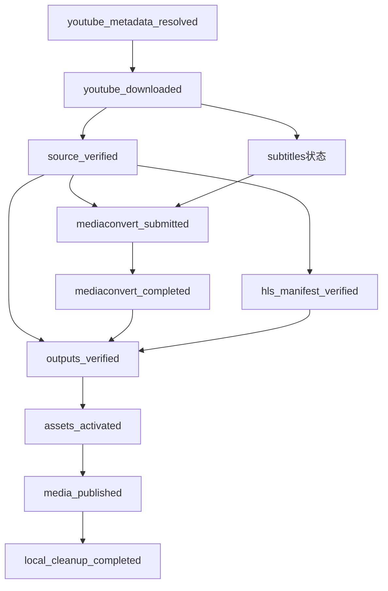

- 本地视频和音频走 `source_verified → mediaconvert_submitted → mediaconvert_completed → outputs_verified`。
- HLS ZIP走 `source_verified → hls_manifest_verified → outputs_verified`，跳过完整视频转码；单帧图片任务单独记录证据。
- YouTube先记录 metadata和 download，再进入通用 source与 MediaConvert节点。
- 字幕节点记录 `available/unavailable/failed_retryable`。`unavailable` 是合法终态；`failed_retryable` 允许视频先发布并由独立字幕 Attempt重试。

每个检查点必须保存验证证据，例如 S3 Key、S3 Version ID、ETag 或 Checksum、对象大小、MediaConvert Job ID 和实际输出清单。恢复前必须重新验证证据；如果对象不存在或校验不符，任务回退到最近仍有效的检查点。

管理员可以：

- **恢复：** 从最近有效检查点继续。
- **从指定节点重跑：** 清理该节点之后产生的非活动资源，再重新执行。
- **完整重跑：** 保留媒体元数据，重新生成媒体资源。
- **取消：** 持久化记录取消意图，终止 Multipart 或 MediaConvert，并清理未发布资源。
- **删除：** 先标记媒体删除，再异步清理 S3；清理失败时保留可重试记录。

状态转换必须通过领域服务完成，并使用数据库事务或条件更新防止重复 Celery 投递、并发恢复和迟到的 MediaConvert 结果覆盖新尝试。

### 7.1 后端临时资源清理

后端临时空间不是持久化存储。每个任务使用独立、不可预测名称的工作目录，并在数据库中记录工作目录标识，不记录可由用户控制的绝对路径。

清理分为两个安全阶段：

1. **S3 原件校验后立即释放大文件：** yt-dlp 或其他后端来源产生的本地视频，只有在 S3 对象的 Key、大小和 Checksum 验证通过并写入 `source_verified` 检查点后才可删除。MediaConvert 直接从 S3 读取，因此后续处理不依赖本地原视频。
2. **媒体发布后清理剩余工作区：** MediaConvert 输出验证通过、资源激活并完成 Media 发布后，删除字幕 JSON3、转换前字幕、ffprobe 输出、Cookie 临时文件和任务工作目录。HLS ZIP 只在浏览器内读取，因此后端不存在对应的 ZIP 或解包目录。

无论任务成功、失败或取消，Cookie 明文临时文件都必须在当前 Worker 执行的 `finally` 路径立即删除。失败和取消任务保留数据库检查点及 S3 中已确认允许保留的对象，但不依赖本地文件恢复。

清理采用幂等实现：目标不存在视为成功；只能删除任务专属工作目录和数据库明确记录的临时对象。清理失败不撤销已经可播放的媒体，而是将 Job的 `cleanup_status` 标记为 `failed`，通过独立 Celery任务重试并在管理界面提示占用空间。

Worker 启动时扫描超过租约时间的孤立工作目录，并仅在确认没有活动任务持有租约后清理。主机同时配置临时目录容量上限、任务级大小上限和最小剩余磁盘阈值；达到阈值时停止启动新的 yt-dlp 任务。

## 8. 导入流程

### 8.1 本地视频文件

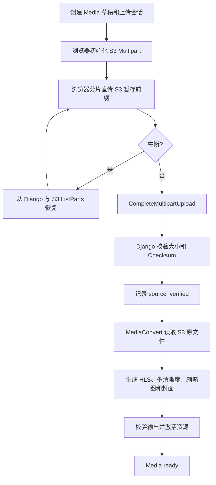

浏览器不获得通用 AWS 凭证，只获得绑定任务、对象 Key、Content-Type、大小及过期时间的上传授权。正式资源使用稳定前缀：

```text
media/{media_uuid}/
├── originals/source.ext
├── hls/master.m3u8
├── hls/1080p/...
├── hls/720p/...
├── hls/480p/...
├── images/poster.jpg
├── images/thumbnail.jpg
└── subtitles/...
```

### 8.2 本地 HLS ZIP

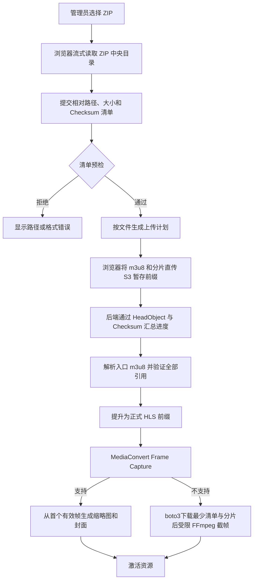

HLS 导入遵循以下安全规则：

- 禁止绝对路径、`..`、符号链接、重复规范化路径和隐藏的跨目录引用。
- 禁止清单引用 HTTP/HTTPS 外部资源、跨任务 S3 对象或未知 URI Scheme。
- 允许 `.m3u8`、预期的视频/音频分片、初始化段及明确允许的字幕格式。
- 限制文件数、单文件大小、总展开大小和清单嵌套深度。
- 主清单不唯一时，由管理员在上传前选择入口。
- 完成状态以 S3 对象、大小、Checksum 和清单引用闭包为准，不以浏览器上报的 `100%` 为准。
- 正式激活前规范化相对 URI，确保所有请求都位于该媒体的 CloudFront 前缀内。
- MVP明确拒绝包含 `EXT-X-KEY`、外部 Key URI或 DRM声明的加密 HLS；支持范围扩展前不尝试复制或重写密钥。
- FFmpeg回退由 Worker使用 boto3读取并解析 S3入口清单，只下载生成首个有效帧所需的最少清单和分片到任务临时目录。不得把预签名主清单 URL直接交给 FFmpeg并假设相对分片自动获得授权。

### 8.3 YouTube 单视频

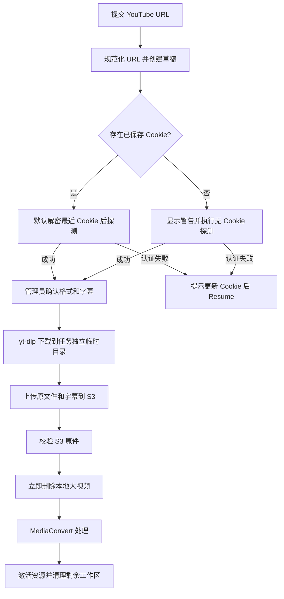

MVP 只接受规范化后的 YouTube 单视频 URL，显式拒绝播放列表。存在已保存 Cookie 时，探测和下载默认直接使用最新版本；不存在时允许无 Cookie 尝试，但提交界面必须警告某些视频可能失败。认证失败任务停留在可恢复检查点，管理员上传或替换 Cookie 后通过 Resume 继续，不重新创建 Media、Job 或重新上传已验证来源。

## 9. 字幕流水线

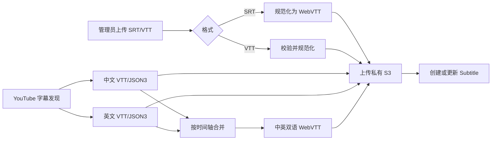

字幕处理规则：

- YouTube 默认优先人工字幕，缺失时才使用自动字幕。
- 中英文都存在时，保存中文、英文和中英双语三条轨道。
- 中文缺失但英文存在时，只发布英文字幕；不为满足轨道数量而生成伪中文字幕或机器翻译。
- 英文缺失但中文存在时，只发布中文字幕；因为双语合并缺少英文输入，不生成双语轨道。
- yt-dlp 没有发现可用字幕或字幕抓取失败时，视频仍可进入 ready，前端字幕菜单显示“暂无可用字幕”。
- 字幕语言代码与显示名称分离。
- 双语合并沿用 `ytdlp-tool` 的 JSON3 Cue 对齐思路，并重构为独立、可测试的项目模块。
- 同一媒体同一语言与轨道标识保持幂等更新。
- 字幕检查点保存状态、发现的语言、人工/自动来源、已发布 S3 Key和安全错误码；不得仅用一个布尔完成标记。
- S3 保存规范化后的 WebVTT；数据库保存精确 S3 Key，API 输出 CloudFront URL。
- 字幕上传、替换和删除继续使用现有 MediaCMS 交互；删除时同步安排对应 S3 对象清理。
- 字幕处理失败不使视频转码失败。视频可以进入 ready；有可恢复来源时界面显示字幕子任务失败并允许单独重试，否则显示暂无可用字幕。
- 手工上传的封面和缩略图直接进入 S3，并可覆盖 MediaConvert 自动生成的展示资源。

## 10. 进度模型与前端展示

每个任务向前端提供统一进度快照：

```json
{
  "status": "processing",
  "stage": "mediaconvert",
  "stage_label": "正在生成多清晰度视频",
  "stage_progress": 64,
  "overall_progress": 78,
  "processed_bytes": 0,
  "total_bytes": 0,
  "completed_items": 0,
  "total_items": 0,
  "message": "MediaConvert 正在处理 720p 输出",
  "can_pause": false,
  "can_cancel": true,
  "can_resume": false
}
```

进度数据来源固定如下：

| 阶段 | 权威进度来源 |
| --- | --- |
| 本地视频上传 | S3 `ListParts` 已确认字节数 / 文件总大小 |
| HLS ZIP 读取 | 浏览器已扫描字节数 / ZIP 大小，仅作即时显示 |
| HLS 文件上传 | S3 已确认对象字节数 / 文件清单总字节数 |
| YouTube 探测 | 明确步骤状态；无法计算百分比时显示不确定进度条 |
| yt-dlp 下载 | yt-dlp Progress Hook 的已下载字节 / 总字节 |
| 原文件上传 S3 | boto3 Transfer Callback 已传字节，并以 S3 校验结果收尾 |
| 字幕处理 | 已完成轨道数 / 计划轨道数 |
| MediaConvert | `GetJob` 的 `status/currentPhase/jobPercentComplete`；百分比缺失时显示不确定进度条 |
| 输出校验 | 已验证对象或检查项 / 预期总数 |
| 发布 | 已完成的原子发布步骤 / 发布步骤总数 |
| 本地清理 | 已清理资源项 / 待清理资源项 |

前端在上传页面、媒体草稿详情页和任务列表中显示同一进度组件。组件至少展示阶段名称、阶段进度条、总体进度条、字节或项目计数、最近更新时间、暂停/继续/取消/重试操作和安全错误信息。页面刷新后从 Django 恢复状态；活动任务可使用短轮询或现有可维护的推送机制更新，但数据库快照始终是状态权威来源。

总体进度使用版本化的阶段权重配置计算，并保证单次 Attempt 内单调不下降。从指定检查点重跑时创建新的 Attempt，界面明确重置该次尝试的进度，避免把旧尝试的百分比混入新执行。对于无法可靠计算百分比的步骤，界面显示不确定进度动画和真实阶段说明，不伪造数值。

## 11. MediaConvert 输出模板

### 11.1 视频输出

本地视频和 YouTube 原视频统一使用 Apple HLS 输出组：

| 输出 | 编码 | 质量 | 最大平均码率 |
| --- | --- | ---: | ---: |
| 1080p | H.264 QVBR / AAC-LC | QVBR 9 | 6 Mbps |
| 720p | H.264 QVBR / AAC-LC | QVBR 8 | 4 Mbps |
| 480p | H.264 QVBR / AAC-LC | QVBR 7 | 1 Mbps |

规则：

- 音频使用 AAC-LC、双声道、48 kHz、128 kbps。
- GOP 为 2 秒，HLS 分片目标长度为 6 秒。
- 帧率和像素宽高比从源文件继承。
- 只输出不大于源分辨率的档位，禁止放大。
- 源视频低于 480p 时，输出一个保持源分辨率的 HLS 档位。
- MediaConvert 从首个有效视频帧生成 `1280×720` Poster 和 `640×360` Thumbnail；不承诺固定在视频 10% 时间点。
- 输出宽高必须归一化为 H.264 可接受的正偶数；低于 480p 的特殊尺寸源不得直接使用奇数宽高创建输出。
- 图片生成失败时使用项目默认图片；视频 HLS 缺失必须判定任务失败。
- 导入的现有 HLS 不重新编码，只进行清单校验、图片生成和资源激活。

图片术语固定为：`poster` 是播放器加载前展示的 `1280×720` 视频封面；`thumbnail` 是媒体列表卡片使用的 `640×360` 缩略图。适配现有 Media 模型时，`external_poster_url` 映射 `poster`，历史命名的 `external_cover_url` 映射 `thumbnail`，新业务代码不得继续混用 `cover` 与 `poster`。

### 11.2 音频输出

- 支持浏览器直传单个音频文件，以及从 YouTube 选择音频来源。
- MediaConvert 生成仅含音频的 Apple HLS，使用 AAC-LC、双声道、48 kHz、128 kbps。
- 音频不创建视频清晰度档位；播放器不显示质量选择器。
- 展示图片按“管理员上传图片、来源图片、系统默认音频封面”的优先级选择。
- 音频和视频使用同一任务模型、检查点、S3 资源模型、签名 Cookie 和进度协议。

## 12. 版本化资源与原子激活

MediaConvert 和上传流程写入 `MediaAssetVersion` 对应的版本化前缀：

```text
media/{media_uuid}/versions/{attempt_uuid}/
├── original/source.ext
├── hls/master.m3u8
├── hls/master_1080p.m3u8
├── hls/master_720p.m3u8
├── hls/master_480p.m3u8
├── hls/*.ts
├── images/poster.jpg
├── images/thumbnail.jpg
└── subtitles/*.vtt
```

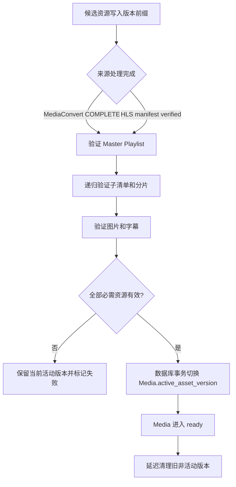

激活原则：

- `MediaAssetVersion` 聚合候选清单及全部 `MediaAsset`；`MediaAsset` 保存 S3 Key，不保存临时签名 URL。
- 重跑任务不覆盖当前可播放资源。
- 只有候选版本全部验证通过后，才在一个数据库事务中更新 `Media.active_asset_version`，把候选版本标为 active并把旧版本标为 retired。
- 数据库对每个 Media最多一个 active版本建立条件唯一约束；播放读取以 `Media.active_asset_version` 外键为准，不扫描 `status=active`。
- 迟到的旧 Attempt 结果不能覆盖新 Attempt；激活时必须比较任务版本。
- 激活失败时保留上一版在线；首次处理失败则 Media 保持草稿或失败状态。
- 旧版本延迟清理，避免正在播放的客户端在切换瞬间丢失分片。
- S3 生命周期规则清理过期 Multipart 和长期未引用的临时前缀；数据库任务仍负责精确清理。

## 13. CloudFront媒体授权

MediaCMS 页面域和 CloudFront 媒体域使用同一主域下的不同子域。CloudFront 配置两个行为，使签名 Cookie 由媒体域本身设置。授权不是“点击播放”时才启动：管理员登录后首次进入任何包含受保护媒体资源的页面，就必须完成 Cookie Bootstrap，确保媒体列表缩略图也可加载。

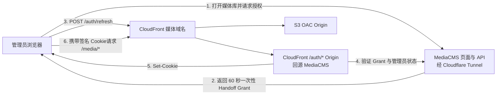

CloudFront 行为：

```text
/auth/*   -> MediaCMS/Cloudflare Tunnel Origin，不缓存
/media/*  -> 私有 S3 Origin，通过 OAC，只允许 GET/HEAD/OPTIONS
```

Cookie 安全属性：

- 使用 `CloudFront-Policy`、`CloudFront-Signature` 和 `CloudFront-Key-Pair-Id`。
- 有效期为 60 分钟，策略仅允许访问 `https://媒体域/media/*`。
- 使用 `Secure`、`HttpOnly`、`SameSite=Lax` 和 `Path=/`。
- 由媒体域 `/auth/refresh` 设置为 Host-only Cookie。
- CloudFront 缓存键不包含签名 Cookie。
- Handoff Grant 最多有效 60 秒、只能使用一次，并绑定唯一管理员会话版本。
- 签名私钥仅保存在 Django 服务端，不进入前端、日志或数据库明文字段。

前端使用单例 `MediaAuthorizationProvider` 管理授权：

- 登录后进入媒体库、媒体详情、播放列表等受保护页面时检查授权，并在需要时 Bootstrap。
- Django只向前端暴露非敏感的 `expires_at` 镜像值；前端不读取三项 HttpOnly签名 Cookie。
- Thumbnail、Poster或其他媒体图片遇到授权型 `403` 时触发一次全局刷新，并为失败图片增加 cache-busting重载。
- 播放器复用同一授权状态，在到期前续期，不重复建立独立 Cookie会话。
- 登出统一调用媒体域 `/auth/logout`。

## 14. 播放器行为

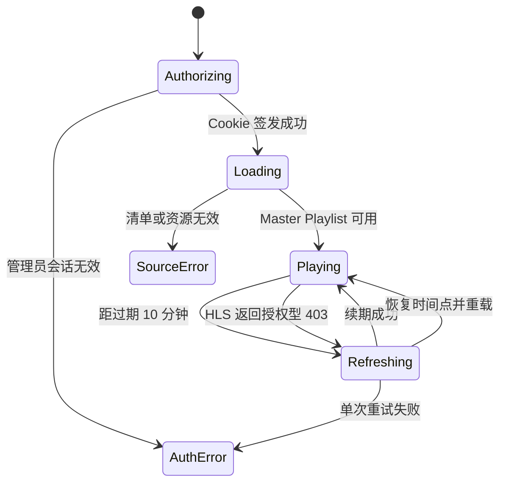

- 播放源只使用 CloudFront HLS，不回退到本地文件、S3 URL 或 MediaCMS 私有路径。
- HLS 请求启用跨域凭证，使浏览器携带签名 Cookie。
- 视频默认使用自适应码率 `Auto`，并通过 Video.js VHS `qualityLevels()` 展示实际存在的清晰度。
- 音频使用同一 HLS 授权流程，但不显示视频清晰度选择器。
- 保留播放速度、音量、全屏、画中画、键盘控制和字幕菜单。
- 播放期间在 Cookie 过期前 10 分钟自动续期。
- 遇到授权型 `403` 时只自动刷新一次 Cookie，重新加载 HLS 并恢复原播放时间。
- 登出时调用媒体域 `/auth/logout` 清除三项 CloudFront Cookie。
- Poster、Thumbnail 和 WebVTT 同样从 CloudFront `/media/*` 获取并受相同 Cookie 保护。
- 页面内图片和播放器共用一次授权刷新锁，避免多个并发 `403` 重复兑换 Handoff Grant。

## 15. 全局串行队列

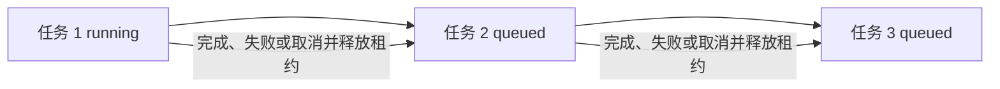

- 新任务允许创建草稿并完成浏览器直传，但进入处理链时必须排队。
- 本地文件和 HLS ZIP在 `source_verified` 前由 `MultipartUpload` 跟踪，Media保持 draft；验证成功后才把 Job置为 queued并参与 FIFO。YouTube URL提交后可直接进入 queued，由取得租约的 Job执行探测和下载。
- FIFO 顺序使用数据库提交时间和不可变任务 ID 确定；管理员可以取消等待任务。
- 数据库保存全局执行租约、持有任务、租约版本和过期时间。Worker 必须通过条件更新原子获取租约。
- Celery Worker 固定 `concurrency=1`，但数据库租约仍是防止重复 Worker、服务重启和运维误配置并发的最终保护。
- Worker 在安全检查点续租；租约过期后，恢复器验证原执行已停止，才允许下一任务接管。
- 排队不使用 Redis 队列长度作为权威状态；PostgreSQL 是顺序和状态真相来源。
- 前端显示排队位置、前序任务阶段、进入执行时间（如果可可靠估算）和取消按钮；无法可靠估算时不显示虚假 ETA。
- 一个任务释放执行租约前必须完成必要的取消确认和本地清理。可独立重试的非阻塞 S3 清理不会长期占用主执行租约。

媒体详情页按状态显示：

- `draft`：元数据可编辑，尚未提交来源。
- `queued`：显示排队位置和前序任务状态。
- `processing`：显示 Job的具体 stage及阶段/总体进度，不把 stage复制为 Media状态。
- `ready`：加载远端 HLS 播放器。
- `failed`：显示安全错误、失败阶段和可用恢复节点。
- Job的 `cleanup_status=failed`：Media仍保持 ready，同时提示临时资源清理正在重试。
- Job为 `canceled`：Media保持 draft或上一活动版本的 ready状态，并允许从有效来源检查点恢复或删除草稿。

## 16. 单管理员模式

保留 `User`、Media owner 和现有权限接口的内部兼容性，但只允许一个有效超级管理员。

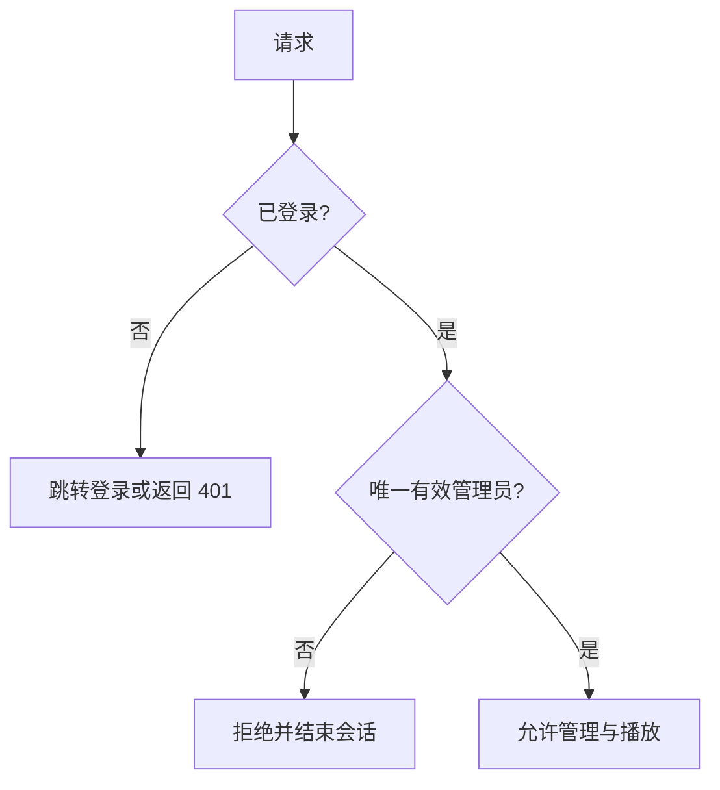

| 能力 | 处理方式 |
| --- | --- |
| 注册、邀请、社交登录 | URL/API 返回 404，前端不渲染入口 |
| 用户列表、用户主页 | 非必要路由关闭 |
| 频道、关注、订阅、通知 | 前端隐藏，写 API 禁用 |
| 评论和回复 | 路由关闭，媒体详情不加载 |
| 分享和 MediaPermission | 路由关闭，不显示分享控件 |
| 点赞、点踩、评分、举报 | 写 API 关闭，不显示统计控件 |
| RBAC、SAML、LTI、身份源 | 首期保留 App与迁移；禁用 URL、前端入口、写 API和信号副作用 |
| 播放列表 | 保留，作为唯一管理员的元数据管理能力 |
| 标签、分类、搜索、CRUD | 保持现有体验 |
| Django Admin | 仅唯一管理员访问 |

使用独立单例模型标识唯一管理员：

```text
SiteAdministrator
- singleton_key        # 固定为 default，主键或唯一
- user                 # OneToOne users.User
- created_at
- updated_at
```

安全边界由单例与认证策略共同实现，而不是声称普通 User表 `CHECK` 约束能够跨行限制用户数量：

- 自定义认证策略、页面中间件和 DRF Permission只允许 `SiteAdministrator.user` 登录和访问。
- 一次性管理命令在事务中锁定单例行、绑定超级管理员，并停用其他账户。
- 注册、创建用户 API以及 Django Admin中的 User新增、激活和提权操作关闭。
- 启动检查确保单例用户存在、有效且为超级管理员。
- 保留现有 User创建默认 Channel的信号与外键结构，避免破坏 Media和 Playlist兼容性。

首次部署通过一次性管理命令创建管理员；生产环境不提供公开创建用户能力。

### 16.1 保留 App、关闭能力

首期不得直接从 `INSTALLED_APPS` 删除 RBAC、LTI、SAML、identity_providers或 actions。现有 `files` 迁移依赖 LTI，User模型也直接依赖 RBAC和 MediaPermission。处理顺序固定为：

1. 保留 App、模型和 migrations，确保全新数据库可完整迁移。
2. 从顶层 URL关闭 LTI、SAML、用户列表、评论、分享和行为入口。
3. 通过统一单管理员 Feature Policy关闭相关 DRF写 API、Django Admin操作和前端控件。
4. 关闭这些模块会创建业务数据或外部副作用的信号/定时任务。
5. 完整依赖审计和数据迁移方案获批前，不删除 App或表。

## 17. Cookie、密钥与 IAM 安全

### 17.1 YouTube Cookie 生命周期

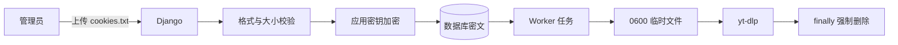

- Cookie 管理界面和 YouTube 导入表单必须显示“上一次上传时间”；可额外显示最近验证结果，但不显示 Cookie 内容。
- 从未上传 Cookie 时，表单显示明确警告：公开内容可能成功，登录、年龄或地区受限内容可能失败。
- 已存在 Cookie 时，新的 YouTube 探测与下载默认直接使用最近一次上传版本。
- 因缺少、过期或失效 Cookie 导致的任务进入 `youtube_auth_required`，界面提示上传或更新 Cookie，并提供 Resume。
- Cookie 更新后 Resume 从认证失败检查点继续，不重新创建媒体、逻辑任务，也不重复已完成且仍有效的检查点。
- 管理员可以替换或清除 Cookie；替换操作创建新加密版本并使后续 Attempt 使用新版本。
- Cookie 加密密钥由部署 Secret 提供，不与数据库密文存放在一起。
- Cookie 上传限制为 Netscape 格式、固定最大大小和允许字段。
- Worker 只在任务执行时将密文解密到权限 `0600` 的任务临时文件，并在 `finally` 中强制删除。

### 17.2 CloudFront 与应用密钥

- YouTube Cookie、CloudFront 私钥、AWS 凭证和一次性 Handoff Grant 不进入日志。
- CloudFront 私钥以只读 Secret 挂载，仅应用用户可读。
- AWS 优先使用实例或容器 IAM Role；开发环境访问密钥只能通过环境 Secret 注入。
- 所有错误响应和任务日志经过凭证、URL 查询参数和 Cookie 脱敏器。

### 17.3 IAM 最小权限

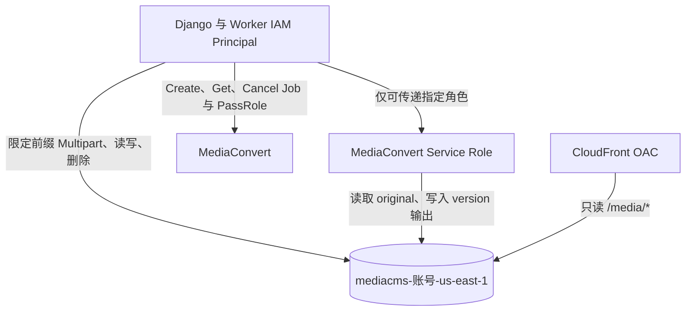

- Django/Worker 只能操作指定 Bucket 和约定前缀。
- `iam:PassRole` 只能传递唯一 MediaConvert Service Role，并限制 `iam:PassedToService`。
- MediaConvert Role 只能读取输入对象并写入项目媒体前缀。
- CloudFront OAC 只有对象读取权限；Bucket Policy 绑定具体 Distribution ARN。
- S3 禁止公开 ACL、公开 Policy 和非 HTTPS 请求。
- Multipart 初始化、签名和完成接口验证管理员、任务、对象 Key、大小、Content-Type 和会话状态。

## 18. 错误分类

| 错误类型 | 示例 | 默认处理 |
| --- | --- | --- |
| `validation_failed` | 文件类型、ZIP 路径、字幕格式错误 | 不重试，显示具体修正项 |
| `upload_interrupted` | 浏览器断网、Part 缺失 | 保留 Multipart，允许续传 |
| `youtube_auth_required` | 没有、过期或失效 Cookie | 提示录入或更新 Cookie 后 Resume |
| `youtube_unavailable` | 删除、私有或地区限制 | 不自动重试 |
| `source_download_failed` | yt-dlp 网络错误 | 有限退避重试，可人工恢复 |
| `source_verification_failed` | S3 大小或 Checksum 不符 | 回退到上传检查点 |
| `mediaconvert_failed` | AWS Job ERROR | 保存安全摘要，从转码节点重试 |
| `output_verification_failed` | Master 或分片缺失 | 不激活候选版本 |
| `subtitle_failed` | 单轨转换失败 | 视频可 ready，字幕单独重试 |
| `playback_authorization_failed` | 会话失效或签名失败 | 重新登录或检查密钥 |
| `cleanup_failed` | 临时文件或 S3 清理失败 | 媒体保持可用，后台重试 |
| `resource_limit` | 后端磁盘不足 | 保持排队，释放资源后继续 |

前端错误只显示可操作的安全描述和 Request ID；受保护的诊断信息仅保存在管理员日志中。

## 19. 重试、取消和恢复

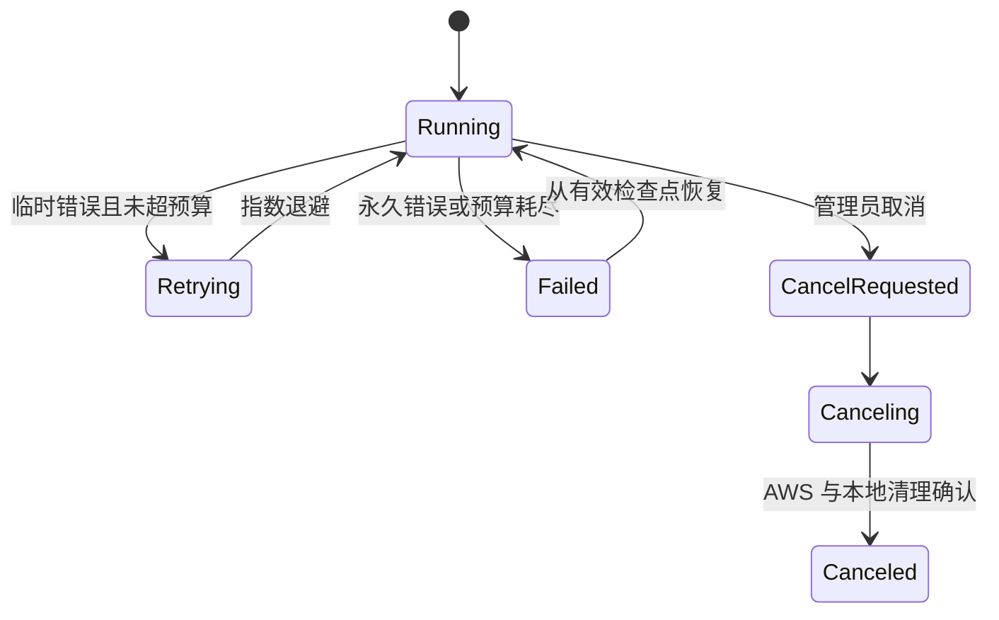

- 自动重试仅用于明确的临时错误，并设置次数上限和指数退避。
- 永久验证错误不自动重试。
- 取消意图首先写入 PostgreSQL，再由 Worker 在安全检查点执行。
- Multipart 取消调用 `AbortMultipartUpload`。
- MediaConvert 取消调用 `CancelJob`，等待终态后清理候选资源。
- 若取消与 MediaConvert 完成竞态，以数据库取消意图为准，不激活输出。
- 失败或进程重启后只根据重新验证的检查点恢复，不依赖本地临时文件。
- 所有恢复和指定节点重跑创建新 Attempt，并保留历史记录。
- MediaConvert返回 `CANCELED` 但本地没有取消意图时，按供应商异常失败处理，不能伪装成管理员取消。

## 20. 测试策略

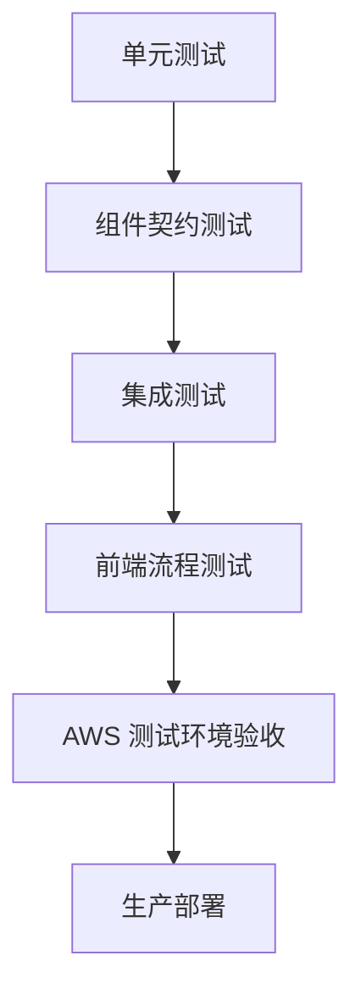

单元测试覆盖：

- 任务状态转换、全局租约、FIFO 排队和检查点回退。
- MediaConvert 视频档位选择、音频模板和禁止放大。
- YouTube URL 规范化、Cookie 版本选择与错误分类。
- SRT/WebVTT 规范化、中英双语 Cue 合并，以及中文字幕、英文字幕或全部字幕缺失的合法降级。
- HLS URI、路径、文件类型和引用闭包校验。
- S3 Key 生成、资源版本激活和旧 Attempt 防覆盖。
- `Media.state` 发布可见性与 `processing_status`、Job状态、cleanup状态互不覆盖，以及 `encoding_status` 兼容投影。
- MediaConvert `SUBMITTED/PROGRESSING/COMPLETE/CANCELED/ERROR`、`currentPhase`和空百分比映射。
- 总体进度权重、阶段进度和重跑后进度重置。
- 日志脱敏、Handoff Grant 和 CloudFront Cookie Policy。

组件契约测试使用 boto3 Stubber 或内存客户端验证：

- Multipart 初始化、ListParts、完成、取消和恢复。
- MediaConvert Probe/Create/Get/Cancel 请求结构。
- S3 对象校验、Checksum、资源提升与幂等删除。
- CloudFront Cookie 签名和授权边界。
- YouTube Cookie 加密、替换、清除及临时文件强制删除。

集成测试覆盖三条完整流程：

1. 本地视频或音频 → S3 → MediaConvert → 激活 → 播放契约。
2. 浏览器读取 HLS ZIP → 文件树直传 → 清单验证 → 激活。
3. YouTube → 可选 Cookie → yt-dlp → 可选字幕 → S3 → MediaConvert → 清理。

必须验证失败、取消、进程重启、租约过期、指定检查点 Resume，以及无字幕视频仍可正常发布。并发测试必须证明任何时刻最多只有一个 Job 进入执行状态。

前端测试覆盖：

- 上传、暂停、恢复、刷新页面续传和取消。
- HLS ZIP 扫描、文件进度和缺失引用提示。
- FIFO 排队位置、阶段进度、总体进度和不确定进度条。
- Cookie 上次上传日期、无 Cookie 警告、认证失败后的 Resume。
- 视频清晰度、音频播放、字幕切换、无字幕提示和授权续期。
- 登录后媒体 Cookie Bootstrap、列表 Thumbnail、Poster、WebVTT和 HLS，以及页面图片授权过期后的单次全局恢复。
- 禁用评论、分享、用户及其他多用户入口。
- 标签、分类、播放列表和媒体 CRUD 回归。

## 21. 部署拓扑

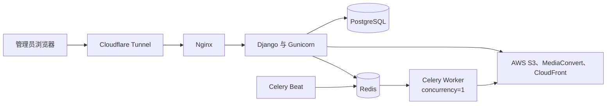

部署约束：

- Docker Compose 保留 Django、Nginx、PostgreSQL、Redis、Celery Worker 和 Beat。
- Worker 使用 `concurrency=1`；数据库全局租约仍是最终并发保护。
- Worker 临时目录使用独立 Volume，并配置容量、任务大小和磁盘余量阈值。
- 禁用现有本地视频转码队列、FFmpeg 编码、Bento4 HLS 和 Whisper 自动转写入口。
- 保留 ffprobe、字幕格式转换和受限单帧提取。
- Cloudflare Tunnel 只暴露页面/API及 CloudFront `/auth/*` 回源路径。
- Django、Worker 和 MediaConvert 使用独立最小权限身份。
- 所有 AWS、域名、Cookie、磁盘和队列参数通过环境配置管理。

### 21.1 AWS媒体与旧本地管线分流

仅设置 `DO_NOT_TRANSCODE_VIDEO=True` 不足以关闭当前本地管线：现有 `Media.post_save` 会调用 `media_init()`，随后仍可能读取本地 `media_file`、生成 Sprite或返回原始文件。新增 `storage_backend` 字段，首期值为 `aws`，并在创建时即写入；信号分流如下：

```mermaid
flowchart TD
    Save[Media post_save] --> Managed{storage_backend == aws?}
    Managed -->|是| Skip[跳过 legacy media_init 与通知副作用]
    Managed -->|否| Legacy{生产允许旧模式?}
    Legacy -->|否| Reject[拒绝创建本地媒体任务]
    Legacy -->|是，仅兼容测试| Init[旧 media_init]
```

- AWS草稿允许 `media_file` 为空，媒体类型由上传会话或探测结果写入。
- 生产配置拒绝 `storage_backend=local`；旧分支只可在明确兼容测试设置中启用。
- 旧 Encoding生成、`create_hls`、Sprite、Trim以及原始文件播放回退全部对 AWS媒体短路。
- 现有 `encoding_status` 由新的 processing状态投影服务维护，不再通过查询本地 Encoding行计算 AWS媒体状态。
- 删除 AWS媒体时不调用本地 FileField路径删除逻辑，而是创建幂等 S3清理任务。

## 22. CloudFormation

```mermaid
flowchart TD
    Stack[MediaCMS CloudFormation Stack]
    Stack --> Bucket[S3 Bucket<br/>mediacms-AccountId-us-east-1]
    Stack --> Lifecycle[S3 Lifecycle Rules]
    Stack --> MCRole[MediaConvert Service Role]
    Stack --> AppPolicy[应用 IAM Policy]
    Stack --> OAC[CloudFront OAC]
    Stack --> PublicKey[CloudFront Public Key]
    Stack --> KeyGroup[CloudFront Key Group]
    Stack --> Headers[CORS 与 Response Headers Policy]
    Stack --> Distribution[CloudFront Distribution]
    Stack --> BucketPolicy[S3 Bucket Policy]
```

模板参数包括：

- `MediaDomainName`
- `AcmCertificateArn`
- `ApplicationOriginDomain`
- `CloudFrontPublicKeyMaterial`
- Bucket 名称覆盖参数
- 允许的前端 Origin
- Multipart 过期天数
- 非活动资源保留天数

模板默认值：

```text
Bucket: mediacms-${AWS::AccountId}-us-east-1
Region: us-east-1
S3 public access: completely blocked
Incomplete multipart abort: 1 day
CloudFront /media/* methods: GET, HEAD, OPTIONS
CloudFront /auth/* cache: disabled
```

CloudFront 签名私钥不进入 CloudFormation 参数或 Output。模板只接收公钥材料；私钥由部署 Secret 单独管理。

## 23. 全新数据库上线

```mermaid
flowchart TD
    Backup[备份旧数据库和 media_files] --> Stop[停止旧写入和任务]
    Stop --> Fresh[创建全新 PostgreSQL Database]
    Fresh --> Migrate[执行 Django migrations]
    Migrate --> Init[加载项目默认初始化数据]
    Init --> Admin[创建唯一管理员]
    Admin --> Deploy[部署 AWS 模式代码]
    Deploy --> Smoke[执行上传、转码、播放 Smoke Test]
    Smoke --> Enable[正式启用]
```

- 不导入旧数据库中的用户、媒体、字幕、行为或元数据。
- 不迁移旧 `media_files/` 内容。
- 旧数据库和文件只做可恢复备份，并在验收期内保持只读。
- 首次创建管理员使用一次性管理命令或 Secret，不开放注册。
- 上线门禁要求视频、音频、HLS ZIP、YouTube/Cookie、无字幕降级、字幕切换、Cookie 续期和单任务队列全部通过。

## 24. 旧 AWS 资源清理

旧资源清理与新架构开发部署分离，只有新系统测试完成并经用户明确确认后执行：

```mermaid
flowchart TD
    Inventory[列出旧 Stack、Bucket、Distribution、IAM] --> Reference[检查 DNS、对象和策略引用]
    Reference --> Backup[保留必要配置与清单]
    Backup --> Disable[先禁用旧入口并观察]
    Disable --> Approve{用户确认删除?}
    Approve -->|否| Keep[保持停用但不删除]
    Approve -->|是| Delete[按依赖顺序删除]
    Delete --> Verify[确认无残留费用和权限]
```

清理前必须输出精确资源清单，包括 ARN、Bucket、Distribution ID、IAM Role、DNS 记录和可恢复性。删除顺序通常为 DNS/入口、Distribution、Bucket 对象和版本、Bucket、IAM Policy/Role、CloudFormation Stack。任何删除操作都需要单独授权，不由部署脚本自动触发。

## 25. 验收标准

- 前端体验保持现有 MediaCMS 风格，元数据 CRUD 完整。
- 单视频、单音频、HLS ZIP 和 YouTube 单视频均可形成 CloudFront HLS。
- 视频展示实际存在的清晰度。
- 来源具备中英文字幕时提供中文、英文和中英双语轨道；只有英文或中文时发布已有轨道；全部缺失时显示“暂无可用字幕”且视频仍可播放。
- 所有阶段显示真实、清晰、可恢复的进度。
- 任意时刻最多一个任务执行，其他任务按 FIFO 排队。
- 失败任务可从有效检查点 Resume。
- Media ready 后后端大文件及临时资源被清理。
- S3 不公开，未授权请求无法获取媒体。
- 签名 Cookie 可签发、续期、403 恢复和退出清除。
- 评论、分享和多用户入口不可用。
- RBAC、LTI、SAML、identity_providers和 actions的 App与迁移保持可安装，但公开入口、写操作及副作用被关闭。
- 本地视频转码链完全禁用。
- `Media.state` 继续管理发布可见性；AWS处理状态、Job执行状态、清理状态和 MediaConvert供应商状态各自独立且映射经过测试。
- 新数据库从空白 AWS 模式开始，不读取旧媒体数据。

## 26. 实施拆分与顺序

本设计是跨子系统的父规格，不应由一个不可审查的大提交一次实现。后续实施计划按以下可独立测试和评审的子项目拆分；相邻子项目通过本文定义的模型、状态和资源契约衔接：

1. **领域基础与单管理员模式：** Django 模型、迁移、状态机、全局租约、禁用多用户/社交入口和全新数据库初始化。
2. **AWS 基础设施与存储适配：** CloudFormation、S3 Key/Checksum、MediaConvert 客户端、CloudFront OAC 和本地 AWS 测试替身。
3. **浏览器直传与 HLS ZIP：** Multipart API、续传会话、浏览器流式 ZIP 读取、HLS 文件树上传、校验和统一进度组件。
4. **媒体处理编排：** 本地视频/音频任务、MediaConvert 模板、版本化资源、原子激活、取消、恢复和临时资源清理。
5. **YouTube 与字幕：** yt-dlp Provider、加密 Cookie 管理、中文/英文/双语字幕、无字幕降级和 Resume。
6. **CloudFront 播放：** Handoff Grant、签名 Cookie、Video.js 远端 HLS、质量选择、音频、字幕及授权续期。
7. **部署与验收：** Compose 资源限制、禁用本地转码、端到端测试、全新数据库切换和运维文档。

每个子项目使用独立实施计划、测试门禁和提交序列。旧 AWS 资源清理不属于上述开发子项目，必须在新系统全部验收后作为单独运维任务执行。
