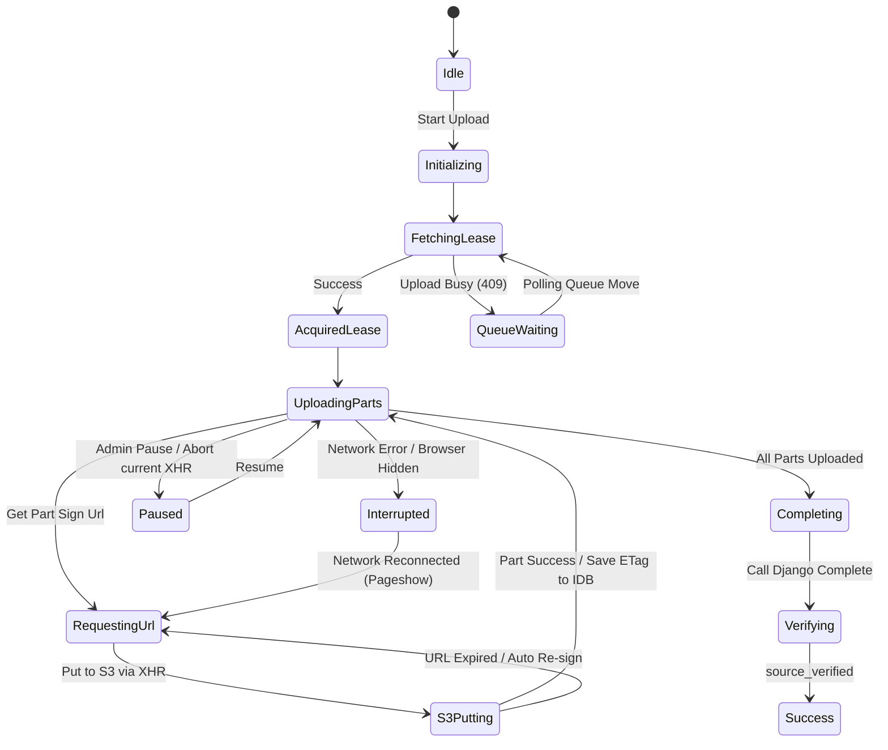

# MediaCMS AWS 后端整合：前端设计与后端配合方案

**日期：** 2026-08-01  
**状态：** 优化方案固化中  
**目标：** 实现前端 React 与 AWS 数据面、Django 控制面的无缝衔接，提供高可靠、低延迟、断点可续传的大文件/HLS ZIP 传输与授权播放体验。

---

## 1. 总体架构与系统边界

### 1.1 前后端职责划分
在 AWS 整合模式下，**MediaCMS 保持为唯一的控制面与业务源，AWS 基础设施作为唯一的数据面**。

*   **Django 控制面：** 负责租约发放、单管理员认证、短期预签名 URL 签发、分片上传对账、任务调度/FIFO 编排以及 CloudFront 签名 Cookie 发放。不承载媒体字节流。
*   **前端展示与传输面：** 负责本地媒体探测、ZIP 流式解包、直接分片 PUT 至 S3、IndexedDB 断点记忆、多标签页上传租约协调、CloudFront Cookie 自动Bootstrap 与 403 并发重试、以及播放进度的离线节流同步。

### 1.2 前端双构建沙箱设计
*   **主站运行时 (React 17)：** 包含 Header 任务图标、Sidebar、Add Media 四步向导、Task Center 及 Task Drawer，与现有 MediaCMS UI 保持 SCSS 主题和 DOM 结构一致。
*   **播放器运行时 (React 19)：** `frontend-tools/video-js` 维持独立构建，使用 Video.js 8 作为播放内核。
*   **集成桥接：** 两个构建**禁止跨 Root 导入任何组件、Hook 或 Context**。数据通过 DOM 节点的 `data-*` 属性传递（如 `media_id`、`active_version_id`、CloudFront M3U8 播放路径），进度同步直接由播放器内的 `PlaybackProgressClient` 异步调用 REST API，保持极致的沙箱化和类型安全。

---

## 2. 前后端配合接口契约 (API Contracts)

### 2.1 统一上传会话与租约 API
系统执行**严格单上传**和**严格 FIFO 串行处理**。

#### 1. 创建上传会话 (Session Create)
*   **请求：** `POST /api/multipart-upload/create/`
    *   **Body:**
        ```json
        {
          "file_name": "example.mp4",
          "file_size": 2147483648,
          "file_hash": "sha256_hash_here",
          "source_type": "video" // video | audio | zip | youtube
        }
        ```
*   **响应 (成功取得租约 - 201 Created)：**
    ```json
    {
      "job_id": "job_12345",
      "upload_id": "s3_upload_id_abcde",
      "s3_key": "uploads/job_12345/s3_upload_id_abcde/source.mp4",
      "lease_token": "lease_token_xyz",
      "part_size": 5242880, // 固定 5MB 分片
      "expires_at": "2026-08-01T12:30:00Z"
    }
    ```
*   **响应 (上传通道繁忙 - 409 Conflict)：**
    ```json
    {
      "error_code": "upload_busy",
      "safe_message": "Another upload is currently in progress. Your task has been added to the queue.",
      "upload_queue_position": 3
    }
    ```

#### 2. 上传租约心跳 (Lease Heartbeat)
前端必须每 10 秒发送一次心跳以维持租约。
*   **请求：** `POST /api/multipart-upload/{job_id}/lease-heartbeat/`
    *   **Headers:** `Authorization: Bearer <token>`
    *   **Body:** `{"lease_token": "lease_token_xyz"}`
*   **响应 (200 OK):** `{"status": "active", "expires_at": "2026-08-01T12:31:00Z"}`
*   **响应 (410 Gone - 租约已过期或被接管):** `{"error_code": "lease_lost", "allowed_actions": ["restart"]}`

#### 3. 分片 URL 预签名 (Sign Part)
*   **请求：** `POST /api/multipart-upload/{job_id}/sign-part/`
    *   **Body:** `{"part_number": 5, "lease_token": "lease_token_xyz"}`
*   **响应 (200 OK):**
    ```json
    {
      "part_number": 5,
      "upload_url": "https://s3.amazonaws.com/mediacms-bucket/uploads/...&X-Amz-Signature=..."
    }
    ```

#### 4. 上传完成与对账 (Complete & Verify)
*   **请求：** `POST /api/multipart-upload/{job_id}/complete/`
    *   **Headers:** `Idempotency-Key: <unique_uuid>`
    *   **Body:**
        ```json
        {
          "upload_id": "s3_upload_id_abcde",
          "parts": [
            { "part_number": 1, "etag": "etag_1" },
            { "part_number": 2, "etag": "etag_2" }
          ]
        }
        ```
*   **后端配合逻辑：**
    1. 后端调用 S3 `ListParts` 对账上报的 ETag 和 Part 完整性。
    2. 向 S3 提交 `CompleteMultipartUpload`。
    3. 调用 `HeadObject` 取得文件真实大小，确认与创建会话时登记的大小一致。
    4. 检验通过后，标记 `MediaIngestionJob` 状态为 `source_verified`，送入 FIFO 调度链，并释放前端上传租约。

### 2.2 任务中心统一投影 (TaskView API)
前端 Task Center 和 Task Drawer 不需要轮询复杂的后台多表关联，后端直接提供格式化好的 TaskView。
*   **接口：** `GET /api/task-center/projection/`
*   **响应 (200 OK)：**
    ```json
    {
      "tasks": [
        {
          "id": "job_12345",
          "media_id": "media_abc",
          "title": "Example Video",
          "source_type": "video",
          "display_status": "processing", // uploading | queued | processing | failed | ready
          "stage": "transcoding",          // uploading | verifying | probing | transcoding | publishing | cleanup
          "stage_label": "Transcoding into adaptive bitrate streams",
          "stage_progress": 68,            // 阶段百分比
          "overall_progress": 82,          // 总体百分比
          "processed_units": 4567890,      // bytes or files
          "total_units": 10000000,
          "unit_type": "bytes",            // bytes | files
          "transfer_speed": 18456000,      // bytes/sec
          "estimated_seconds_remaining": 45,
          "upload_queue_position": 0,
          "processing_queue_position": 0,
          "allowed_actions": ["cancel"]    // pause | resume | cancel | retry
        }
      ]
    }
    ```

### 2.3 播放器与播放进度同步 API
*   **获取活动资源契约：** `GET /api/media/{media_id}/active-assets/`
    *   **响应：**
        ```json
        {
          "media_id": "media_abc",
          "active_version_id": "version_999",
          "manifest_url": "https://media.mediacms.local/media/media_abc/version_999/master.m3u8",
          "poster_url": "https://media.mediacms.local/media/media_abc/version_999/poster.jpg",
          "subtitles": [
            { "language": "zh", "label": "Chinese", "src": "https://media.mediacms.local/media/media_abc/version_999/subtitles/zh.vtt" },
            { "language": "en", "label": "English", "src": "https://media.mediacms.local/media/media_abc/version_999/subtitles/en.vtt" }
          ]
        }
        ```
*   **断点续播同步 (Progress Sync)：** `POST /api/media/{media_id}/progress/`
    *   **Body:**
        ```json
        {
          "position_seconds": 345.6,
          "duration_seconds": 600.0,
          "completed": false,
          "playback_session_version": "session_timestamp_111"
        }
        ```
    *   **后端配合：** 使用唯一约束 `(administrator_id, media_id)`，拒绝携带过期 `playback_session_version` 的旧标签页覆盖新进度。

---

## 3. 前端 Service 与数据流设计

### 3.1 UploadEngine 核心状态机
`UploadEngine` 是一个独立的、纯 TypeScript 编写的传输组件。通过 XHR 传输提供高灵敏度的字节级反馈与 `abort()` 取消。



### 3.2 任务状态 Provider (React 17 TaskProvider)
*   **高频状态节流：** `UploadEngine` 的 `progress` 事件通过事件监听传出，`TaskProvider` 内部必须使用 `requestAnimationFrame`（或 150ms-250ms 的防抖节流）对进度通知进行批量化更新，再 `dispatch` 到 Context 状态中，**防止分片进度刷新把整个 Header 和 Sidebar 树渲染撑爆**。
*   **IndexedDB 数据同步：**
    *   **Key 结构：** `job_id` | `upload_id` | `file_fingerprint` | `parts_map`（记录每个 `PartNumber` 的已完成 ETag） | `hls_entries_map` (HLS 模式下的子文件 ETag) | `wizard_draft` (向导草稿)。
    *   **清理时机：** 任务成功、任务被主动删除/取消后，前端应立刻主动清除该 `job_id` 对应的 IndexedDB 条目。

---

## 4. 关键边缘场景的防御性设计 (Edge Cases)

### 4.1 HLS ZIP 流式解包的分片高频 PUT 缓冲
*   **问题：** 浏览器解压 HLS 目录树后可能包含数千个几百 KB 的小 TS 分片，对每个小分片都请求 Django 的 `sign-part` 接口，会导致后端 Django 的并发承受极高压力。
*   **优化设计：**
    1. **前端分流机制：** 小于 5MB 的非 Multipart 文件直接请求 Django 单步预签名（`PUT` URL 签名），大文件才走 Multipart。
    2. **并发数控制（Concurrency Limit）：** 限制前端并发上传数在 **3 个** 对象，利用轻量级 Async Queue 控制，防止在前端建立几百个并发 XHR 导致浏览器或 Django 请求崩溃。

### 4.2 CloudFront 签名 Cookie 的跨域 CORS 与 SameSite
*   **同源/同父域要求：** CloudFront（如 `media.mediacms.local`）与 Django 控制面（如 `api.mediacms.local`）必须处于相同的父域名下（如 `.mediacms.local`）。
*   **同源 Cookie 参数：** Django 写入的 Cookie 必须包含：`Domain=.mediacms.local; Path=/media/; Secure; HttpOnly; SameSite=Lax`。
*   **前端 CORS 凭据携带：**
    *   所有媒体资源，包括 Video.js HLS M3U8/TS 请求、WebVTT 字幕请求和海报图片 `` 标签，必须声明凭据属性。
    *   视频播放：Video.js 中配置 `withCredentials: true`。
    *   海报图与字幕：
        ```html
        <video crossorigin="use-credentials">
          <track kind="subtitles" src="..." label="..." default crossorigin="use-credentials" />
        </video>
        ```

### 4.3 已下架（Retired）版本的安全宽限期
*   **问题：** 替换封面、修改字幕、重转码等均会创建并原子激活新的 `MediaAssetVersion`。由于 URL 绑定了 `asset_version_id`，当前正在看旧版本视频的用户（已打开 M3U8）在拉取后续分片（TS）时，如果后端立刻删除了旧的 S3 物理对象，播放会瞬间断掉。
*   **优化设计：**
    *   **后端宽限期保留：** 被替换（Retired）的资源版本并不立即从 S3 删除。
    *   **生命周期/定时任务清理：** 后端数据库维护 `retired_at`，并在其上设定最少 **2小时 的宽限期**，超过 2 小时后，后端的异步 Janitor 任务再将其对应的 S3 物理对象安全删除。这能覆盖签名 Cookie 有效期（60分钟）和常规视频播放会话。

### 4.4 移动浏览器后台、锁屏与 Hidden 行为防御
*   **问题：** 移动端（iOS Safari/Android Chrome）在切入后台或锁屏时，XHR 连接会被系统挂起或直接杀掉。
*   **优化设计：**
    1. **事件捕获：** 前端监听 `visibilitychange`、`pagehide` 和 `pageshow` 事件。
    2. **主动挂起：** 在 `document.visibilityState === 'hidden'` 时，`UploadEngine` 主动 `abort()` 当前正在传输的 Part，并进入 `Interrupted` 状态，不让错误的“超时重试”损耗资源。
    3. **自动对账对齐：** 在 `pageshow` 重新进入 visible 状态后，自动向 Django 发起对账查询，获取当前 S3 端的真实 ETag 清单，并重新申请 `lease_token`，自动无感恢复。

---

## 5. 实施路线图 (Implementation Roadmap)

1.  **阶段一：双构建沙箱环境准备 (前端 17/19 对齐)**
    *   配置主站 Webpack 支持 HLS `@zip.js/zip.js` 和 `idb` 的按需动态加载。
    *   独立挂载 React 19 播放器组件。
2.  **阶段二：控制面与配合 API 搭建**
    *   开发 `SiteAdministrator` 控制，禁用冲突 App。
    *   编写上传租约接口、心跳接口、分片预签名和 TaskView 投影视图。
3.  **阶段三：直传与向导联调 (E2E 直连 S3)**
    *   联调 UploadEngine，测试断开网络、刷新页面、重选同一文件后续传。
    *   测试 HLS ZIP 浏览器本地扫描、流式解包和高并发 S3 传输。
4.  **阶段四：CloudFront 签名 Cookie Bootstrap 与续期测试**
    *   测试多站点同父域 Cookie 写入，验证 403 发生时合并 Promise 续期，防止请求风暴。
5.  **阶段五：资源受限生产部署与资源释放监控**
    *   根据 Gunicorn 1 worker, Celery concurrency=1 的预算配置，观察在单管理员上传和转码峰值时内存与存储的下降、清理情况。
