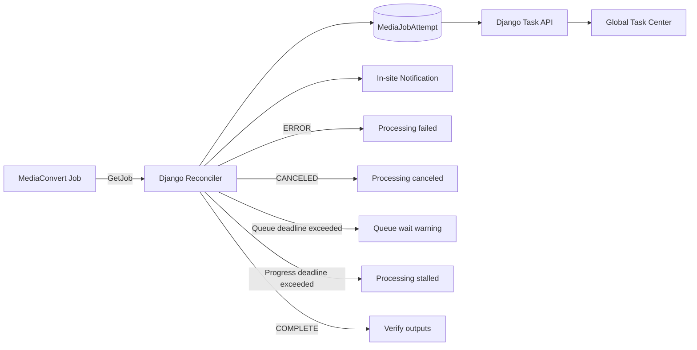

# MediaConvert API Polling and AWS Cost Minimization Design

## 1. Decision

MediaCMS will not provision an AWS-side alerting or monitoring service for the MVP. Django is the control plane and uses the MediaConvert `GetJob` API to reconcile the only active processing job. It persists provider state, progress, errors and warnings, then exposes them through the existing task API, global task center and in-site notifications.

The CloudFormation Stack must not create SNS topics or subscriptions, CloudWatch alarms, CloudWatch dashboards, custom CloudWatch metrics, EventBridge rules, SQS queues or monitoring Lambdas. The Runtime User must not receive `cloudwatch:PutMetricData` permission.

MediaConvert can continue publishing AWS-managed metrics automatically. MediaCMS does not create resources that consume those metrics.

## 2. Status and notification flow

Only the globally leased active job is reconciled. Historical jobs are read from PostgreSQL and never polled again after reaching a terminal provider state.

The provider state projection is:

| MediaConvert state | Application behavior |
|---|---|
| `SUBMITTED` | Persist queue state and continue polling. |
| `PROGRESSING` | Persist phase and real `jobPercentComplete` when present. |
| `COMPLETE` | Stop provider polling and execute output verification and activation checkpoints. |
| `ERROR` | Persist a sanitized provider error, mark the attempt failed and create an in-site notification. |
| `CANCELED` | Persist the terminal state, continue scoped cleanup and create an in-site notification when cancellation was not requested locally. |

Unknown provider states are stored as reconciliation evidence and treated as retryable integration errors. They must not be silently projected to success or failure.

## 3. Adaptive polling and abnormal-state rules

The reconciler uses one durable schedule for the active attempt:

- Poll every 10 seconds after submission or after observable progress.
- Back off to 30 seconds after two unchanged successful responses.
- Back off to at most 60 seconds after five unchanged successful responses.
- Reset to 10 seconds whenever state, phase or real percentage changes.
- On throttling, timeout or transient AWS failure, use bounded exponential backoff with jitter; keep the last known provider state and do not mark the job failed.
- Stop polling immediately after `COMPLETE`, `ERROR` or `CANCELED`.

Default abnormal-state deadlines are configuration values, not state-machine constants:

- `SUBMITTED` without entering `PROGRESSING`: warning after 30 minutes.
- `PROGRESSING` without state, phase or percentage change: warning after 30 minutes.
- Total MediaConvert processing deadline: fail as timed out after 6 hours, then request cancellation and reconcile to a provider terminal state.

Warnings are deduplicated by attempt, warning kind and threshold crossing. Repeated polls update evidence but do not create repeated notifications. A later progress change resolves the stalled warning while preserving its history.

The browser continues polling only the Django task API. It never receives AWS credentials and never calls MediaConvert directly.

## 4. Error and quality reporting boundary

The MVP records MediaConvert API status, error code/message, phase, percentage and safe `Messages.Warning` values returned by `GetJob`. Sensitive input paths, signed URLs, cookies and credentials are removed before persistence or display.

`BlackVideoDetected` and `VideoPaddingInserted` are completion metrics rather than reliable `GetJob` state fields. With CloudWatch alarms, metric reads and EventBridge intentionally removed, MediaCMS will not claim automatic black-frame or padding detection in the MVP. Output existence, manifest integrity, duration and rendition validation remain mandatory before activation.

## 5. Removed AWS resources and permissions

The core template removes:

- `AlarmNotificationEmail`.
- SNS alert topic and email subscription.
- All CloudWatch alarms and the custom dashboard.
- `cloudwatch:PutMetricData` from the Runtime User.
- The `MediaCMS/Processing` custom metric namespace contract.

Deployment validation must assert that no `AWS::SNS::*`, `AWS::CloudWatch::*`, `AWS::Events::*`, `AWS::SQS::*` or monitoring `AWS::Lambda::*` resource exists.

## 6. Storage cost policy

S3 bucket versioning is disabled for the MVP. Media objects already use immutable, attempt-specific keys and `MediaAssetVersion` provides application-level activation and retirement. Enabling S3 Versioning would retain complete noncurrent copies of large media objects and duplicate storage cost without serving the selected recovery model.

The bucket retains:

- private access, AES-256 server-side encryption and Block Public Access;
- one-day abort of incomplete multipart uploads;
- explicit application cleanup of completed upload sources, retired candidates and failed-attempt objects;
- `DeletionPolicy` and `UpdateReplacePolicy` retention so Stack operations cannot casually destroy the bucket.

Automatic age-based deletion of active media is forbidden. Cleanup acts on exact attempt/version prefixes only after database evidence proves they are inactive.

## 7. Retained AWS resources and cost justification

| Resource | Decision | Requirement served |
|---|---|---|
| Private S3 bucket | Keep | Multipart ingestion and durable media assets. |
| CloudFront distribution, OAC and Key Group | Keep | Private HLS, poster, thumbnail and subtitle delivery with signed cookies. |
| MediaConvert templates and service role | Keep | Video/audio HLS conversion and frame capture. Templates and IAM themselves do not run jobs. |
| Runtime IAM User with A/B keys | Keep | External non-EC2 production host requires AWS API access and controlled rotation. |
| One Secrets Manager secret | Keep | CloudFormation must securely retain the generated active AccessKey secret for administrator extraction; secret values cannot be Stack outputs. |
| Optional ACM certificate Stack | Keep undeployed | Created only after a real custom media domain and Cloudflare DNS approval exist. |

The MVP does not enable accelerated transcoding, Automated ABR, CloudWatch Logs ingestion, CloudTrail S3 data events, S3 Intelligent-Tiering monitoring, provisioned MediaConvert queues or additional notification transports.

## 8. Testing and acceptance

Tests must prove:

- CloudFormation contains none of the removed monitoring resources or parameters.
- Runtime IAM cannot call `cloudwatch:PutMetricData`.
- S3 Versioning is absent while multipart cleanup and retention policies remain.
- `GetJob` state mapping covers all five provider states and an unknown state.
- adaptive polling backs off, resets on progress and stops at terminal states;
- transient AWS errors retry without producing false failures;
- queue, stall and total deadlines create one deduplicated in-site notification;
- terminal errors are sanitized and visible in task history;
- output validation still blocks activation of incomplete HLS/assets;
- deployment capability checks cover S3 and MediaConvert only, not CloudWatch custom metrics.

## 9. Documentation migration

The modular AWS infrastructure, processing, deployment and test documents must remove CloudWatch/SNS alert promises and replace them with this API reconciliation contract. The active AWS infrastructure implementation plan must replace its monitoring task with a cost-minimization removal task before implementation resumes.
