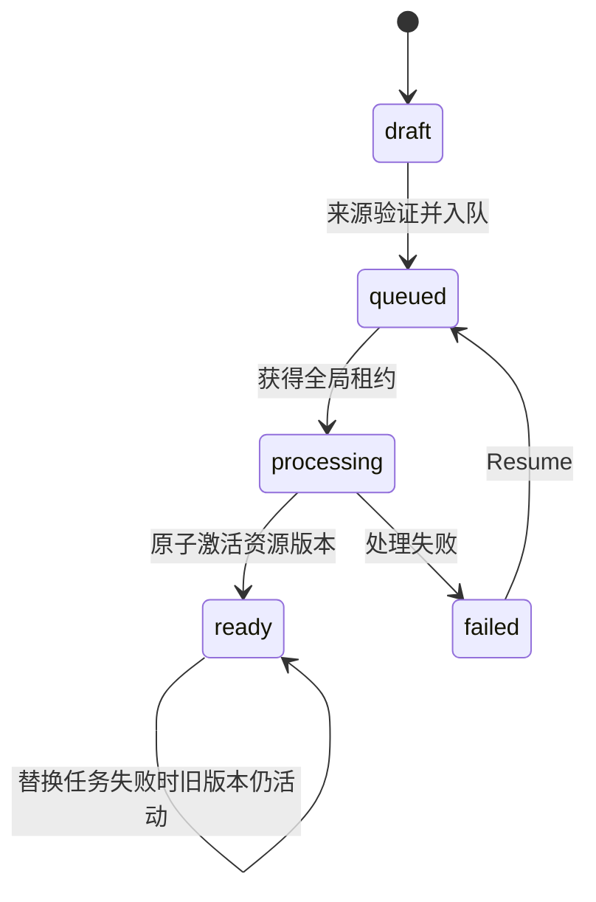
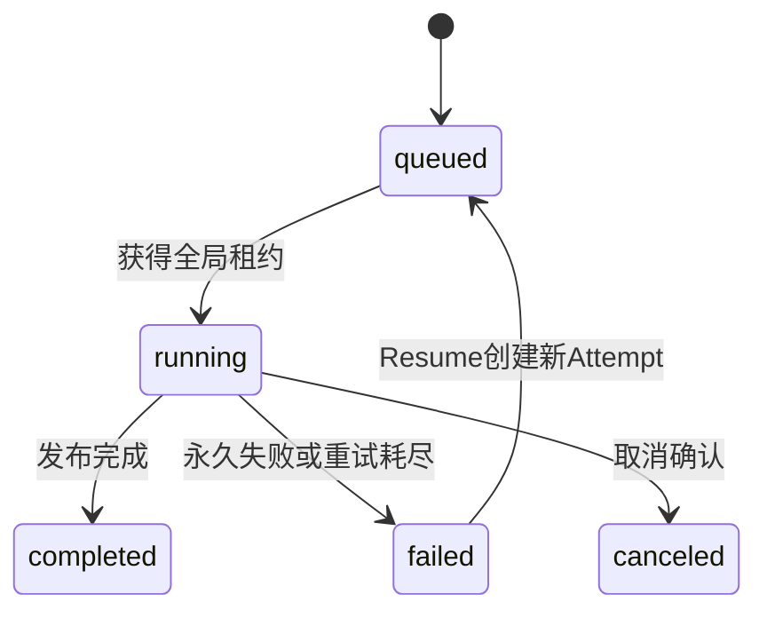

# 01. 领域模型与单管理员

## 1. 范围

本模块权威定义 Media、Job、Attempt 的状态边界、单管理员约束和现有 MediaCMS App 的兼容方式。上传、AWS 输出和播放授权由其他模块定义。

## 2. 状态必须分离

### 2.1 Media

- 现有 `Media.state` 继续表示 `private/public/unlisted`，不得复用为处理状态。
- 新增 `processing_status=draft/queued/processing/ready/failed`。
- 现有 `encoding_status` 暂作兼容投影：`draft/queued → pending`、`processing → running`、`ready → success`、`failed → fail`。
- 管理员提交来源时立即创建草稿，并可在处理期间修改标题、描述、标签、分类和可见性。
- 自动探测只补充未人工确认的字段，不得覆盖管理员已修改字段。



### 2.2 Job、Attempt 与 Cleanup

- `MediaIngestionJob.status=queued/running/failed/canceled/completed`，表示一次逻辑导入。
- Resume 在同一 Job 下创建新的 `MediaJobAttempt`，不创建重复 Media。
- Attempt 保存 Celery ID、MediaConvert Job ID、供应商状态、检查点证据和诊断错误。
- `cleanup_status=pending/running/failed/completed` 独立保存。资源已激活后清理失败不能把 Media 从 `ready` 回退。



`completed` 仅表示 Job 流程终结；Media 的业务含义仍由 `processing_status` 和活动资源版本决定。

## 3. 建议字段与约束

`MediaIngestionJob` 至少包含：`id`、`media_id`、`source_type`、`status`、`stage`、`progress`、`cancel_requested`、`cleanup_status`、`source_metadata`、`safe_error`、创建/更新时间。

`MediaJobAttempt` 至少包含：`id`、`job_id`、递增 `sequence`、`status`、`celery_task_id`、`mediaconvert_job_id`、`provider_status`、`provider_phase`、可空 `provider_percent_complete`、`checkpoint_evidence`、`diagnostic_error` 和时间戳。数据库唯一约束 `(job_id, sequence)`。

安全错误供前端展示；诊断错误仅管理员日志可见，不得泄露 Cookie、签名 URL、密钥或完整 AWS 响应。

## 4. 单管理员可实现机制

普通 CHECK 约束不能跨行保证全表只有一个管理员，因此新增单例表：

```text
SiteAdministrator
- singleton_key: 固定唯一值 "default"
- user: OneToOne(User)
- created_at / updated_at
```

- 首次初始化命令在事务中创建或绑定管理员，并禁用其他已有用户；全新数据库正常只有一个用户。
- 登录后 Auth Backend、中间件和 DRF Permission 都必须验证当前 User 等于 `SiteAdministrator.user` 且有效。
- 禁用注册、邀请、用户创建/启用 API 和 Django Admin 用户管理入口。
- 不修改 Django `User` 核心字段语义，也不依赖“第一个 superuser”推断管理员。
- 数据库备份恢复后若单例缺失或指向无效用户，应用进入维护状态，只允许修复命令运行。

## 5. 保留 App，关闭能力

RBAC、LTI、SAML、`identity_providers`、`actions` 等与 User、Category、迁移图、ContentType 或外键有关。MVP 保留其 `INSTALLED_APPS`、迁移和必要模型，但：

- 不挂载面向用户的 URL；移除导航和前端入口。
- 写 API 返回 `403 feature_disabled`，读 API 仅在核心页面确有依赖时开放。
- 关闭注册、频道/关注、评论、分享、评分、点赞、用户通知等信号副作用。
- 创建唯一管理员时只保留核心必需的默认对象。
- 完成完整依赖审计和迁移替代方案前，不删除 App、表或 ContentType。

## 6. 与现有 MediaCMS 的接入点

- `files.models.Media` 保留 owner、state 和现有列表契约。
- AWS 来源设置 `storage_backend=aws`；旧 `post_save → media_init → local ffmpeg/HLS` 路径必须显式短路。
- `DO_NOT_TRANSCODE_VIDEO` 不能作为唯一保护，因为旧信号和辅助任务仍可能触发本地处理。
- 生产 AWS 模式拒绝创建 legacy-local 导入；删除 AWS Media 时创建对象清理任务，不调用本地文件删除假设。

## 7. 元数据修订与字段来源

任务运行期间允许管理员编辑 Media，因此普通元数据写入使用乐观并发：

- `Media.revision` 只在标题、描述、标签、分类、可见性等业务元数据改变时递增。
- PATCH 请求携带 `If-Match`；过期 revision 返回 `409 media_revision_conflict` 和最新字段。
- 新增可查询的字段来源记录，至少区分 `admin/file_probe/youtube/default`。
- 管理员写入后来源改为 `admin`；自动探测只能补充空字段或覆盖仍属于同一自动来源的字段。
- 标签和分类按集合比较，不因顺序变化制造冲突。
- Job状态、播放进度和资源激活不递增元数据 revision；封面和字幕通过资源版本事务处理。

## 8. 异步删除状态

`Media.deletion_status=none/pending/deleting/failed/completed` 与 processing/publish状态分离。

- 删除请求携带 Media revision，首次返回 `202 Accepted`。
- 删除草稿先取消关联任务；删除 ready Media 立即撤销列表与播放入口，再异步删除活动、候选和暂存对象。
- 关闭页面不等于取消；取消上传、取消处理与删除 Media 是三个不同操作。
- 删除失败时 Media 继续不可见，任务中心提供 `retry_cleanup`。
- Job、Attempt、标题快照和诊断长期保留；审计关系使用可空外键或快照，不能随 Media 级联删除。
- 所有对象清理只使用数据库登记的精确 Key；普通删除不依赖 CloudFront invalidation。

## 9. 验收

- 状态枚举互不混用，Media ready 后 cleanup failed 仍可播放。
- 替换任务失败时活动版本和列表可见性保持不变。
- 第二个有效管理员无法登录或调用 API。
- 全新迁移图可执行，保留 App 不暴露已禁用功能。
- AWS 导入不会触发旧的本地转码、精灵图、trim 或本地播放回退。
- 并发编辑产生可处理的 revision 冲突，后台自动结果不覆盖管理员字段。
- 取消、删除和清理失败状态互不混用，删除 Media 后审计历史仍存在。
