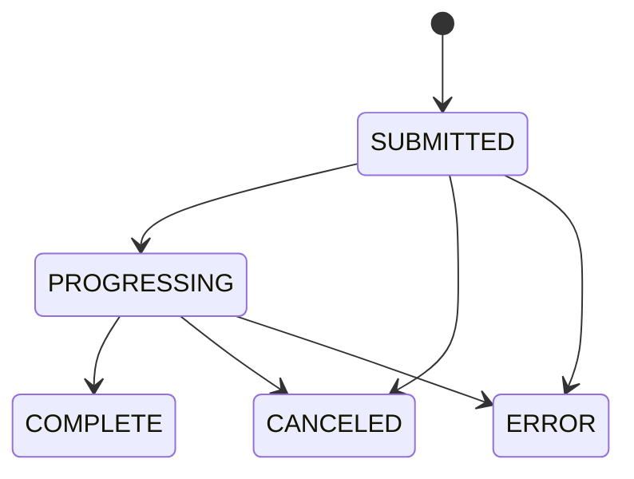

# 02. AWS 基础设施与存储

## 1. 范围

本模块权威定义独立 AWS 资源、S3 Key、IAM、MediaConvert 输出与资源版本。任务何时调用这些能力见 `04`，播放授权见 `06`。

## 2. 资源与命名

- 区域固定为 `us-east-1`。
- S3 Bucket 默认物理名：`mediacms-${AWS::AccountId}-us-east-1`；参数可覆盖，但部署前必须验证全球唯一。
- 新建私有 S3、MediaConvert Service Role、应用 IAM Role/Policy、CloudFront Distribution、OAC、Key Group 和签名公钥。
- S3 启用 Block Public Access、默认加密、Multipart 生命周期清理和最小 CORS。
- CloudFront 仅通过 OAC 读 S3；S3 不提供公共 URL。
- CloudFormation 输出 Bucket、Distribution ID/Domain、Key Pair ID、MediaConvert Role ARN 和应用所需配置。

建议 Key：

```text
uploads/{job_id}/{upload_id}/...
originals/{media_id}/{attempt_id}/source.ext
candidates/{media_id}/{attempt_id}/hls/...
candidates/{media_id}/{attempt_id}/images/...
candidates/{media_id}/{attempt_id}/subtitles/...
```

数据库保存精确 Key，不扫描 Bucket 推断业务资源，也不保存临时预签名 URL。

## 3. IAM 最小权限

应用角色只允许：

- 对限定前缀发起、列出、完成和中止 Multipart；Head/Get/Put/Delete 必须限定到业务 Key。
- 创建、查询和取消属于本应用的 MediaConvert Job，并仅能 `iam:PassRole` 给指定服务角色。
- 读取 CloudFront 签名配置所需的非秘密标识；私钥由应用秘密存储提供。

MediaConvert 服务角色只允许读取 `originals/` 或明确输入 Key，并写当前 Attempt 的 `candidates/` 前缀。浏览器预签名请求限制 Key、方法、Content-Type、过期时间和可验证的大小/校验信息。

## 4. MediaConvert 状态整合

核心 API Job 状态保存为：`SUBMITTED/PROGRESSING/COMPLETE/CANCELED/ERROR`。`PROGRESSING` 时可保存 `currentPhase=PROBING/TRANSCODING/UPLOADING` 和可空百分比。



- MVP 每 10–15 秒调用 `GetJob`；不使用 EventBridge。
- `INPUT_INFORMATION`、`STATUS_UPDATE`、`NEW_WARNING`、`QUEUE_HOP` 是 EventBridge 事件类型，不能写入 `provider_status`。
- `COMPLETE` 只表示输出已写到 S3；之后仍必须验证清单、对象和校验数据，再原子激活。
- `ERROR/CANCELED` 映射到 Attempt 结果，不直接改写 Media 可见性。

官方语义以 AWS 文档为准：

- [Job 进度与阶段](https://docs.aws.amazon.com/mediaconvert/latest/ug/how-mediaconvert-jobs-progress.html)
- [GetJob API](https://docs.aws.amazon.com/mediaconvert/latest/apireference/jobs-id.html)
- [EventBridge 事件列表](https://docs.aws.amazon.com/mediaconvert/latest/ug/mediaconvert_event_list.html)

## 5. 输出模板

### 5.1 视频

- 输出自适应 HLS master、各清晰度 variant、音频 rendition、首个有效视频帧封面和缩略图。
- 预设清晰度按源分辨率裁剪，不放大低分辨率源；所有输出宽高规范为偶数。
- 编码参数、segment 时长和码率形成版本化模板；Job/Attempt 记录模板版本。
- 输出进入候选前缀，验证完成前不进入活动播放路径。

### 5.2 音频

- 单个音频文件由 MediaConvert 输出私有音频 HLS。
- 封面优先级：管理员上传 → 来源图片 → 系统默认音频封面。
- 不伪造视频分辨率；播放器使用音频模式。

### 5.3 HLS 导入的缩略图

HLS 文件树跳过完整转码。优先使用来源封面；否则后端通过 boto3 读取清单和生成首个有效帧所需的最少分片到受限临时目录，再用 FFmpeg 截取单帧。也可为单个对象签发短期预签名 S3 URL，但不得假设相对分片会自动继承鉴权。加密 HLS（`EXT-X-KEY`）或 DRM 在 MVP 中拒绝。

## 6. 版本化资源

```text
MediaAssetVersion
- id, media_id, attempt_id
- status: candidate | active | retired
- manifest_key
- activated_at, retired_at

MediaAsset
- id, version_id
- kind, s3_key, content_type, size, checksum
```

- `Media.active_asset_version` 是唯一播放指针。
- 每个 Attempt 构建完整 candidate；清单、variant、分片、字幕、poster、缩略图逐项登记并校验。
- 数据库事务内锁定 Media，确认 candidate 完整，将旧 active 标为 retired、candidate 标为 active，并一次更新外键。
- S3 对象本身不依赖逐个移动来实现发布；失败 candidate 可延迟清理。
- 替换过程中旧 active 始终可服务，缓存和 Cookie 不指向 candidate 前缀。

## 7. 验收

- Bucket 无公共读取，CloudFront OAC 可读取活动资源。
- 应用和 MediaConvert 越权访问其他前缀失败。
- MediaConvert COMPLETE 后缺少任一必需对象不会激活版本。
- 低分辨率源不被放大，尺寸均为偶数；音频得到可播放 HLS 和封面。
- HLS 加密输入被安全拒绝，单帧回退只下载最少对象并清理临时文件。
