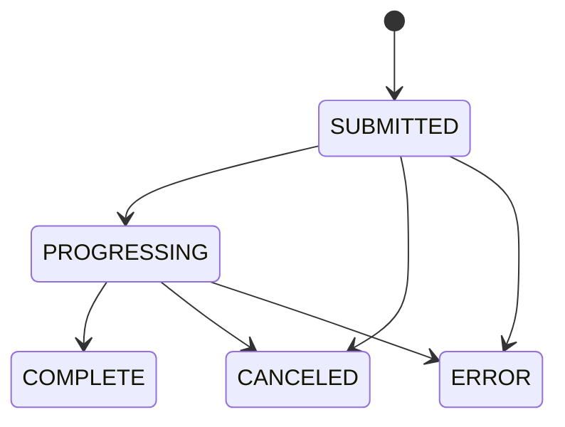

# 02. AWS 基础设施与存储

## 1. 范围

本模块权威定义独立 AWS 资源、S3 Key、IAM、MediaConvert 输出与资源版本。任务何时调用这些能力见 `04`，播放授权见 `06`。

## 2. 资源与命名

- 区域固定为 `us-east-1`。
- S3 Bucket 默认物理名：`mediacms-${AWS::AccountId}-us-east-1`；参数可覆盖，但部署前必须验证全球唯一。
- 新建私有 S3、MediaConvert Service Role、应用 IAM Runtime User/Policy、版本化 Job Template、CloudWatch 告警、CloudFront Distribution、OAC、Key Group 和签名公钥。
- S3 启用 Block Public Access、默认加密、Multipart 生命周期清理和最小 CORS。
- CloudFront 仅通过 OAC 读 S3；S3 不提供公共 URL。
- CloudFormation 输出 Bucket、Distribution ID/Domain、Key Pair ID、MediaConvert Role ARN 和应用所需配置。

建议 Key：

```text
uploads/{job_id}/{upload_id}/...
originals/{media_id}/{attempt_id}/source.ext
candidates/{media_id}/{attempt_id}/hls/...
candidates/{media_id}/{attempt_id}/images/...
candidates/{media_id}/{attempt_id}/subtitles/...
```

数据库保存精确 Key，不扫描 Bucket 推断业务资源，也不保存临时预签名 URL。

## 3. IAM 最小权限

### 3.1 生产运行时身份

生产服务器位于 AWS 外部的荧光云。MVP 采用与参考项目一致的独立 IAM Runtime User 模式，不引入 IAM Roles Anywhere：

- CloudFormation 创建无控制台密码的专用 IAM User、AccessKey、最小权限 Policy 和 Secrets Manager Secret。
- Secret 以 JSON 保存 `AWS_ACCESS_KEY_ID` 与 `AWS_SECRET_ACCESS_KEY`；Stack Outputs 只输出 Secret ARN 和非秘密资源标识，禁止输出密钥值。
- 管理员使用本地 AWS CLI `default` profile 读取 Secret，并写入生产机 `/etc/mediacms/secrets/aws-runtime.env`；该文件归属 `root:mediacms`、权限 `0640`。
- Web 与 Worker 通过 Compose `env_file` 使用该文件；不得挂载管理员 `~/.aws`，不得把凭证写入镜像、Git、数据库、日志或环境探查报告。
- dev/prod 使用不同 Stack、IAM User、AccessKey、Secret 和策略作用域。运行时身份不能调用 CloudFormation、IAM 管理 API、Secrets Manager 读取 API或操作其他项目 Bucket。
- 长期 AccessKey 是降低单机 MVP 运维复杂度后的明确权衡。至少每 90 天审查 `AccessKeyLastUsed` 和密钥年龄；禁止原地覆盖且不留回退凭证。
- CloudFormation 以 `RuntimeAccessKeyAEnabled`、`RuntimeAccessKeyBEnabled` 和 `RuntimeActiveAccessKeySlot=A|B` 管理两个 Key 槽位。初始仅启用 A。轮换固定使用三个独立 Change Set：先启用 B且Secret仍指向A；再把Secret切到B、重新提取生产env并完成健康检查和观察；最后禁用A。下一轮反向执行。任意时刻最多存在两把Key，禁止单资源 replacement 在同次更新中直接删除回退Key。
- CloudFormation `Rules` 必须拒绝“两个槽位都关闭”以及“Active Slot 对应槽位未启用”的参数组合，避免 Secret 引用不存在的 AccessKey。
- 首次创建和后续轮换都由 CloudFormation 完成，不得使用零散 `aws iam create-access-key` 绕过 Stack。
- Secret 使用 `DeletionPolicy: RetainExceptOnCreate` 与 `UpdateReplacePolicy: Retain`；生产 Stack 删除和遗留凭证清理属于单独破坏性审批，不随普通部署执行。

部署机 `default` profile 仅创建/更新/验收 Stack和读取一次运行时 Secret，不复制到生产容器。生产应用仅使用 Runtime User 凭证。

### 3.2 权限边界

应用角色只允许：

- 对限定前缀发起、列出、完成和中止 Multipart；Head/Get/Put/Delete 必须限定到业务 Key。
- 创建、查询和取消属于本应用的 MediaConvert Job，并仅能 `iam:PassRole` 给指定服务角色。
- 读取 CloudFront 签名配置所需的非秘密标识；私钥由应用秘密存储提供。

这里的“应用角色”在 MVP 物理实现中对应上述 Runtime User Policy；权限语义保持一致，未来迁移到临时 Role 时不改变应用接口。

MediaConvert 服务角色只允许读取 `originals/` 或明确输入 Key，并写当前 Attempt 的 `candidates/` 前缀。浏览器预签名请求限制 Key、方法、Content-Type、过期时间和可验证的大小/校验信息。

## 4. MediaConvert 状态整合

核心 API Job 状态保存为：`SUBMITTED/PROGRESSING/COMPLETE/CANCELED/ERROR`。`PROGRESSING` 时可保存 `currentPhase=PROBING/TRANSCODING/UPLOADING` 和可空百分比。



- MVP 每 10–15 秒调用 `GetJob`；不使用 EventBridge。
- `INPUT_INFORMATION`、`STATUS_UPDATE`、`NEW_WARNING`、`QUEUE_HOP` 是 EventBridge 事件类型，不能写入 `provider_status`。
- `COMPLETE` 只表示输出已写到 S3；之后仍必须验证清单、对象和校验数据，再原子激活。
- `ERROR/CANCELED` 映射到 Attempt 结果，不直接改写 Media 可见性。

官方语义以 AWS 文档为准：

- [Job 进度与阶段](https://docs.aws.amazon.com/mediaconvert/latest/ug/how-mediaconvert-jobs-progress.html)
- [GetJob API](https://docs.aws.amazon.com/mediaconvert/latest/apireference/jobs-id.html)
- [EventBridge 事件列表](https://docs.aws.amazon.com/mediaconvert/latest/ug/mediaconvert_event_list.html)

## 5. 输出模板

### 5.1 视频

- 输出自适应 HLS master、各清晰度 variant、音频 rendition、首个有效视频帧封面和缩略图。
- 预设清晰度按源分辨率裁剪，不放大低分辨率源；所有输出宽高规范为偶数。
- MVP 固定使用 H.264、AAC、Apple HLS 和 QVBR；不使用 CBR、Automated ABR 或多 codec 输出。
- 输入 `VideoSelector.Rotate=AUTO`，使具有受支持旋转元数据的手机 MP4/MOV 生成方向正确的像素输出，而不是依赖播放器旋转。
- 编码参数、segment 时长和码率形成版本化 Job Template；Job/Attempt 记录模板名和版本。
- 输出进入候选前缀，验证完成前不进入活动播放路径。

初始固定梯度：

| 输出 | QVBR Level | Max Bitrate |
| --- | ---: | ---: |
| 1080p | 8 | 6 Mbps |
| 720p | 8 | 4 Mbps |
| 480p | 7 | 1 Mbps |
| 360p | 7 | 700 Kbps |

- 默认 `SINGLE_PASS_HQ + QVBR`，不设置 `MaxAverageBitrate`。
- 低于源分辨率或会导致放大的 rendition 不生成；因此实际 master 可以少于四档。
- 若验收证明质量不足，再新建 `MULTI_PASS_HQ` 高质量模板，不能原地改变既有模板语义。
- 生产首版模板名为 `mediacms-video-hls-v1`；为允许同账户同区域的 dev/prod 独立共存，开发模板名为 `mediacms-dev-video-hls-v1`。两者的 Attempt 都保存逻辑版本 `template_version=h264-hls-qvbr-v1`，CloudFormation Rules 固定环境与资源名前缀的对应关系。

### 5.2 音频

- 单个音频文件由 MediaConvert 输出私有音频 HLS。
- 封面优先级：管理员上传 → 来源图片 → 系统默认音频封面。
- 不伪造视频分辨率；播放器使用音频模式。
- 生产首版模板名为 `mediacms-audio-hls-v1`，开发模板名为 `mediacms-dev-audio-hls-v1`；输入/输出路径、IAM Role、标签和必要来源差异在提交时覆盖。

### 5.3 HLS 导入的缩略图

HLS 文件树跳过完整转码。优先使用来源封面；否则后端通过 boto3 读取清单和生成首个有效帧所需的最少分片到受限临时目录，再用 FFmpeg 截取单帧。也可为单个对象签发短期预签名 S3 URL，但不得假设相对分片会自动继承鉴权。加密 HLS（`EXT-X-KEY`）或 DRM 在 MVP 中拒绝。

MediaConvert 的 Frame Capture 不能成为 Job 的唯一输出，必须同时产生普通音视频输出。已经可播放的 HLS 若只为截图调用它，会产生多余转码和费用，因此 MVP 明确不使用 MediaConvert 执行 HLS-only 截图，继续采用上述最小本地回退。

### 5.4 暂不启用的模板能力

- `Automated ABR`：配置开关保留，默认关闭；MVP 的质量菜单和输出数量保持可预测。
- `AccelerationMode`：保留 `DISABLED/PREFERRED` 配置，MVP 固定 `DISABLED`；后续经格式兼容和成本验收后才能启用 `PREFERRED`。
- 逐帧 VMAF/SSIM 等质量报告只用于开发样本比较，不加入生产模板。

能力依据：

- [QVBR 配置指南](https://docs.aws.amazon.com/mediaconvert/latest/ug/qvbr-guidelines.html)
- [自动旋转](https://docs.aws.amazon.com/mediaconvert/latest/ug/automatic-rotation.html)
- [Job Template](https://docs.aws.amazon.com/mediaconvert/latest/ug/working-with-job-templates.html)
- [Frame Capture 输出限制](https://docs.aws.amazon.com/mediaconvert/latest/ug/file-group-with-frame-capture-output.html)
- [Automated ABR 及其限制](https://docs.aws.amazon.com/mediaconvert/latest/ug/auto-abr.html)
- [Accelerated Transcoding](https://docs.aws.amazon.com/mediaconvert/latest/ug/setting-up-accelerated-transcoding.html)

## 6. 版本化资源

```text
MediaAssetVersion
- id, media_id, attempt_id
- status: candidate | active | retired
- manifest_key
- activated_at, retired_at

MediaAsset
- id, version_id
- kind, s3_key, content_type, size, checksum
```

- `Media.active_asset_version` 是唯一播放指针。
- 每个 Attempt 构建完整 candidate；清单、variant、分片、字幕、poster、缩略图逐项登记并校验。
- 数据库事务内锁定 Media，确认 candidate 完整，将旧 active 标为 retired、candidate 标为 active，并一次更新外键。
- S3 对象本身不依赖逐个移动来实现发布；失败 candidate 可延迟清理。
- 替换过程中旧 active 始终可服务，缓存和 Cookie 不指向 candidate 前缀。

## 7. 验收

- Bucket 无公共读取，CloudFront OAC 可读取活动资源。
- 应用和 MediaConvert 越权访问其他前缀失败。
- MediaConvert COMPLETE 后缺少任一必需对象不会激活版本。
- 低分辨率源不被放大，尺寸均为偶数；音频得到可播放 HLS 和封面。
- HLS 加密输入被安全拒绝，单帧回退只下载最少对象并清理临时文件。
