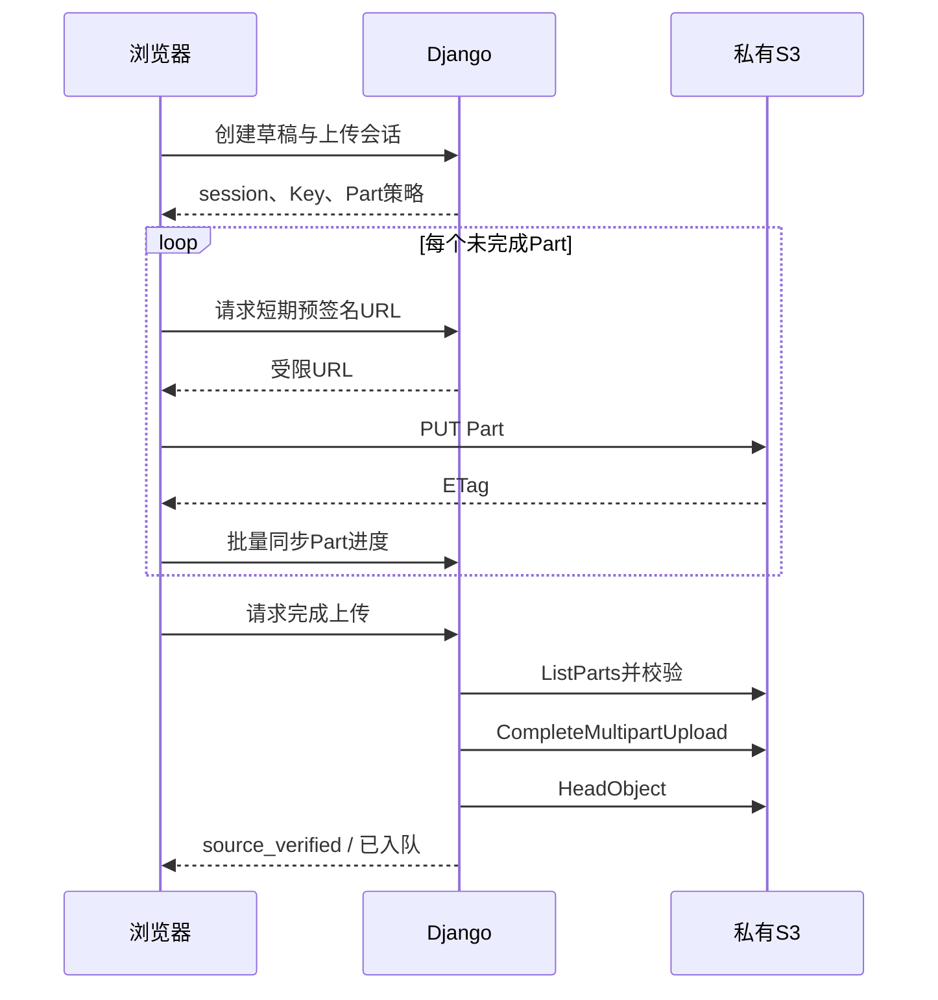
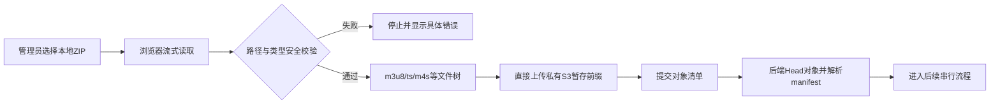

# 03. 浏览器上传与 HLS 导入

## 1. 范围

本模块权威定义从管理员本地导入单个视频/音频文件和 HLS ZIP 的上传协议、安全约束、恢复证据与服务端接口。具体向导、任务中心、上传客户端组件和视觉进度由 `08` 定义。MVP 不从其他 S3 位置复制，避免跨桶权限复杂度。

## 2. 统一上传会话

Django 创建 Media 草稿、Job 和 `MultipartUpload`，并签发限定到该 Job 前缀的凭证。记录至少包含：`upload_id`、`job_id`、`s3_key`、预期大小、文件指纹、状态、已完成 Part、过期时间和拥有者。

全系统任何时刻只允许一个任务上传。服务端维护单例上传租约，保存队首Job、owner token、heartbeat和过期时间；只有持有有效租约的客户端才能请求Part URL或执行完成操作。Web Locks/BroadcastChannel只能优化同一浏览器协调，不能替代服务端租约。

浏览器在 IndexedDB 保存非秘密恢复数据：业务 upload session ID、文件名/大小/lastModified/可选快速指纹、S3 Upload ID、Part 大小、已完成 Part/ETag 和本地 HLS 文件映射。预签名 URL 不持久化，恢复时重新获取。

后端不能仅相信浏览器上报。完成前必须以 S3 `ListParts`、完成结果、`HeadObject`、大小、类型和可用校验值为准。

## 3. 单个视频或音频文件

1. 管理员选择本地文件并填写标题、标签等元数据。
2. Django 创建草稿和会话；任务取得唯一上传租约后，浏览器按固定 Part 大小上传。实现可在同一文件内部使用少量Part网络并行，但不得同时上传第二个任务。
3. 暂停时停止新请求；已完成 Part 保留。刷新后重新选择同一文件或通过 File System Access 能力恢复句柄，再核对指纹。
4. 上传完成后后端先持久化提升意图，再通过S3服务端Copy把暂存对象移动到该Attempt的`originals/{media_id}/{attempt_id}/source.ext`；Head验证大小、类型和checksum成功后才完成`source_verified`并将Job放入FIFO队列。该步骤不新增编排检查点，媒体字节不经过Django主机。
5. 音频与视频共用上传协议，后续选择不同 MediaConvert 模板。

若浏览器无法重新获得本地文件句柄，界面必须提示管理员重新选择同一文件；指纹不匹配禁止续传。

## 4. 本地 HLS ZIP

ZIP 不上传为单个对象，也不经过 Django 或后端解包。浏览器使用流式 ZIP 读取器逐项解压，并保持安全的相对目录树直传 S3。

安全约束：

- 拒绝绝对路径、`..`、反斜线歧义、NUL、重复规范化路径、符号链接和超限目录深度。
- 限制压缩包总文件数、单文件解压大小、总解压大小和压缩比，防止 ZIP bomb。
- 首期允许明确的 HLS 清单、分片、初始化段、字幕和图片扩展名；其他文件拒绝或忽略策略必须固定。
- 必须存在且唯一确定入口 master/media playlist；所有本地引用规范化后必须落在本次上传树中。
- 拒绝外部 HTTP 引用、`EXT-X-KEY` 和 DRM。

小对象可按每个对象单次 PUT；大对象仍使用 Multipart。续传状态以“文件 + Part”粒度保存。Django 最终逐项 Head 校验管理员提交的对象清单，并解析 HLS 依赖闭包；不能通过列举整个 Bucket 猜测内容。

## 5. 取消与生命周期

- `uploading` 阶段取消：Django 中止所有已知 Multipart，删除会话暂存前缀中的已完成小对象，并标记 canceled。
- 浏览器离线或崩溃：生命周期规则清理超期未完成 Multipart；应用定时任务清理过期会话和已完成孤儿对象。
- 完成后取消：交给编排模块按检查点取消后续任务并清理 candidate/original。
- 任何删除必须限定到数据库记录的精确 Key 或 Job 前缀，不能使用未校验的用户路径。

## 6. 真实进度

前端统一显示：当前阶段、阶段百分比、总体百分比、已处理/总字节或文件数、传输速度、预计剩余时间、暂停/恢复/取消操作和安全错误。

- 单文件上传：由已确认字节 / 总字节计算。
- HLS ZIP：同时显示 ZIP 解包扫描、已上传文件数/总文件数和已上传字节/总解压字节；总量尚未知时使用不确定进度并显示已处理数。
- S3 完成与后端验证分别显示，不能在最后一个 PUT 完成时提前显示“处理完成”。
- 刷新后从后端 `ListParts`/对象验证结果重建权威进度；本地 IndexedDB 只用于加速。
- 禁止与真实工作无关的定时递增。

## 7. 接口边界

建议 API：创建会话、签发 Part URL、同步/查询 Part、完成、恢复、取消、提交 HLS 对象清单。所有接口必须幂等；完成请求使用 idempotency key，重复调用返回同一结果。

上传完成只产生 `source_verified`，不得直接把 Media 标为 ready。后续状态和进度由 `04` 的编排 API 提供。

## 8. 验收

- 大文件字节不经过 Tunnel/Django，暂停和刷新后可从已确认 Part 继续。
- 错选不同文件不能续传；预签名 URL 过期可透明续签。
- HLS ZIP 在浏览器解包，后端无 ZIP 临时文件；相对目录和 master 引用保持正确。
- 路径穿越、ZIP bomb、外部引用和加密 HLS 被拒绝。
- 取消后 Multipart 与暂存对象最终清理，进度条与 S3 权威状态一致。
