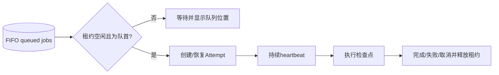

# 04. 媒体处理编排

## 1. 范围

本模块权威定义来源检查点、FIFO 串行执行、MediaConvert 协调、资源激活、失败恢复、取消和本地清理。

## 2. 通用检查点

所有来源最终遵循：


每个检查点保存状态、完成时间、输入指纹、输出证据和生成它的 Attempt。Resume 从首个未满足或证据失效的节点继续；只看 Celery task 是否结束不构成完成证据。

## 3. 按来源的检查点图

### 3.1 本地视频/音频


`mediaconvert_complete` 只接受 `GetJob=COMPLETE`；`outputs_verified` 还要验证 S3 master、variant、分片、图片及内容类型。音频使用音频模板。

### 3.2 HLS ZIP 文件树


该来源跳过完整 MediaConvert 转码。缩略图按 `02` 的首个有效视频帧策略处理。

### 3.3 YouTube

```mermaid
flowchart LR
    M[metadata_discovered] --> D[source_downloaded]
    D --> S[subtitles: available/unavailable/failed_retryable]
    S --> SV[source_verified]
    SV --> MS[mediaconvert_submitted]
    MS --> MC[mediaconvert_complete]
    MC --> OV[outputs_verified]
    OV --> AA[assets_activated]
    AA --> MP[media_published]
    MP --> LC[local_cleanup_completed]
```



字幕是可选分支：`available` 和 `unavailable` 可继续；`failed_retryable` 显示警告并允许仅重试字幕或明确跳过。Cookie 失败的 Resume 规则由 `05` 定义。

## 4. 全局 FIFO 与执行租约

- PostgreSQL Job 队列按 `queued_at, id` 排序；数据库是顺序权威来源。
- Worker 固定 `concurrency=1`，但这不是唯一并发保护。
- 单例 `ProcessingLease` 行通过事务锁获取，保存 Job、Attempt、owner token、heartbeat 和 lease expiry。
- 只有队首 queued Job 可取得租约；租约持有期间其他 Worker/管理命令不得启动重处理。
- Worker 定期 heartbeat；进程死亡且租约过期后，reconciler 检查 AWS/检查点真相再接管，不能盲目重复提交 MediaConvert。
- 网络上传可以同时进行，但“验证后进入处理链”的重任务严格一次一个。



## 5. MediaConvert 协调

提交前写 `mediaconvert_submitting` 意图和幂等 token；提交成功立即保存 Job ID。`ClientRequestToken` 计算为：

```text
sha256(attempt_id + template_version + input_checksum)
```

AWS 对该 Token 的重复提交保护时间有限，因此它只是第二层保护。权威幂等链为“数据库提交意图 + 已保存 MediaConvert Job ID + ClientRequestToken”。崩溃恢复时先检查提交意图和已保存 ID，再按非敏感 `userMetadata` 对账，不能仅因 Token 相同就盲目重提。每 10–15 秒轮询，持久化供应商状态、阶段和真实百分比。

每个 Job 添加标准 AWS Tags：`Project=mediacms`、`Environment=dev|prod`、`MediaId`、`JobId`、`AttemptId`、`SourceType=upload|youtube`、`TemplateVersion`。Tags 用于成本、审计和资源归属；`userMetadata` 只写 `job_id/attempt_id`。两者都禁止写标题、YouTube URL、Cookie、管理员信息、签名 URL或其他秘密。

接口语义参考 [CreateJob 的 ClientRequestToken](https://docs.aws.amazon.com/cli/latest/reference/mediaconvert/create-job.html) 和 [MediaConvert 资源标签](https://docs.aws.amazon.com/mediaconvert/latest/ug/tagging-mediaconvert-resources.html)。

进度显示优先级：MediaConvert 百分比可用时使用；仅有阶段时显示不确定阶段，不构造伪百分比。`COMPLETE` 后进入输出验证；`ERROR` 归类并记录安全错误；取消请求调用 MediaConvert CancelJob 后继续轮询到终态。

## 6. 原子激活与发布

1. 为 Attempt 创建 candidate `MediaAssetVersion`，逐个登记精确对象和校验。
2. 验证完整依赖闭包，生成稳定 `manifest_key`。
3. 在数据库事务中锁定 Media 和版本，确认 Attempt/Job 未被取消。
4. 旧 active 标记 retired，candidate 标记 active，一次更新 `Media.active_asset_version`。
5. 设置 `processing_status=ready` 和兼容 `encoding_status=success`，然后完成 `media_published`。

事务失败时活动指针不变。S3 删除不属于该事务，retired/candidate 由延迟清理处理。

## 7. 重试、Resume 与取消

错误分为：

- `retryable`：AWS 节流、短暂网络、轮询超时、字幕临时失败；指数退避且有上限。
- `action_required`：Cookie 缺失/失效、需重新选择本地文件、元数据需修正；等待管理员动作。
- `permanent`：不支持的格式、加密 HLS、清单越界、来源不存在；修正来源后新 Attempt。
- `canceled`：用户请求且外部作业/上传已确认停止。

Resume 创建新 Attempt，复用仍有有效证据的检查点。重新提交 MediaConvert 前必须确认旧 Job 不存在或已终结。资源已激活后的清理 Resume 只重试清理，不重复处理或撤销 ready。

取消采用协作式标志：每个检查点和轮询周期检查 `cancel_requested`，停止创建新工作，取消可取消的 AWS Job，清理候选/临时对象，最后标记 canceled。已经 active 的旧版本不删除。

## 8. 后端本地清理

- yt-dlp 下载视频：原件流式上传 S3并经 `HeadObject`/大小/校验验证后立即删除。
- cookies 临时文件：每次 yt-dlp 调用结束即删除，权限始终 `0600`。
- 字幕中间文件、ffprobe 输出、HLS 单帧所需最少分片和工作目录：发布后统一清理。
- 清理幂等，记录每个路径/Key 的结果；只能删除受管临时根下属于当前 Attempt 的规范化路径。
- 周期性 janitor 回收进程崩溃残留；失败写入独立 cleanup_status 和告警，不影响已 ready 媒体。
- HLS ZIP 从不进入后端，不存在后端 ZIP 清理步骤。

## 9. 前端任务投影

后端将 Media、Job、Attempt、Cleanup 和供应商状态投影为稳定 `TaskView`；前端不自行解释状态机：

```text
TaskView
- id, revision, projection_version
- media: id, title, thumbnail_url
- source_type
- display_status, stage, stage_label
- stage_progress, overall_progress
- processed_units, total_units, unit_type
- transfer_speed, estimated_seconds_remaining
- upload_queue_position, processing_queue_position
- allowed_actions[]
- error: code, message, retryable
- latest_attempt_id, cleanup_status, updated_at
```

`display_status` 是只读投影：`waiting_upload/uploading/upload_paused/waiting_processing/processing/action_required/completing/completed/failed/canceled/deleting`。它不写回任何领域模型。操作按钮只由 `allowed_actions` 决定；MediaConvert原始状态只能在详情展示。

`stage_progress/overall_progress` 可为 `null`；没有真实进度时前端显示不确定阶段，禁止伪造百分比。`stage_label` 返回本地化键。每次响应带 revision，旧轮询响应不能覆盖新状态。

## 10. 版本化进度权重

每个 Job 固定保存创建时的 `progress_profile_version`：

| 本地视频/音频 | 权重 |
| --- | ---: |
| 文件准备与指纹 | 2% |
| S3上传 | 48% |
| 来源验证 | 5% |
| MediaConvert | 35% |
| 输出验证 | 5% |
| 资源激活 | 3% |
| 清理 | 2% |

| HLS ZIP | 权重 |
| --- | ---: |
| ZIP扫描与安全检查 | 10% |
| 文件树上传 | 60% |
| Manifest验证 | 15% |
| 首帧封面/缩略图 | 8% |
| 输出验证与激活 | 5% |
| 清理 | 2% |

| YouTube | 权重 |
| --- | ---: |
| 元数据发现 | 5% |
| yt-dlp下载 | 20% |
| 原件上传S3 | 15% |
| 字幕处理 | 5% |
| 来源验证 | 5% |
| MediaConvert | 40% |
| 输出验证 | 5% |
| 资源激活 | 3% |
| 清理 | 2% |

总体进度等于已完成权重加当前权重乘真实阶段进度，并保持单调。等待队列不增加百分比；字幕 unavailable 正常完成该阶段。无法可靠估算剩余时间时返回 `null`。

## 11. 统一任务 Action API

所有状态变更使用同一接口并要求 `If-Match` 与 `Idempotency-Key`。支持 `pause_upload/resume_upload/cancel/resume/skip_subtitles/retry_cleanup/acknowledge_error`；Cookie文件先通过专用上传接口保存，再单独调用 Resume。

- 后端在事务中验证 revision、当前状态、allowed_actions和租约。
- 重复 Idempotency-Key 返回首次结果，不重复创建 Attempt或取消外部任务。
- revision冲突返回 `409 task_revision_conflict`；成功返回 `202 + 最新TaskView`。
- 前端可以立即禁用按钮，但不能乐观伪造最终状态。

## 12. 任务历史与汇总查询

- 活动任务、历史、详情、Attempt和汇总使用独立接口。
- 历史使用游标分页，默认25条；排序、来源、状态、错误、模板和媒体筛选由后端执行。
- 汇总按7/30/90天、今年、全部聚合；历史日期可读取每日聚合表，当日实时计算。
- 媒体删除后继续通过标题快照搜索；前端不得加载全部历史自行统计。
- CSV导出不进入MVP。

## 13. 验收

- 两个重任务始终按 FIFO 执行，Worker 崩溃后不会重复提交 MediaConvert。
- 三类来源从正确节点恢复；字幕 unavailable 不阻止发布。
- MediaConvert COMPLETE 但对象缺失时不激活；替换失败时旧版本继续播放。
- 相同提交意图在崩溃恢复和快速重试中不会创建重复 MediaConvert Job，标签可追溯到 Attempt 和模板版本。
- 取消最终停止外部工作并清理 candidate；清理失败不回退 ready。
- yt-dlp 原件上传验证后立即释放后端磁盘，janitor 可回收崩溃残留。
- TaskView投影、进度权重和Action幂等在多标签页与网络重试下保持一致。
- 长期历史分页、筛选和汇总不依赖前端全量加载。
