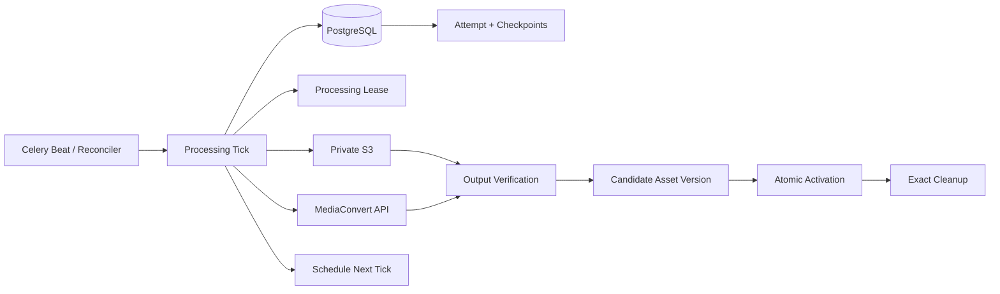
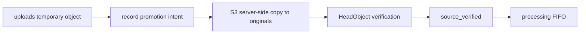
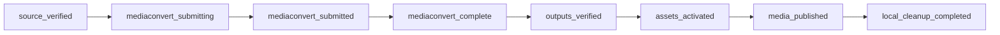
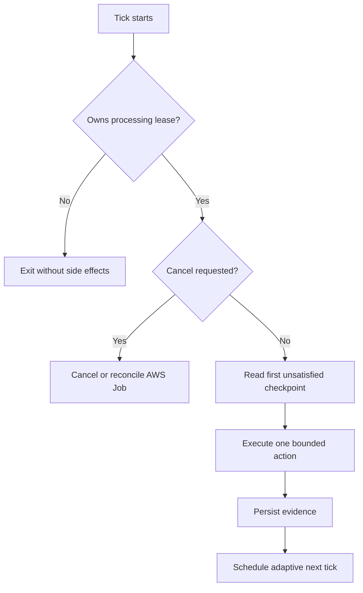

# 04a. MediaConvert 核心编排

## 1. 范围

本子模块实现本地单视频和单音频从 `source_verified` 到发布与清理的 AWS 闭环。HLS 导入发布、YouTube/字幕、TaskView/Action API和历史汇总分别后续实现。它细化 `04-media-processing-orchestration.md`，冲突时以本文件对本子模块的约束为准。

## 2. 架构

采用短周期 Celery tick 状态机。每个 tick 最多执行一个有界外部副作用；PostgreSQL、S3 和 MediaConvert 是状态真相，Redis/Celery 只负责唤醒。生产不增加常驻 orchestrator 服务。



组件职责：

- `processing_runner.py`：读取 Attempt/检查点并选择下一动作，不包含 AWS SDK 细节。
- `mediaconvert.py`：Probe已验证的私有S3原件，并创建、列举对账、查询和取消Job；强制输入范围、模板、标签、`userMetadata`和幂等Token。
- `output_verification.py`：验证 AWS 输出路径、HLS manifest 闭包与 S3 对象证据。
- `asset_publishing.py`：建立 candidate 版本、登记精确 Asset并调用原子激活。
- `processing_cleanup.py`：清理数据库登记的精确临时 Key/本地路径。
- `processing_tasks.py`：短周期 tick、reconciler 与调度，不承载领域规则。
- `processing_queue.py`：继续作为全局 FIFO Processing Lease 权威。

## 3. 上传原件提升

浏览器只写 `uploads/` 暂存 Key。上传完成服务必须先创建或取得 Attempt，再以 S3 服务端 Copy 把单文件提升为：

```text
originals/{media_id}/{attempt_id}/source.{ext}
```

复制意图先持久化到上传对象的 `promoted_s3_key/promotion_status`；Copy 后通过 `HeadObject` 验证大小、Content-Type和checksum。只有 `originals/` 对象验证成功后才完成 `source_verified` 并进入 Processing FIFO。数据不经过 Django 主机，也不新增 `original_prepared` 检查点。



## 4. 检查点与提交幂等



Attempt持久化 `template_name`、`template_version`、`client_request_token`、`submission_intent_at`、`next_poll_at`、`provider_last_changed_at` 和 `provider_unchanged_count`。Token为：

```text
sha256(attempt_id + template_version + input_checksum)
```

提交意图前调用MediaConvert `Probe`读取已验证的`originals/` S3 URI，规范化保存时长、视频宽高、codec和音轨证据；Probe不得接受HTTP URL、`uploads/`、`candidates/`或其他Bucket。视频梯度只保留不高于规范化源高度的360p/480p/720p/1080p输出，尺寸保持偶数；音频不产生视频梯度。后端不为生产探测启动FFprobe或下载原件。

提交顺序固定为：

1. 写 `mediaconvert_submitting` 意图、模板、输入证据、candidate目标和Token。
2. `mediaconvert_job_id` 非空时禁止再次 `CreateJob`。
3. Create成功立即保存 Job ID并完成 `mediaconvert_submitted`。
4. 请求结果未知时先复用一分钟内的Token，再通过 `ListJobs` 对账。
5. 对账只接受 `userMetadata.job_id/attempt_id` 同时匹配，且模板、输入Key和目标前缀一致的唯一Job。
6. 有界对账仍找不到时进入 `action_required`，绝不自动重提。
7. Resume前必须找回旧Job，或确认旧Job已终结且不会产生候选输出。

`ListJobs` 返回Job与 `userMetadata`，但IAM不支持按Job ARN限定该动作，因此Runtime Policy只为该动作使用 `Resource: '*'`。Create仍要求 `Project=mediacms` 与对应Environment请求标签；Get/Cancel仍限定本账户本区域Job ARN。

标准Tags为 `Project`、`Environment`、`MediaId`、`JobId`、`AttemptId`、`SourceType` 和 `TemplateVersion`。`userMetadata`只包含 `job_id/attempt_id`；不得写标题、源路径、URL、Cookie、管理员信息或秘密。

## 5. Tick、轮询与取消



- 提交或状态、阶段、真实百分比变化后10秒轮询。
- 连续两次无变化后30秒；连续五次后60秒，上限60秒。
- `SUBMITTED`超过30分钟或`PROGRESSING`连续30分钟无变化时，按 `(attempt_id, warning_code)` 创建一次站内警告，不自动失败。
- 总处理超过6小时，请求取消并按超时失败。
- throttling、网络超时和5xx使用有界指数退避加抖动，保留最后状态。
- `COMPLETE`只完成 `mediaconvert_complete`；`ERROR`保存受限诊断和安全英语错误；`CANCELED`须由AWS终态确认。

`cancel_requested=True` 后禁止创建新工作。未提交时直接进入精确清理；已提交时调用一次Cancel并继续Get到终态。取消与COMPLETE交叉时不得激活candidate。替换失败或取消始终保留旧active version。

## 6. 输出验证与发布

`GetJob=COMPLETE` 后使用 `outputGroupDetails`：HLS的 `playlistFilePaths` 指向master，`outputFilePaths`指向variant；Frame Capture的 `outputFilePaths`指向最终图片。所有路径必须属于本Attempt的candidate根。

视频要求唯一master、至少一个variant和一张Frame Capture图片；音频要求唯一master和至少一个音频variant，不要求图片或分辨率。Manifest限制大小和UTF-8文本，拒绝外部URI、路径逃逸、加密引用、意外Bucket与缺失对象。从AWS返回路径递归解析到segment/init-map，对每个对象Head验证非零大小、允许Content-Type和可用checksum。

新增 `AttemptArtifact` 保存Attempt产生或接管的精确S3 Key、用途、大小、checksum和cleanup状态。原件提升时登记upload暂存Key与original Key；MediaConvert COMPLETE后允许列举仅由服务端生成的本Attempt candidate前缀，把所有结果先登记为Artifact，再从manifest闭包选择可发布的业务Asset。未知或多余对象不进入 `MediaAssetVersion`，但作为cleanup-only Artifact保留精确删除证据。这里的List只做受管Attempt输出盘点，不能通过扫描Bucket推断Media或版本归属。

验证后创建candidate `MediaAssetVersion`，逐项登记精确 `MediaAsset`。发布事务锁定Media、Job、Attempt和candidate，复核未取消，再调用既有原子激活逻辑：旧active转retired、candidate转active、一次更新active指针并把Media置ready。事务失败时旧active不变。

## 7. 清理

- 成功：删除本次 `uploads/` 暂存源和 `originals/` 转码原件，保留active candidate。
- 失败或取消：删除该Attempt登记的original与candidate，保留历史记录和旧active。
- 每个对象单独记录结果；重复执行已删除对象视为成功。
- cleanup失败只设置独立 `cleanup_status=failed`，不得回退ready。
- janitor只处理数据库已登记且位于受管根的精确Key/路径，不按用户路径或未知前缀批量删除。
- 本流程不创建后端媒体临时文件。验收裁切副本必须在测试脚本 `finally` 中删除。

## 8. 测试与真实验收

自动化覆盖FIFO竞争、提交响应丢失与ListJobs找回、超过窗口不重提、五种供应商状态、自适应轮询、AWS临时错误、停滞/超时、取消竞态、输出缺失/越界/加密、激活事务回滚、cleanup失败保持ready，以及Redis调度丢失后的PostgreSQL重建。

dev真实验收严格串行：

- 视频源裁切前20秒临时副本，验证QVBR HLS、实际rendition、旋转、poster和资源激活。
- 音频源裁切前30秒临时副本，验证音频HLS且不伪造视频资产。
- 优先FFmpeg stream copy；输出验证失败时仅对临时副本做兼容编码。
- 使用独立Media/Job/Attempt和精确S3 Key；视频完成与cleanup后才运行音频。
- 结束后删除本次S3对象、测试数据库记录和本地副本，不修改源素材。
- 记录非敏感Job ID、模板版本、时长和结果，不记录本地源路径、凭证或预签名URL。

Cloudflare和最终自定义域名不参与本阶段。

## 9. 验收门

- Worker崩溃或Create响应丢失不产生重复MediaConvert Job。
- COMPLETE后对象闭包不完整时不激活。
- 取消最终停止外部工作并精确清理candidate/original。
- cleanup失败不影响已ready媒体。
- 视频和音频真实dev短素材闭环通过，且无验收对象或Multipart遗留。
