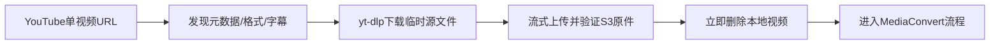
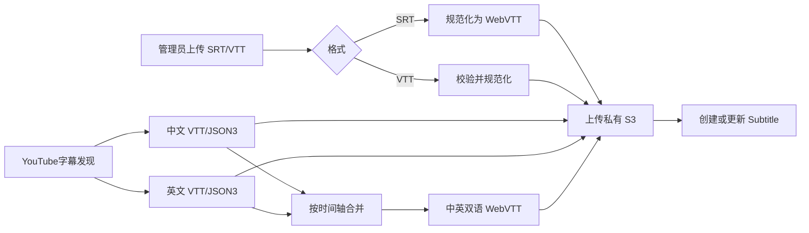

# 05. YouTube 与字幕

## 1. 范围

本模块权威定义 YouTube 单视频 MVP、`cookies.txt` 生命周期、自动/手工字幕以及中英双语合并。视频转码与发布由 `04` 编排。

## 2. YouTube 单视频流程

- 只接受可规范化为单个 YouTube 视频的 URL/ID，明确拒绝播放列表和批量导入。
- 提交后立即创建 Media 草稿；先发现标题、描述、时长、封面、格式和字幕，再由管理员确认或继续编辑。
- yt-dlp 在 Worker 的 Attempt 临时目录下载一个适合 MediaConvert 的源文件；不得长期保存在后端。
- 源文件流式上传到该 Attempt 的 `originals/` Key，完成 S3 验证后立即删除本地视频，再提交 MediaConvert。
- 自动元数据只写未被管理员修改的字段。

## 3. Cookie 上传与默认选择

管理员可选上传 Netscape 格式 `cookies.txt`。上传页必须在选择文件前显示：

- 有历史版本：显示最近一次有效上传日期，并说明新任务默认使用该版本。
- 无历史版本：显示警告“尚未上传 Cookie；公开视频可能仍可下载，受限视频可能失败”。

上传后先解析格式、限制大小和行数、拒绝非文本/异常字段；不验证或展示 Cookie 值。有效内容使用应用级加密密钥加密后持久化，记录版本、上传时间、校验摘要、状态和最后使用时间。新版本成为默认，旧版本可审计但不能由普通页面读取明文。

Worker 只在 yt-dlp 进程启动前解密到当前 Attempt 的随机临时文件，权限 `0600`；使用参数传文件路径，不把内容放入命令行、环境变量或日志；进程结束在 `finally` 中立即删除。

默认行为：有有效历史版本时直接使用最新版本；没有时先尝试无 Cookie 下载，不阻止任务提交。

## 4. Cookie 失败与 Resume

将 yt-dlp 错误安全分类。只有能合理归因于登录、年龄/地区验证或 Cookie 失效的错误才标记 `action_required: cookies`，前端提示上传/更新 Cookie，并保留已完成检查点。管理员上传新版本后点击 Resume：同一 Job 创建新 Attempt，重新执行受 Cookie 影响的 metadata/download 节点，不重复创建 Media。

Cookie 错误消息不得包含 Cookie 内容、完整 yt-dlp 命令或敏感 URL 参数。不能确定原因时显示通用诊断和重试选项，不谎称一定需要 Cookie。

## 5. 自动字幕

优先发现并选择中文和英文轨，允许人工字幕和自动字幕；选择规则及语言代码映射必须可测试并固定。尽可能获取 WebVTT 和用于时间轴合并的 JSON3：

结果规则：

- 中文和英文都有：保存中文原始 WebVTT、英文原始 WebVTT，并生成“中文 / English”双语 WebVTT，前端三轨切换。
- 只有中文或英文：发布存在的一轨，不生成伪双语轨。
- 都没有：检查点为 `unavailable`，视频正常处理和发布，前端显示“字幕暂无可用选项”。
- 临时抓取/解析失败：`failed_retryable`，可重试字幕或由管理员明确跳过；不能把“确实不存在”混同为失败。

## 6. 双语合并

- 以 JSON3 事件时间轴为优先输入，清理重复片段、空事件和无效时间。
- 依据时间重叠和邻近阈值匹配两种语言，不按数组下标机械配对。
- cue 必须时间单调、`end > start`、文本正确转义；重叠策略和阈值写入可版本化配置。
- 一侧缺句时允许单语 cue，不能丢弃整段。
- 输出标准 WebVTT，并保存生成器版本和源字幕摘要，确保重试幂等。

## 7. 手工字幕

- 管理员可为 Media 上传 SRT 或 WebVTT，选择语言、显示名和默认轨。
- 校验编码、文件大小、cue 数、时间范围和 WebVTT 安全内容；SRT 转为规范 WebVTT。
- 文件直传或经轻量后端处理后保存到当前资源版本的私有字幕前缀，并创建/更新 MediaCMS `Subtitle` 关联。
- 替换字幕构建新候选资源版本并原子激活，避免 manifest 指向尚未存在的轨道。
- 删除字幕只影响新版本；活动版本在切换前保持完整。

## 8. 验收

- 无 Cookie 时有明确警告但公开视频仍可尝试；存在历史 Cookie 时显示日期并默认使用最新版本。
- Cookie 相关失败在上传新 Cookie 后可从正确节点 Resume，磁盘无残留明文。
- 中文/英文/双语三轨、单轨和无字幕三种情况均能发布并正确显示。
- SRT/VTT 校验、转换、关联和版本切换幂等；字幕错误不会误删活动视频资源。
