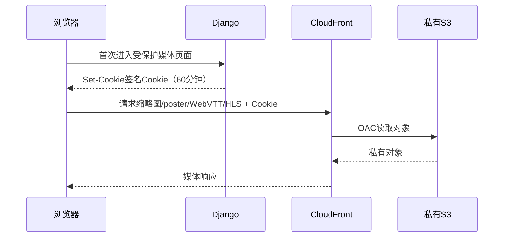

# 06. CloudFront 播放与授权

## 1. 范围

本模块权威定义私有媒体的 CloudFront 签名 Cookie、登录后 Bootstrap、续期、缩略图/poster/WebVTT/HLS 授权和播放器行为。

## 2. 为什么使用签名 Cookie

HLS 播放会请求一个 master、多个 variant 和大量分片，同时页面还需加载 poster、缩略图和字幕。逐对象生成签名 URL 会改写清单、增加后端调用并使续期复杂。签名 Cookie 可在限定路径和时间内授权同一资源版本的整棵对象树，浏览器无需暴露 S3 权限。

Cookie 策略必须限制 CloudFront 域名、受保护路径和有效期；默认 60 分钟。S3 始终私有，Cookie 不能用于 S3 API。

## 3. 首次进入受保护页面时 Bootstrap

登录成功后，管理员首次进入任何包含受保护媒体的页面（列表、详情、编辑或播放）时，由前端全局 `MediaAuthorizationProvider` 调用 Bootstrap API。Django 验证唯一管理员，生成策略并以 `Set-Cookie` 写入 CloudFront 三个签名 Cookie。

不能等到点击播放才 Bootstrap，因为媒体列表缩略图和详情 poster 已需要授权。普通不含媒体的后台页无需签发。

## 4. Cookie 属性与密钥

- 使用 CloudFront 要求的 `CloudFront-Policy`、`CloudFront-Signature`、`CloudFront-Key-Pair-Id`。
- Domain/Path 与实际媒体域名和统一受保护前缀匹配；`Secure`、`HttpOnly`，SameSite 按页面域名拓扑选择最严格可用值。
- CORS、播放器请求和字幕请求必须允许携带凭据；媒体域名配置不能依赖 JS 读取 HttpOnly Cookie。
- 私钥只存应用 Secret，不进入数据库、镜像、CloudFormation 输出或日志；支持 key group 双钥轮换。
- 退出登录时由 Django 以相同 Domain/Path 清除 Cookie。

## 5. 续期与 403 恢复

- Provider 记录服务端返回的过期时间，在临近过期时只发起一次全局续期请求。
- Video.js 播放器在播放期间确保续期，不为每个分片请求单独刷新。
- 页面内任一受保护图片/字幕/HLS 收到授权型 403 时，触发单飞刷新；并发 403 共享同一 Promise，防止刷新风暴。
- 刷新成功后，HLS 由播放器重载；图片在 URL 加一次性 cache-busting 参数重新请求，避免浏览器复用缓存的 403。
- 刷新仍失败则回到登录/权限错误，不无限循环。

## 6. 播放器行为

- 保留现有 React/Video.js 页面结构和元数据 CRUD 体验。
- 视频使用活动版本 master HLS；质量菜单从 master variant 读取，支持 Auto 和各可用清晰度，不显示不存在的档位。
- poster、缩略图、WebVTT 和 HLS 全部使用稳定 CloudFront URL，不把预签名 S3 URL 写入 Media。
- 字幕菜单展示实际存在的中文、English、中文 / English；没有轨道时显示“字幕暂无可用选项”，不阻止播放。
- 单音频资源使用音频播放器模式和选定封面，不显示视频清晰度控件。
- 新版本激活后新页面解析活动 manifest；正在播放的旧版本可在合理窗口继续服务，retired 清理由缓存/会话保留期约束。

## 7. 前端一致性

Media 列表、详情、编辑和播放器均从同一活动资源 API 获得稳定路径。删除、替换封面、增删字幕和重新处理沿用现有操作入口，但写操作创建候选版本并原子切换。后端不能向前端暴露 candidate 或物理 Bucket 名作为业务契约。

## 8. 必测场景

- 登录后首次进入媒体列表即可显示缩略图，无需先点击播放。
- 详情 poster、WebVTT 和 HLS 均通过同一 Cookie 授权。
- Cookie 播放中临近过期可续期，HLS 不明显中断。
- Cookie 过期后并发图片 403 只刷新一次，页面内图片恢复。
- 登出清除 Cookie；非管理员即使已登录也不能 Bootstrap。
- 三轨、单轨、无字幕、多个清晰度和单音频 UI 均符合预期。
