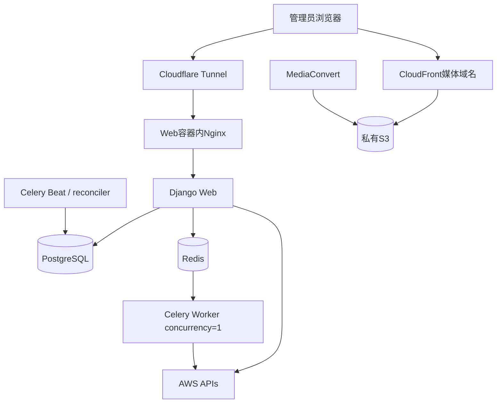

# 07. 部署与验收

## 1. 范围

本模块权威定义 Compose/CloudFormation 部署、全新数据库初始化、AWS/旧本地管线隔离、测试矩阵、上线和旧资源清理门槛。

## 2. 部署拓扑

Cloudflare Tunnel 只路由页面/API。Nginx、Django 和容器请求体限制不再承担大媒体上传，仅需覆盖字幕、Cookie 和普通表单。

首期保留现有镜像内的 Supervisor + Nginx + Gunicorn 结构，避免为移除 Nginx 重写入口。Tunnel 只连接宿主机 loopback 映射端口，Nginx 仅代理轻量页面/API。Nginx、Supervisor 和 Gunicorn 的内存都计入 Web 容器上限。

应用和媒体使用同一可注册父域下的独立子域，例如`app.<base-domain>`与`media.<base-domain>`。实际名称必须由部署参数提供。Cloudflare控制台只承担应用Tunnel hostname与DNS记录；媒体域名MVP以`DNS only`直接指向CloudFront，不将S3、MediaConvert或CloudFront流量送入Tunnel。详细外部配置门和执行时机见`10-test-and-deployment-plan.md`。

## 3. CloudFormation

模板创建 MediaCMS 独立资源：

- 私有 S3 Bucket（默认 `mediacms-${AWS::AccountId}-us-east-1`）、加密、CORS、Block Public Access 和生命周期规则。
- MediaConvert Service Role 与最小 Bucket 前缀权限。
- `mediacms-video-hls-v1` 与 `mediacms-audio-hls-v1` 两个版本化 Job Template。
- 应用 IAM Runtime User/Policy、A/B AccessKey 槽位和 Secrets Manager 运行时凭证。
- AWS 外部生产机使用独立 IAM Runtime User；CloudFormation 创建 AccessKey 并保存到 Secrets Manager，Stack 不输出密钥值。管理员读取一次后写入生产机权限为 `0640` 的 `/etc/mediacms/secrets/aws-runtime.env`，Compose 只通过 `env_file` 注入 Web/Worker。
- CloudFront Distribution、OAC、Key Group、公钥及缓存行为。
- CloudWatch Dashboard、应用自定义任务时长指标和告警。
- 参数化域名、Bucket 覆盖名、日志/保留期；输出非秘密资源标识。

私钥和 Django 加密密钥通过独立 Secret 注入，不写入模板输出。部署需幂等；删除 Stack 时生产 Bucket 使用 Retain，避免测试脚本误删媒体。

Runtime User 长期密钥至少每 90 天审查并按 CloudFormation A/B 双槽位流程轮换。轮换依次启用备用槽、切换 Secret/生产 env 并验证、最后禁用旧槽；每一步使用独立 Change Set，不允许用零散 IAM create 命令旁路 Stack。旧 Key 只有在新 Key 完成 S3、MediaConvert 和 CloudWatch 健康检查并经过观察后才能删除。

CloudWatch 至少覆盖：

- MediaConvert `JobsErroredCount` 和 `JobsCanceled`。
- `StandbyTime`、`TranscodingTime`、SD/HD/UHD/音频输出时长与 QVBR 质量统计 Dashboard。
- `BlackVideoDetected`、`BlackVideoDetectedRatio`、`VideoPaddingInserted` 和对应 Ratio 的质量告警；告警只产生发布后警告，不自动把 Media 标为 failed。
- Job 长时间等待和长时间转码告警。MediaConvert 的部分指标在 Job 结束时才产生，因此实时超时告警使用 Django reconciler 根据持久化阶段/心跳发布的应用自定义 CloudWatch 指标，不能错误地依赖结束后指标。
- 通过 Tags 按 `Environment` 和 `TemplateVersion` 分析输出分钟数与成本；成本报表本身由 AWS Billing Cost Allocation Tags 配置启用。

指标名称和产生时机以 [MediaConvert CloudWatch 指标列表](https://docs.aws.amazon.com/mediaconvert/latest/ug/metrics.html) 为准。

## 4. 全新数据库初始化

本项目不导入旧数据库、旧用户、旧媒体、旧字幕或历史任务：

1. 部署新 AWS 资源和应用配置。
2. 对空 PostgreSQL 执行完整 Django migration，包括为依赖保留的 App。
3. 运行幂等初始化命令，创建/绑定 `SiteAdministrator`、必要默认分类/站点配置和系统音频封面。
4. 设置 `storage_backend=aws` 和生产保护开关，启动前进行配置自检。
5. 以空媒体库进入系统，所有新媒体从 AWS 流程产生。

初始化命令不得创建演示用户、频道、评论或旧本地媒体。重复运行不得产生第二管理员或重复默认对象。

## 5. AWS 与旧本地管线隔离

- 在模型/服务入口按 `storage_backend` 明确分流，而非依赖单个 `DO_NOT_TRANSCODE_VIDEO` 设置。
- AWS Media 的 post_save 不调用 `media_init`、本地 encoding、create_hls、sprites、trim 或本地播放 fallback。
- 生产配置拒绝 AWS Media 写入本地原文件字段作为播放来源。
- 保留旧代码仅用于迁移兼容和测试期审计，默认不可达；测试用 spy 证明相关任务未调度。
- AWS 删除、替换和字幕更新使用版本化 S3 清理，不调用假定本地路径存在的逻辑。

## 6. 测试矩阵

### 6.1 单元与模型

- Media/Job/Cleanup/Provider 状态转换和 `encoding_status` 投影。
- `SiteAdministrator` 单例、认证/权限和禁用功能。
- 检查点证据、Resume、全局租约过期接管和原子资源切换。
- HLS manifest 路径、外部引用、加密、ZIP 安全和首帧选择。
- YouTube URL、Cookie 错误分类、字幕语言选择和双语时间轴合并。
- CloudFront 策略路径、过期时间和 Cookie 属性。

### 6.2 AWS 集成

- Multipart 创建/ListParts/完成/中止与过期续签。
- MediaConvert 提交、轮询五种状态、取消、COMPLETE 后输出缺失。
- 固定 ABR/QVBR 梯度、源分辨率裁剪、自动旋转、Job Template 版本和 `ClientRequestToken` 幂等。
- 私有 S3 + OAC、越权前缀拒绝、生命周期规则。
- candidate 完整验证和一次事务切换 active version。
- Job Tags/userMetadata 无敏感字段，CloudWatch 错误、超时、黑屏与 padding 告警可触发。

### 6.3 前端与端到端

- 大视频暂停、刷新、重选相同文件后续传；错误文件拒绝。
- HLS ZIP 浏览器流式解包、对象/字节进度、恢复和取消。
- FIFO 两任务等待位置、阶段进度、失败动作和 Resume。
- YouTube 无 Cookie、默认最近 Cookie、Cookie 失败后上传并 Resume。
- 视频多清晰度、中文/英文/双语、单轨、无字幕、单音频。
- 首次受保护页面 Cookie Bootstrap、缩略图/poster/WebVTT/HLS、过期后图片恢复。
- 后端磁盘在 yt-dlp 原件验证后下降，成功/失败/崩溃路径无超期残留。

### 6.4 回归

- 标题、描述、标签、分类、封面、字幕等现有 CRUD 体验不退化。
- 禁用的注册、评论、分享、关注、评分、RBAC/LTI/SAML 写入口不可达。
- 全量空库 migration 成功，现有 App 依赖和 ContentType 正常。
- AWS 路径不会启动本地视频转码。

## 7. 上线门槛

- CloudFormation、空库 migration、初始化命令和配置自检全部成功。
- ACM验证CNAME、CloudFront媒体CNAME和Tunnel应用hostname按外部配置门完成；无Cloudflare Access、WAF或Cache Rules依赖。
- 至少完成：本地视频、本地音频、本地 HLS ZIP、YouTube 有/无字幕、Cookie Resume 的端到端验收。
- 验证多清晰度 HLS、首个有效帧 poster、缩略图、字幕和签名 Cookie 续期。
- 验证固定 ABR 使用 QVBR、手机视频自动旋转、低分辨率源不放大，Automated ABR 和 Acceleration 保持关闭。
- 验证任意时刻只有一个重任务；后端大文件不经过 Tunnel；临时磁盘可回收。
- 安全审计确认 Bucket 私有、IAM 前缀最小化、日志无 Cookie/签名/私钥。
- 备份并演练 PostgreSQL 恢复；恢复后 SiteAdministrator 和活动版本指针一致。

## 8. 旧 AWS 资源清理

旧资源清理是上线后的独立、破坏性工作，不随本设计自动执行：

1. 记录旧 Bucket、Distribution、Role、Policy、MediaConvert 模板和依赖清单。
2. 证明新系统验收完成、备份有效且观察期结束。
3. 向管理员再次展示精确目标、影响和恢复方式并取得明确批准。
4. 优先停用/隔离，再按依赖顺序删除；保留审计记录。

未经这次单独批准，不修改或删除 `/home/caoyujie/projects/cyj/media-platform` 使用的任何 AWS 资源。

## 9. 最终验收标准

- MediaCMS 仍是唯一界面和数据库，元数据 CRUD 与播放体验一致。
- 本地大文件/HLS 文件树直达私有 S3并可断点续传，所有真实进度清晰可见。
- MediaConvert 提供自适应 HLS、缩略图和首个有效帧封面；音频可独立播放。
- 三类来源可按检查点 Resume，完整资源原子激活，清理失败不影响 ready 媒体。
- YouTube 单视频、可选 Cookie、可选字幕和三轨双语行为符合规范。
- CloudFront 签名 Cookie 覆盖列表图片、poster、字幕和 HLS，并能续期恢复。
- 单管理员和 FIFO 单任务约束可由数据库与运行时共同证明。
