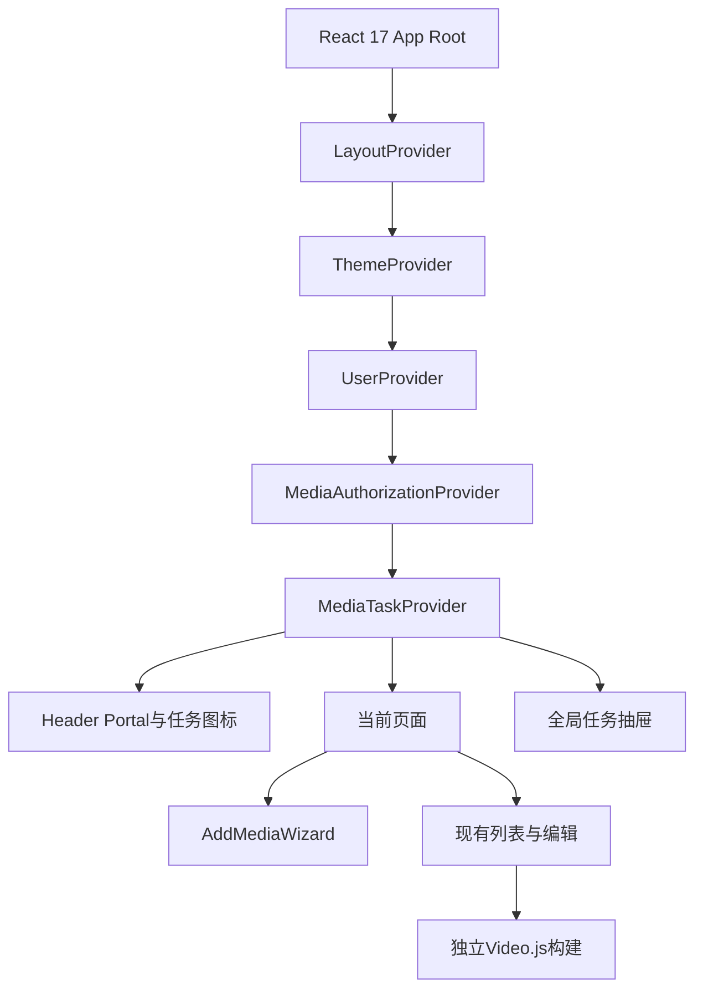
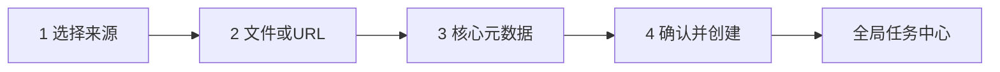
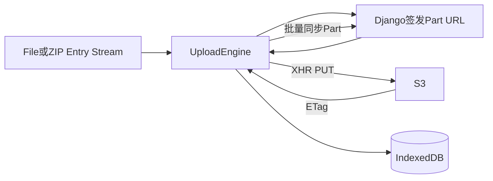
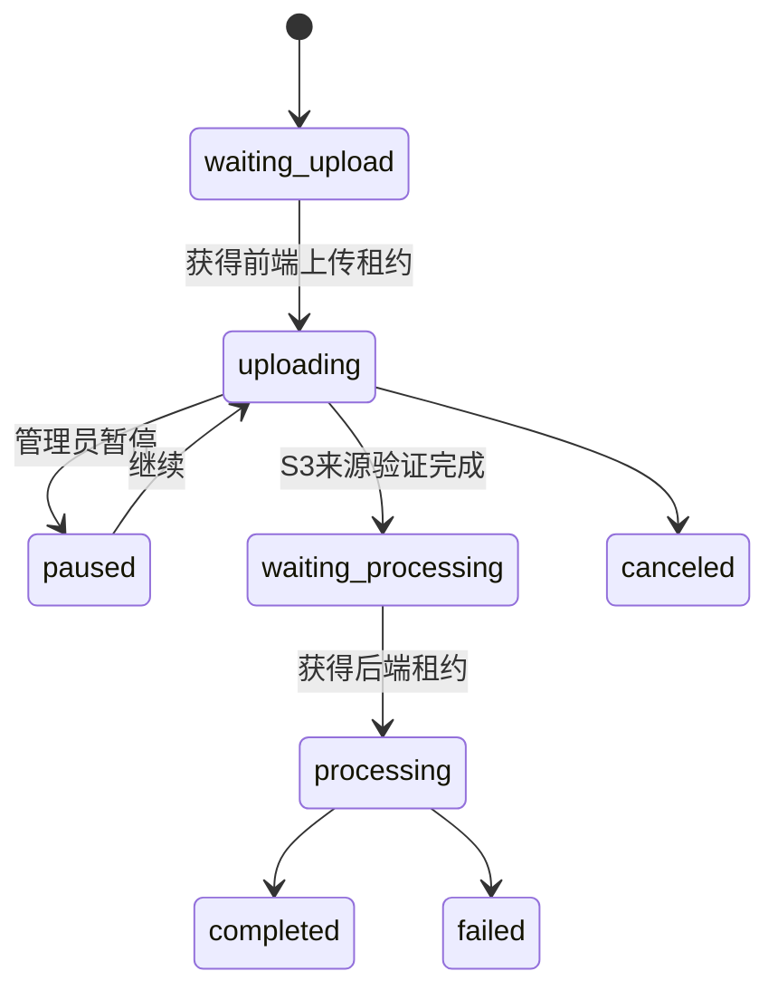
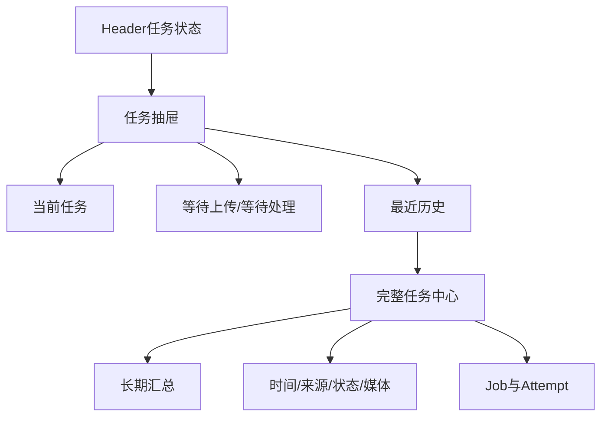
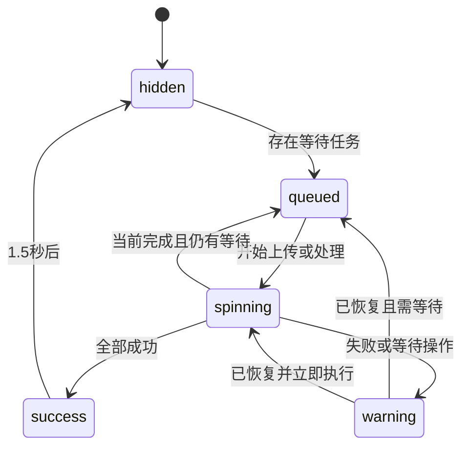
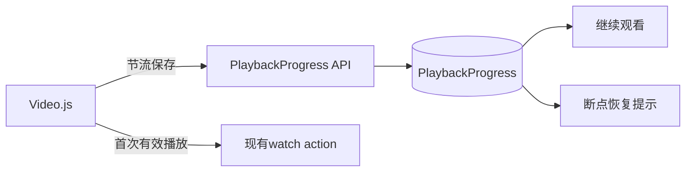
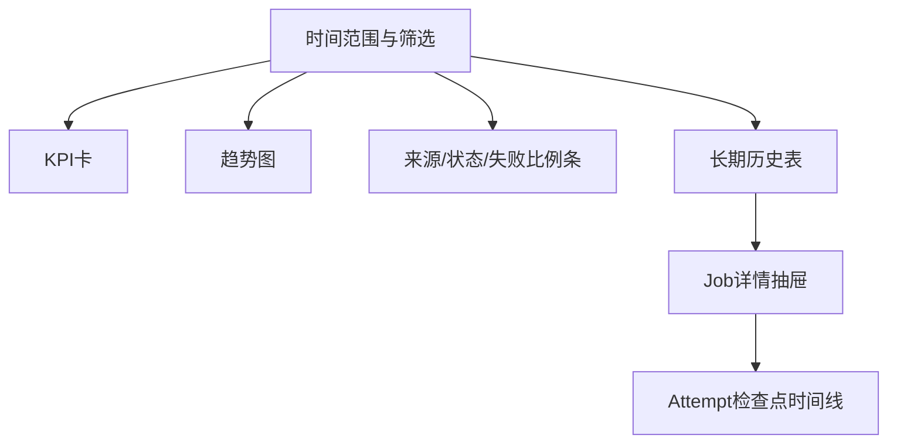

# 08. 前端资源整合与体验

**日期：** 2026-08-01

**状态：** 已确认设计，待实施

## 1. 范围

本模块权威定义 AWS 模式下的前端组件边界、统一添加媒体向导、浏览器上传客户端、全局任务中心、处理图标、播放器客户端和断点续播。上传安全与服务端协议以 `03` 为准，编排状态以 `04` 为准，CloudFront 授权契约以 `06` 为准。

目标是保留现有 MediaCMS Header、Sidebar、媒体列表、详情、编辑页和 Video.js 体验，只替换旧上传内核并增加 AWS 状态能力。

## 2. 整合策略

采用现有 React 17 页面体系内的增量扩展：

- 保留当前 renderer、Portal、页面配置、SCSS 主题和元数据 CRUD。
- 新增 TypeScript React 组件替换添加媒体页对 Fine Uploader 的依赖。
- 在根 Provider 中增加媒体授权和任务 Provider；普通页面导航重新加载后，从服务端和 IndexedDB 重建任务并自动续传。
- `frontend-tools/video-js` 继续作为独立 React 19/Video.js 8 构建，通过 API 和 Cookie 与主站协作，不跨 React Root 共享 Context。
- 不建立第二个媒体管理 SPA，不迁移现有列表和编辑页。
- 添加媒体页停止加载 Fine Uploader 5.13；首期不删除仓库库文件，先审计其他引用。



## 3. 组件与服务边界

### 3.1 MediaAuthorizationProvider

- 进入含受保护媒体的列表、详情、编辑或播放页时调用 Cookie Bootstrap。
- 记录服务端提供的过期时间，临近过期单飞续期。
- 并发授权型 403 共享一次刷新；刷新失败不无限循环。
- 对外只暴露 `ensureAuthorized`、`refreshAuthorization` 和安全状态，不暴露 Cookie 值。

### 3.2 MediaTaskProvider

- 获取当前任务、队列位置、最近历史和汇总摘要。
- 协调服务端唯一上传租约，并使用 Web Locks/BroadcastChannel 防止同一浏览器多个标签页竞争。
- 协调 IndexedDB 恢复、页面刷新对账和任务抽屉。
- Provider 不持有 File 大对象；文件句柄/指纹和上传恢复数据由持久化层管理。

### 3.3 AddMediaWizard

- 负责来源选择、文件/URL输入、核心元数据、预检查和任务创建。
- 创建 Job 后将生命周期交给 Provider；同页操作不会终止上传，普通页面导航后由新页面自动恢复。
- 向导草稿可持久化，但不得保存 Cookie、预签名 URL 或媒体完整内容。

### 3.4 UploadEngine

- 独立 TypeScript 服务，不依赖 React，可由 Provider 驱动和单元测试。
- 使用 XHR PUT 上传 S3 Part，以获得字节进度和立即 abort 能力。
- 负责暂停、继续、URL续签、重试、ETag、服务端同步和严格单任务；只有持有服务端上传租约时才能发起 PUT。
- 对浏览器只提供状态事件；Django/S3 对账结果始终覆盖本地推断。

### 3.5 TaskCenter

- 抽屉显示当前任务、队列和最近历史；完整页面显示长期历史、Attempt 和汇总。
- 只消费稳定任务 API，不自行推导后端检查点是否完成。

### 3.6 PlaybackProgressClient

- 位于独立播放器构建内，查询、提示、保存和离线同步播放位置。
- 通过播放会话时间戳/版本避免旧标签页覆盖新进度。
- 不改变现有 `MediaAction(action=watch)` 的观看计数语义。

## 4. 统一添加媒体向导

统一“添加媒体”页面采用四步向导：



来源固定为：

1. 本地视频或音频。
2. 本地 HLS ZIP。
3. YouTube 单视频。

字幕上传仍在媒体编辑页，不作为独立媒体来源。

### 4.1 来源步骤

- 本地媒体：只选择一个文件，显示类型、大小、快速指纹和可恢复会话。
- HLS ZIP：显示扫描状态、入口 manifest、文件数量、解压总量和安全检查。
- YouTube：输入并规范化单视频 URL，显示 Cookie 最近上传日期、无历史警告和发现结果。

### 4.2 核心元数据

向导只录入标题、描述、标签、分类、可见性和可选封面。自动值标记来源；管理员修改后标为人工值，后端自动探测不得覆盖。高级字段、字幕和完整 CRUD 继续使用现有媒体编辑页。

### 4.3 确认步骤

显示来源、文件、预计上传量、元数据、字幕发现和 Cookie 使用状态。确认后立即创建 Media 草稿、Job 和上传会话。管理员可以前往媒体编辑页或留在任务详情；全局任务中心继续工作。

### 4.4 Cookie 组件

同一安全组件出现在：

- YouTube 向导快捷入口。
- 管理设置页。
- Cookie 导致失败的任务 Resume 区域。

只显示最近上传和最近使用日期，永不显示或下载明文。存在有效历史版本时默认使用最新版本；没有时显示警告但允许无 Cookie 尝试。

## 5. 前端依赖与资源

| 能力 | 选型 | 约束 |
| --- | --- | --- |
| HLS ZIP | `@zip.js/zip.js` | Web Streams、Worker、Zip64；Worker数量固定1 |
| IndexedDB | `idb` | 保存恢复元数据，不保存媒体或秘密 |
| Multipart | 自建 UploadEngine + XHR | 浏览器无 AWS 凭证；Django签发短期URL |
| 状态 | React Context + reducer | 单管理员、单上传，不引入Redux |
| 播放 | 现有 Video.js 8 | 继续独立构建 |
| 图标 | Material Icons + CSS | 遵循现有主题和减少动画偏好 |

不引入浏览器 AWS SDK。普通 API 延用 Axios；XHR 只承担需要上传进度的 S3 PUT。



ZIP entry 通过 Stream 进入受控 Part 缓冲区，不生成完整解压 Blob。依赖依据：[zip.js](https://github.com/gildas-lormeau/zip.js)、[idb](https://github.com/jakearchibald/idb)、[S3 Multipart](https://docs.aws.amazon.com/AmazonS3/latest/userguide/mpuoverview.html)。

## 6. 严格单上传与恢复

前端上传也严格单任务。新任务可创建，但只有队首能取得服务端上传租约。Django租约是跨浏览器和跨设备的权威保护；Web Locks API和BroadcastChannel只是同一浏览器内的快速协调与状态广播。租约包含owner token、heartbeat和过期时间，页面崩溃后必须等待过期并与S3对账再接管。



- 支持 File System Access API 时，在明确授权后保存文件句柄。
- 不支持或权限失效时，要求重新选择同一文件。
- 文件名、大小、lastModified 和快速指纹必须匹配；不匹配禁止复用 Part。
- HLS ZIP 重新选择后跳过已由 S3验证的 entry/Part。
- IndexedDB 保存业务会话 ID、Upload ID、文件指纹、Part/ETag、HLS entry映射和向导草稿；不持久化预签名 URL。
- 刷新恢复先查询 Django/ListParts/Object 验证，再更新 IndexedDB。
- 普通页面导航会中止当前XHR；已完成Part保留，未完成Part在新页面重传。新页面初始化Provider后重新取得/接管租约并自动续传，因此不承诺单个XHR跨页面存活。
- 关闭浏览器、失去文件句柄权限或换设备后，任务保持 `action_required`；重新授权同一文件后继续。

## 7. 全局任务中心与长期历史

Header 按钮打开任务抽屉；抽屉显示当前任务、等待队列和最近历史，“查看全部”进入完整页面。



活动任务卡必须显示：媒体标题、来源、当前阶段、阶段/总体两条进度、字节或文件数、速度、剩余时间、队列位置、最近更新时间、允许操作和安全错误。

历史任务、Attempt、诊断和汇总长期保留，不自动删除。媒体删除后保留标题快照和审计关系。完整页展示成功率、总上传量、处理时长、来源分布、失败分类和 AWS 输出分钟数；诊断默认折叠且已脱敏。

## 8. 旋转任务图标

Header 在存在未终结任务时显示任务状态图标：

- `waiting_upload/waiting_processing`：静态时钟和等待数量徽标。
- 上传、验证、下载、转码、发布、清理：`sync/autorenew` 外圈以 `1.1s linear` 旋转，细进度环显示总体进度。
- 点击打开任务抽屉，悬停显示当前阶段和百分比。
- 全部成功：显示勾选约 1.5 秒后淡出并从 DOM 移除。
- 失败或等待 Cookie/文件授权：停止旋转并显示警告，直到管理员确认或处理。
- 历史完成任务不重新显示图标。
- `prefers-reduced-motion` 时不旋转，只更新静态进度环、图标和可读文本。



## 9. 播放器客户端

媒体 API 向播放器提供 `media_id`、`asset_version_id`、`media_type`、稳定 CloudFront manifest/poster/thumbnail URL、duration、实际字幕轨和处理状态。

- 初始化前确保 CloudFront Cookie 已 Bootstrap。
- HLS 默认 Auto；手动清晰度偏好保存在浏览器。
- 新媒体不存在偏好档位时选择最接近且不高于偏好的档位；清晰度菜单以 manifest 为准。
- 手动档位不因网络自动降级；提示可切回 Auto。
- 字幕只显示实际存在的中文、English、中文 / English；无字幕显示“字幕暂无可用选项”。
- 音频使用同一授权、字幕和进度逻辑，隐藏清晰度菜单并显示封面。
- 授权型 403 触发一次单飞刷新；图片加一次 cache-busting，HLS重载；仍失败则停止循环并显示登录/权限错误。

## 10. 断点续播

新增独立 `PlaybackProgress`，不复用 `MediaAction.extra_info`：

```text
PlaybackProgress
- administrator_id
- media_id
- asset_version_id
- position_seconds
- duration_seconds
- completed
- playback_session_version
- last_played_at
```

唯一约束为管理员和 Media。`asset_version_id` 用于判断替换语义，不把每个资源版本产生为独立永久进度。



### 10.1 恢复规则

- 小于 10 秒：从头，不提示。
- 10 秒至 95%且距结尾至少 30 秒：显示“从 mm:ss 继续 / 从头播放”。
- 默认选择继续，但不强制自动播放。
- 超过 95%或距结尾不足30秒：视为已完成，下次从头。
- URL显式 `?t=` 优先，不显示断点提示。
- 音频与视频规则一致。

### 10.2 保存与冲突

- 播放中每10秒节流保存；pause、seeked、页面隐藏和销毁立即保存。
- ended 设置 `completed=true`；进度更新不增加观看次数。
- 网络失败只在本地保留最新待同步位置；联网后提交最新值。
- 请求携带播放会话版本/时间戳，服务端拒绝旧标签页覆盖更新进度。
- 重新编码同一内容默认保留进度；替换源文件默认重置，管理员可明确选择保留。
- 媒体卡片显示细进度条，并提供“继续观看”列表。

## 11. 错误与恢复契约

API 错误使用稳定 `error_code + safe_message + allowed_actions`，前端禁止解析错误字符串决定流程。

- 网络上传失败指数退避，默认最多5次；已由 S3确认的 Part不重传。
- 预签名 URL过期透明续签，不计普通上传失败次数。
- 文件权限丢失进入 `action_required`，保留已上传 Part。
- HLS ZIP安全或 manifest失败立即停止后续上传并展示可理解的问题。
- Cookie失败提供内嵌上传和 Resume。
- 断点保存失败不打断播放，本地排队并非阻塞提示。
- 取消二次确认，说明上传数据将由后端最终清理。
- 日志、UI、IndexedDB和分析事件均不得包含 Cookie、签名 URL、CloudFront签名、本地完整路径或秘密。

## 12. 测试与验收

### 12.1 单元

- reducer、队列和唯一上传租约。
- Part暂停、重试、续签、取消和ETag合并。
- 文件指纹、句柄恢复、HLS路径/压缩限制。
- 进度聚合、旋转图标状态和减少动画。
- 断点阈值、完成判定、版本替换和旧会话冲突。
- 自适应轮询退避、前后台切换、Leader选举和旧revision丢弃。
- 能力协商、未知状态兜底和Chart.js文字/数据表替代内容。

### 12.2 API契约

- 上传创建、Part URL、完成、恢复、取消和S3对账。
- 当前任务、长期历史、汇总和Attempt。
- Cookie状态、上传和Resume。
- CloudFront Bootstrap/续期。
- PlaybackProgress查询、写入、完成和版本替换。
- TaskView投影、进度配置、Action幂等和Media revision冲突。
- 历史游标分页、服务端筛选、每日汇总和已删除Media快照。

### 12.3 浏览器端到端

- 视频/音频/HLS ZIP的暂停、刷新、重新授权、恢复和完成。
- 第二任务严格等待，第一任务暂停/结束后才获得上传租约。
- 同页离开向导时上传不中断；跨页面导航后自动重建并续传，Header图标与任务中心一致。
- 多标签页、不同浏览器或设备同时打开时，服务端租约仍只允许一个上传者。
- 成功图标消失，失败警告保留。
- YouTube无Cookie、默认历史Cookie和Cookie失败Resume。
- Cookie过期后缩略图、poster、WebVTT和HLS恢复。
- 清晰度Auto/手动记忆、字幕三轨/单轨/无字幕。
- 视频/音频断点、`?t=`优先、已完成重播和跨设备冲突。
- 元数据并发冲突、字幕/封面原子换版、异步删除和清理重试。
- 站内通知、可选浏览器通知、能力不兼容阻止上传和安全降级。

### 12.4 非功能

- 多GB文件和ZIP entry不整体进入内存。
- 键盘可操作向导、抽屉、恢复提示和播放器菜单。
- 进度条具备可访问数值与文本；窄屏抽屉为全屏面板。
- 真实浏览器连接测试S3 Multipart、CORS、ETag和CloudFront Cookie；Mock不能代替该验收。

## 13. 自适应轮询与多标签页

MVP不使用SSE。`MediaTaskProvider`采用自适应轮询：

- 上传中由本地事件实时更新，每5秒与后端对账。
- 排队、处理、发布和清理阶段每5秒。
- 页面进入后台后降为每20秒。
- 网络错误按5/10/20/30秒退避，上限30秒并加入随机抖动。
- 页面恢复前台、打开任务中心或执行Action后立即刷新。
- 无活动或待处理任务时停止轮询。

同一浏览器通过BroadcastChannel与Web Locks选出一个轮询Leader，其他标签页接收状态广播；Leader消失后重新选举。后端读接口仍必须容忍重复轮询，Leader机制只优化流量，不保证正确性。

前端只消费 `04` 定义的TaskView。未知display status、stage或error code使用安全兜底文案；只有较新revision可覆盖当前状态。Action按钮严格依据allowed_actions，调用统一Action API时携带If-Match和Idempotency-Key。

## 14. 历史与汇总展示技术

采用“现有React/SCSS + Chart.js小范围趋势图 + CSS比例条 + 现有管理表格 + Attempt时间线”：

- KPI卡：任务总数、成功率、上传总量、MediaConvert输出分钟、平均等待和平均处理时间。
- Chart.js：每日完成/失败、上传量、等待/处理时长；按需注册Line/Bar、Scale、Tooltip和Legend。
- CSS比例条：来源、最终状态和Top失败分类，避免为简单分布使用复杂图表。
- 历史列表：复用MediaCMS Management Table视觉，后端游标分页、筛选和排序。
- Job详情：抽屉内使用语义化有序时间线展示Attempt、检查点、AWS Job和清理。

Chart.js Canvas必须同时提供标题、动态aria-label、文字摘要和“查看数据表”；不能只用颜色区分状态。前端不重新聚合全部历史。依据：[Chart.js可访问性](https://www.chartjs.org/docs/latest/general/accessibility.html)。

建议页面层级：



## 15. 通知与浏览器支持

### 15.1 通知

- 站内通知默认开启；成功显示轻量Toast，失败/action_required显示持久通知。
- 通知点击打开任务或Media；连续完成可以合并摘要。
- 浏览器Notification为可选且默认关闭，只在管理员主动开启时请求权限。
- 页面在后台时才发送系统完成/失败/等待操作通知；拒绝权限后不重复请求。
- MVP不发送邮件，不使用Service Worker Push；浏览器关闭后不承诺通知。
- 通知正文不得包含本地路径、YouTube URL、Cookie或AWS诊断秘密。

### 15.2 浏览器基线

- 支持桌面Chrome、Edge、Firefox、Safari最近两个主要版本；不支持IE和旧WebView。
- Chrome/Edge可使用持久文件句柄；Firefox/Safari重新选择同一文件恢复。
- 移动端支持任务查看、CRUD、播放和普通媒体上传；HLS ZIP正式支持仅限桌面。
- 不依赖Background Fetch。Web Locks/BroadcastChannel缺失时退化为服务端租约和普通轮询。
- 使用能力检测而不是User-Agent决定功能。

## 16. 媒体编辑与播放入口

### 16.1 继续观看

- 首页在存在有效断点时把“继续观看”放在媒体列表顶部。
- 历史页提供“继续观看/全部历史”；后端按last_played_at返回，不由前端全量筛选。
- 媒体卡片显示细进度条和“已观看x% · 继续mm:ss”。
- completed媒体不在继续观看中但保留观看历史。
- “清除观看进度”只删除PlaybackProgress，不删除watch历史或计数。
- URL显式时间、恢复阈值和资源替换规则遵循第10节。

### 16.2 字幕面板

- 媒体编辑页展示语言、名称、来源、格式、默认轨和处理状态。
- 管理员可上传SRT/VTT、替换、删除、下载受保护文件和重新生成双语字幕。
- 字幕较小，经Django完成限制、规范化、校验和S3发布，不使用Multipart。
- 字幕变化创建候选资源版本并原子激活，不重跑MediaConvert；旧版本处理期间继续播放。
- 双语轨与中文/英文源轨存在依赖，删除源轨时必须提示同步删除或标记双语轨过期。
- 没有字幕时显示“字幕暂无可用选项”。

### 16.3 Poster与Thumbnail面板

- 明确区分播放器Poster、列表Thumbnail、自动帧、YouTube来源图和管理员上传图。
- 管理员可替换、恢复自动候选、让Thumbnail使用Poster；上传图优先级最高。
- 小图片经Django校验和Pillow轻量裁剪/缩放，不走Multipart。
- 视频默认16:9裁剪；音频方图按播放器容器适配，不破坏原比例。
- 图片变化创建新资源版本；没有候选时使用系统默认视频/音频封面。

### 16.4 元数据冲突与删除

- 编辑页PATCH携带Media revision；409时展示服务器值与本地值供管理员选择。
- 自动字段标明来源，管理员编辑后变为人工值。
- 暂停、取消上传、取消处理、删除Media和关闭页面使用不同操作与文案。
- 删除返回202并显示后台删除进度；删除失败提供重试清理，历史审计仍可查看。

## 17. 能力协商与部署保护

前端启动添加媒体与任务功能前调用：

```text
GET /api/media-system/capabilities
```

响应至少包含AWS模式、API主版本、Task投影版本、各来源进度配置版本、已启用来源、功能开关和前端预检查限制。

```json
{
  "mode": "aws",
  "api_version": "1",
  "task_projection_version": "1",
  "progress_profile_versions": {
    "local_media": "1",
    "hls_zip": "1",
    "youtube": "1"
  },
  "sources": {
    "local_media": true,
    "hls_zip": true,
    "youtube_single": true
  },
  "features": {
    "playback_progress": true,
    "browser_notifications": true,
    "automated_abr": false,
    "accelerated_transcoding": false
  }
}
```

- mode不是aws或API主版本不兼容时禁止创建任务并显示部署错误，不回退旧本地转码。
- 来源卡和文件限制由响应控制；后端仍重复执行安全验证。
- 能力响应不得包含密钥、Bucket、Role ARN、S3 Key或内部诊断。
- 部署顺序为兼容后端、前端、开启AWS模式。

## 18. 前后端接口汇总

```text
GET  /api/media-system/capabilities
GET  /api/media-tasks/active
GET  /api/media-tasks/history
GET  /api/media-tasks/summary
GET  /api/media-tasks/{id}
GET  /api/media-tasks/{id}/attempts
POST /api/media-tasks/{id}/actions

GET    /api/playback-progress/continue
GET    /api/playback-progress/{media_id}
PUT    /api/playback-progress/{media_id}
DELETE /api/playback-progress/{media_id}
```

上传会话、Cookie、CloudFront Bootstrap、字幕和视觉资源接口遵循对应模块契约。所有写接口使用Session + CSRF；S3和CloudFront凭证边界以`06`为准。
