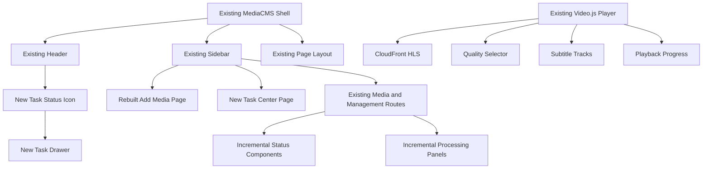

# 09. 前端兼容式布局

**日期：** 2026-08-01

**状态：** 已确认设计，待实施

## 1. 目标与边界

本模块权威定义 AWS 模式的新前端布局。组件行为、任务投影、上传恢复、轮询与播放器数据契约以 `08-frontend-experience.md` 为准。

布局采用兼容优先的增量方案：保留现有 MediaCMS React 17 Root、renderer、路由、Header、Sidebar、Portal、SCSS 主题、媒体 CRUD 和 Video.js 页面。`Add media` 是唯一整体替换的现有页面，`Task center` 是唯一新增的主要页面；其余页面只增加局部组件。

所有新增可见文字，包括标签、按钮、状态、提示、校验、错误、Tooltip 和空状态，必须使用英语。旧界面文案不在本模块中做全站翻译。



## 2. 全局外壳

### 2.1 Header

- Logo、搜索、Sidebar 开关和管理员菜单保持不变。
- 在现有 Upload 入口与管理员头像之间加入任务状态图标。
- 点击图标通过现有 Portal 打开右侧 Task Drawer。
- 没有活动任务和需处理异常时，图标从 DOM 移除。
- 运行中显示已批准的旋转进度图标；全部成功时显示勾选约 1.5 秒后消失；需处理的失败持续显示警告。
- 不新增通知铃。普通反馈继续使用现有 Toast，持久异常由任务图标和 Task Center 表达。

Tooltip 示例固定使用英语：`Uploading — 42%`、`Processing — 68%`、`3 tasks waiting`、`Task requires attention`。

### 2.2 Sidebar

保留现有顺序、路由、选中样式、折叠行为和权限机制，只做以下增量：

- 现有 Upload 入口显示为 `Add media`，仍使用兼容路由。
- 在其下新增 `Task center`。
- 保留 `My media`、`Manage media`、`Playlists`、`History`、`Tags` 和 `Categories` 等现有入口。
- YouTube Cookie 和系统状态位于现有管理员设置，不新增顶级导航。
- 评论、分享、用户管理、LTI、SAML、RBAC 等禁用入口由 capabilities/配置隐藏；后端仍必须拒绝相应写 API。
- 失败任务可在 `Task center` 入口显示警告徽标；Sidebar 不重复运行中旋转动画。

建议的局部导航结构：

```text
Home
Featured
Latest

Add media
Task center
My media
Manage media

Playlists
History
Tags
Categories
```

## 3. Add media

页面沿用现有内容区，采用四步向导：`Source`、`Input`、`Details`、`Review`。

```text
┌──────────────────────────────────────────────────────────────┐
│ Add media                                                    │
│ Upload, import, or download media                            │
├──────────────────────────────────────────────────────────────┤
│  1 Source  ───  2 Input  ───  3 Details  ───  4 Review      │
├───────────────────────────────────────┬──────────────────────┤
│ Current step form                     │ Task summary         │
│ Source-specific fields                │ Source               │
│ Metadata fields                       │ File / URL           │
│ Validation and warnings               │ Subtitle status      │
├───────────────────────────────────────┴──────────────────────┤
│ Cancel                         Back            Continue      │
└──────────────────────────────────────────────────────────────┘
```

- 桌面主表单约 70%，`Task summary` 约 30%；移动端变为单列，摘要位于表单下方。
- 来源选项为 `Video file`、`Audio file`、`HLS package` 和 `YouTube video`。
- HLS 明确要求 ZIP；浏览器本地扫描、解包并直传 S3。
- `Details` 复用现有标题、描述、标签、分类等字段和校验。
- YouTube 提供 `Use saved cookies`，显示 `Last uploaded: …`；没有历史 Cookie 时警告但允许直接尝试。
- 选中文件后立即显示名称、大小、类型和恢复能力。
- 最终按钮为 `Create task`。创建后进入全局严格单任务队列，页面可离开。
- 草稿可恢复；文件权限失效时显示 `Select the same file to continue`。
- Stepper使用语义化有序列表，当前步骤标记 `aria-current="step"`；每一步使用原生表单语义。
- 校验失败时在步骤顶部显示可聚焦的Error Summary，各错误链接到对应字段，并把焦点移到Summary。
- `Create task`提交后立即禁用并显示pending；请求携带Idempotency-Key，防止双击创建重复任务。
- 返回上一步保留已录入字段；切换Source会清除来源专属字段，必须先确认。
- 离开提醒只用于未保存元数据或尚未创建的草稿。跨页面上传恢复文案使用 `Upload will resume on the next page`。
- 窄屏Stepper只显示 `Step 2 of 4 · Input` 这类当前步骤摘要，不强行排列四个完整标题。
- 移动端步骤操作栏sticky置底并加入safe-area padding；Back和Continue在滚动、软键盘收起后始终可找到。
- 文件选择器返回后焦点落到文件摘要。Metadata输入字号至少16px；YouTube字段使用`type="url"`、`inputmode="url"`并关闭自动大写和拼写检查。
- 移动端上传阶段显示 `Keep this page open while uploading. You can resume if the upload is interrupted.`，不得声称锁屏或切换App后仍持续传输。

## 4. Task Drawer

桌面从右侧打开，宽度约 420px；小于 768px 时占满屏幕。

```text
┌──────────────────────────────────────┐
│ Tasks                         Close  │
├──────────────────────────────────────┤
│ Current task                         │
│ Video title                          │
│ Uploading · 42%                      │
│ █████████░░░░░░░░░░░                 │
│ 1.2 GB of 2.8 GB · 18 MB/s           │
│ About 1 minute remaining       Pause │
│                                      │
│ Waiting                              │
│ 1  Another video       Ready         │
│ 2  YouTube video       Waiting       │
│                                      │
│ Recent                               │
│ ✓ Audio title          Completed     │
│ ! Failed video         Action needed │
├──────────────────────────────────────┤
│ View task center                     │
└──────────────────────────────────────┘
```

- 只展开一个当前任务；同时显示总体进度和真实阶段。
- 上传显示字节、速度和可计算的剩余时间；AWS 阶段不伪造剩余时间。
- 等待任务显示固定 FIFO 顺序，不允许拖拽。
- Recent 最多 5 条，完整记录进入 Task Center。
- 失败任务显示首要恢复动作，如 `Upload cookies`、`Select file`、`Retry` 或 `Resume`。
- `Pause`、`Cancel` 等操作严格来自后端 `allowed_actions`。
- 关闭抽屉不终止任务。
- 桌面端是非模态 complementary panel，不使背景页面失效；打开后焦点移到抽屉标题，关闭后返回Header任务按钮。
- 移动端全屏是modal dialog：背景inert，Tab/Shift+Tab限制在抽屉内，Escape关闭，并具有可见Close按钮和可访问名称。
- 删除、取消等不可逆确认使用alertdialog，初始焦点放在非破坏性操作。
- 移动端Drawer使用动态视口高度，Header与底部操作栏固定、内容区独立滚动；打开时保存并锁定背景滚动，关闭后恢复原位置。
- 从Drawer进入完整Task Center时先关闭Drawer；任务确认框不得形成modal套modal。

## 5. Task center

页面复用现有内容宽度、卡片、管理表格和分页模式。

- 顶部 KPI 为 `Active`、`Waiting`、`Failed` 和 `Completed`。
- 有运行任务时显示 Current task 卡，无任务时不保留空占位。
- 标签为 `All`、`Active`、`Waiting`、`Failed`、`Completed`。
- 支持搜索以及 Source、Date、Status 过滤；过滤条件保存在 URL。
- 表格列为 `Task`、`Source`、`Status`、`Progress` 和 `Updated`；移动端转为卡片。
- 默认按最近更新时间倒序，使用后端游标分页和 `Load more`，不全量下载长期历史。
- 点击任务打开任务详情，不跳到媒体编辑页。
- 历史长期保留；媒体删除后仍显示安全的标题快照。
- 可折叠 `Insights` 提供最近 30 天的完成率、平均处理时长、来源分布、每日完成/失败趋势和处理时长分布。
- 趋势使用 Chart.js；KPI、比例条优先使用 React/SCSS；每个 canvas 图表必须有等价文本或表格。
- Attempt 时间线使用语义化 HTML/CSS，不引入额外时间线库。
- `@zip.js/zip.js`只在选择HLS package后动态加载；Chart.js只在展开Insights后动态加载。长期历史继续服务端分页，首期不引入虚拟列表。
- 移动任务卡默认只显示title、display status、progress、updated time和首要action；Source、Attempt、队列、速度和错误详情在展开区显示。
- 移动筛选使用全屏或bottom sheet，固定提供Status、Source、Date、Apply filters和Clear filters；应用或返回后保持列表滚动位置。

## 6. 媒体列表与编辑页

### 6.1 列表

- `ready` 保持现有卡片和播放行为。
- `draft` 显示 `Draft` 并进入编辑页。
- `processing` 显示真实阶段与紧凑进度，如 `Transcoding · 68%`。
- `failed` 显示 `Action needed` 并优先打开关联任务。
- 无 active asset 时禁用播放；旧 active asset 有效时允许播放，并显示 `New version processing`。
- 缩略图未生成时继续使用现有占位图。
- 管理表格增加或复用 `Status`、`Source`、`Updated`；批量选择和原 CRUD 不变。
- 异步删除期间显示 `Deleting`。
- 轮询只局部更新受影响卡片或行，避免整个列表闪烁。

### 6.2 编辑页

保留现有 `Media details` 表单，在下方增加彼此独立提交的三个区域：

1. `Processing`：状态、来源、active version、最近处理时间，以及后端允许的 `View task`、`Replace source`、`Reprocess`。
2. `Subtitles`：分别管理 `Chinese`、`English`、`Chinese / English`；接受 SRT/VTT 并由后端规范化，不触发 MediaConvert。
3. `Visual assets`：分别维护 Poster 和 Thumbnail，可上传或选择候选图片。

`Replace source` 创建 candidate asset version，成功后原子切换；失败不影响旧 active version。源文件已清理时禁用依赖源文件的 `Reprocess` 并说明原因。双语字幕只有在中英文轨均存在时才能重新生成。局部提交运行时显示旋转图标，成功后显示约 1.5 秒勾选再消失。

## 7. 首页、History 与播放器

### 7.1 Continue watching

- 首页在现有常规媒体区块之前加入可配置的 `Continue watching`；没有未完成记录时整个区块不渲染。
- 卡片复用现有缩略图，只增加底部进度条和剩余时间。
- 点击后显示 `Resume from 12:34`，操作为 `Resume`、`Start over`。
- 显式 `?t=` 覆盖保存进度且不弹询问。
- 超过 95% 或不足 30 秒视为完成，不进入该区块。
- History 增加 `Progress`、`Last watched`、`Completed`、`Clear progress`；清除只删除 PlaybackProgress。
- 移动端使用横向卡片滚动，不增加密集表格。

### 7.2 播放器

- 保留现有 Video.js 页面与控制条，HLS 默认 `Auto`，并提供实际存在的 `1080p`、`720p`、`480p`、`360p`。
- 字幕菜单只显示实际存在的 `Chinese`、`English`、`Chinese / English` 和 `Off`；无字幕显示 `No subtitles available`。
- 音频使用同一页面的紧凑模式，并以 Poster 为封面或背景，不显示质量选择。
- Poster、WebVTT 和 HLS 共用 CloudFront Signed Cookie 授权域。
- Cookie 过期导致资源失败时暂停、重新 Bootstrap，并从原位置恢复；不得暴露 candidate URL。
- 进度保存失败不打断播放，只显示 `Playback progress could not be saved`。
- 设备旋转只触发响应式重排，不得自动调用全屏。全屏只能由用户操作触发；进入全屏后可尽力锁定横屏，失败静默回退，退出时解除锁定。
- 移动控制条固定优先级为Play/Pause、Time、Spacer、Settings、Fullscreen，主要触控区域至少44×44px；不得为塞入全部按钮而缩小到26px或取消间距。
- Quality、Subtitles、Playback speed、Autoplay和Chapters进入Settings面板；直接CC按钮可隐藏，但字幕能力必须始终可从Settings访问。
- 移动Resume提示使用控制条上方的轻量底部面板，不遮挡字幕；`Resume`为主要操作，但不得强制自动播放。
- 必须移除播放器对`:focus`/`:focus-visible`的全局`outline: none`覆盖，并为播放、设置、字幕、质量和全屏等控件提供高对比焦点环。
- 字幕位置依据实际控制条和面板高度计算，不使用多组固定`em`偏移；普通与双语字幕均不得被Resume、错误或Settings面板覆盖。
- 字幕至少提供`Small`、`Default`、`Large`显示偏好并在浏览器保存；双语字幕优先每种语言一行，避免占据超过约30%的视频高度。

## 8. 管理员设置

复用现有管理员设置页，增加 `Media processing`：

- `System status` 只显示 AWS storage、MediaConvert、CloudFront 和 Upload queue 的安全状态及 `Refresh status`。
- 状态值为 `Connected`、`Available`、`Degraded`、`Unavailable`；不返回 Bucket 密钥、IAM 凭证、Cookie 内容或签名私钥。
- `YouTube cookies` 显示最近上传时间、状态以及 `Upload cookies`、`Remove`。
- 从未上传时显示 `No cookies have been uploaded` 和 `Some YouTube videos may require cookies to download.`
- 任务默认使用最近有效 Cookie；Cookie 失败的任务显示 `Upload cookies and resume`。
- Cookie 由 Django 接收并加密保存，不能下载明文；移除需要二次确认，且不自动改变已有任务。
- 站内通知默认开启且首期不提供关闭；浏览器通知默认关闭且可选开启；不显示邮件或后台 Push 设置。
- `Default quality` 可将浏览器保存的手动偏好恢复为 `Auto`。

## 9. 通知、错误与可访问性

- 成功使用自动消失 Toast；需要操作的异常长期保留至恢复、取消或确认。
- 同一任务的重复轮询结果必须合并。
- 浏览器通知仅在管理员开启、页面后台且发生完成、失败、需要文件或需要 Cookie 时使用，不包含敏感信息。
- 断网显示 `Connection lost. Progress will update when the connection is restored.`；恢复后立即对账并显示 `Connection restored`。
- AWS 原始错误只写后端日志；界面显示安全摘要和可执行恢复动作。
- capabilities 不兼容或 AWS 模式不可用时禁用 `Create task`，不得回退到本地转码。
- 新控件支持键盘操作、焦点恢复和屏幕阅读器；状态不能只靠颜色表达。
- `prefers-reduced-motion` 下以静态阶段图标和文字替代旋转动画。
- 可计算的上传/文件进度使用原生`progress`或带`aria-valuenow`的progressbar；AWS无法提供可靠百分比时使用indeterminate且省略`aria-valuenow`，不得为了视觉连续性伪造数值。
- `aria-valuetext`包含阶段和可用数值；独立`aria-live="polite"`只播报阶段变化、每10%进度或action required，不播报每个XHR事件。
- Task标题、YouTube metadata和安全错误必须作为文本节点渲染，禁止使用`dangerouslySetInnerHTML`。
- MediaTaskProvider、Add media、Task Center和播放器整合区分别设置错误边界；单个新模块异常不得使现有Header、Sidebar或媒体页面白屏。

## 10. 响应式规则

- `>=1200px`：现有 Sidebar 与完整内容区；Add media 70/30 双栏；Task Drawer 约 420px。
- `768–1199px`：沿用折叠 Sidebar；Add media 摘要缩窄或下移。
- `<768px`：沿用移动 Header；向导单列；表格转卡片；Task Drawer 全屏。
- 移动端正式支持视频/音频基础上传、CRUD、任务查看和播放。
- HLS ZIP 正式支持桌面端；移动端显示 `HLS package import is available on desktop browsers.`。
- 全局viewport保持用户缩放并增加`viewport-fit=cover`，禁止`maximum-scale=1`和`user-scalable=no`。
- 全屏Drawer和移动面板使用`100vh`回退及`100dvh`动态高度，并通过`env(safe-area-inset-*)`保护刘海、圆角和底部Home Indicator。
- 软键盘出现时当前输入和主要操作必须保持可见；不得以固定viewport高度推算键盘空间。

## 11. 技术整合与验收

- 不替换全站状态、路由、CSS 或 UI 框架；任务状态只使用小型 Context/reducer。
- 上传引擎使用已批准的 UploadEngine + XHR，不扩展 Fine Uploader 为 AWS 引擎。
- 新依赖限制为 `@zip.js/zip.js`、`idb` 和 `Chart.js`；播放器继续使用现有 Video.js。
- 新文案集中在英语文案模块，避免散落硬编码并保留未来国际化边界。
- capabilities、TaskView、`allowed_actions` 和 asset version 是前端能力与状态的唯一依据。
- 主站`react`、`react-dom`与对应类型保持17.x；播放器独立保持19.x。共享模块不得依赖React，构建检查必须阻止跨Root组件导入。
- 列表Thumbnail与播放器Poster使用不同响应式尺寸，容器固定`aspect-ratio`且非首屏图片lazy load；授权恢复只重试失败图片且每次失败最多自动恢复一次。

必须验证：

1. 旧路由、Header/Sidebar 折叠、主题和媒体 CRUD 无回归。
2. 上传时离开页面、刷新、重新选择文件后能够安全恢复。
3. 多标签页和多设备下仍由服务端保证严格单任务。
4. 缩略图、Poster、WebVTT 和 HLS 在 Cookie Bootstrap、过期和续期后正确恢复。
5. Media 状态、Job 状态与 cleanup 状态没有在 UI 中混为一个可写状态机。
6. 所有新增可见文案均为英语。
7. 禁用模块入口不可见，写 API 被拒绝。
8. 桌面、移动、键盘、屏幕阅读器和 reduced-motion 行为符合本模块要求。

## 12. 实施计划非阻塞优化清单

以下项目必须带入实施计划，但不作为MVP功能验收的阻塞条件；不得因此推迟核心上传、处理和播放闭环：

- 任务列表使用稳定尺寸的skeleton，避免轮询和首次加载造成布局跳动。
- URL同步的搜索输入增加debounce；过滤器变化立即作废旧请求。
- Header任务图标提供完整accessible name，数量超过99显示`99+`。
- Toast限制同时可见数量，并按任务合并重复事件。
- 浏览器Notification权限只在管理员点击开启时请求。
- 在`prefers-reduced-motion`之外补充`forced-colors`和高对比度样式。
- 使用PerformanceObserver记录Add media首次可交互、Task Center渲染和播放器启动耗时；事件不得包含媒体标题、URL、S3 Key或签名信息。
- 将主站Browserslist与“最近两个主要版本”的已批准浏览器基线统一，并记录构建体积和polyfill变化。
- 使用真实iPhone Safari和Android Chrome覆盖竖屏、横屏及约360px高度的短视口，不以DevTools模拟替代最终验收。
- 测试来电、锁屏、切换App、浏览器回收和Wi-Fi/蜂窝切换后的上传、轮询、授权与播放恢复。
- 验证Android Back按层级先关闭Settings/筛选/Drawer，再执行页面导航。
- 覆盖200%字体放大、系统粗体、移动forced-colors以及长标题两行截断/详情完整显示。
- 覆盖普通Metadata、Tags、YouTube URL和Cookie上传时的虚拟键盘遮挡与焦点恢复。
- 可记录移动上传恢复率、Part重试数和播放器首帧时间，但不得记录文件名、标题、URL或签名信息。

## 13. 最佳实践依据

- [W3C Dialog Modal Pattern](https://www.w3.org/WAI/ARIA/apg/patterns/dialog-modal/)：模态抽屉的焦点、键盘和关闭行为。
- [W3C Progressbar Range Properties](https://www.w3.org/WAI/ARIA/apg/practices/range-related-properties/) 与 [ARIA25](https://www.w3.org/WAI/WCAG21/Techniques/aria/ARIA25)：确定/不确定进度和live region。
- [React External Store Guidance](https://react.dev/reference/react/useSyncExternalStore)：外部可变数据的稳定订阅边界；主站React 17采用等价的Provider订阅模式，不调用React 18 API。
- [Back/forward cache guidance](https://web.dev/articles/bfcache)：使用`pagehide/pageshow`并避免`unload`。
- [File System Access guidance](https://developer.chrome.com/docs/capabilities/web-apis/file-system-access)：文件权限请求必须由用户操作触发。
- [Accessible tap targets](https://web.dev/articles/accessible-tap-targets)：移动触控目标与间距。
- [CSS dynamic viewport units](https://developer.mozilla.org/en-US/docs/Web/CSS/Reference/Values/length) 与 [safe-area environment variables](https://developer.mozilla.org/en-US/docs/Web/CSS/Reference/Values/env)：移动动态视口和设备安全区。
- [Screen Orientation lock](https://developer.mozilla.org/en-US/docs/Web/API/ScreenOrientation/lock)：全屏和方向锁定的能力限制。
