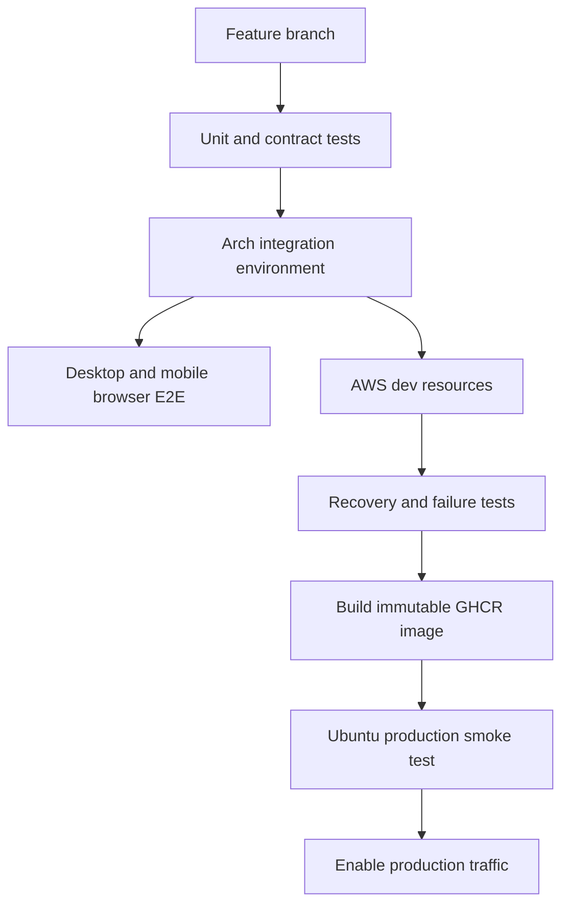
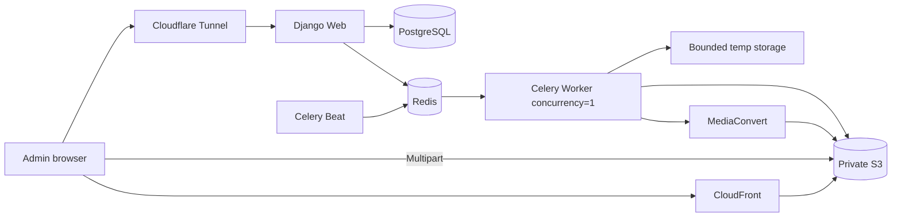
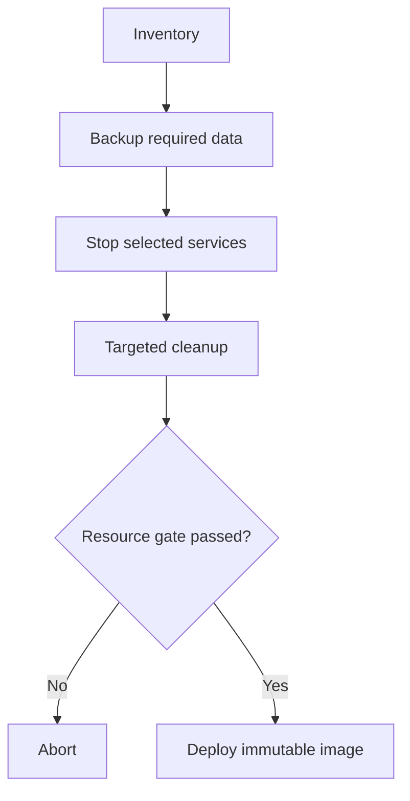
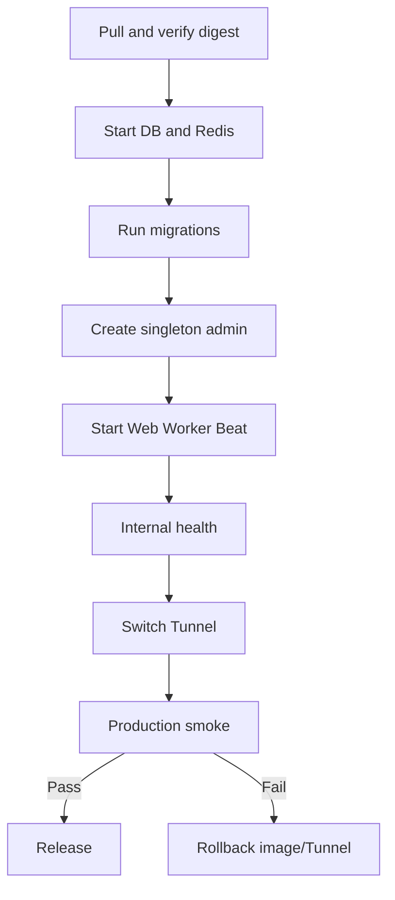

# 10. 测试环境与资源受限生产部署

**日期：** 2026-08-01

**状态：** 已确认设计，待实施计划

## 1. 范围与依据

本模块依据仓库根目录的 `arch-test-environment.txt` 和 `ubuntu-production-environment.txt`，权威定义 AWS 模式的测试分层、机器职责、生产容量准入、GHCR 镜像交付、维护清理、首次部署、回滚和发布门禁。功能验收仍以 `07-deployment-and-acceptance.md` 为准；本模块解决“在哪里、以多少资源、按什么顺序执行”。

全局原则：Arch 是完整开发测试环境；Ubuntu 只运行轻量控制面；S3、MediaConvert 和 CloudFront 承担大文件存储、重转码与分发；生产不构建镜像、不运行压力测试。

## 2. 实测容量与职责

### 2.1 Arch 测试机

实测14个逻辑CPU、30 GiB内存、约20 GiB可用内存、59 GiB Swap、约491 GiB可用NVMe，并具有Docker、AWS CLI、FFmpeg、yt-dlp、GUI和Intel Arc硬件能力。

承担：

- Django/PostgreSQL/Redis/Celery完整开发栈。
- 前端构建、真实浏览器和移动设备联调。
- 视频、音频、HLS ZIP、YouTube和字幕测试。
- CloudFormation与AWS dev资源部署。
- 故障注入、恢复、完整发布候选验收。
- GHCR镜像构建；生产机只拉取不可变镜像。

本地测试最多使用8个CPU、16 GiB容器内存，并始终保留100 GiB磁盘余量。媒体闭环严格串行，普通单元测试可以并行。报告显示项目目录曾达到约53 GiB，实施前必须审计Docker build context和`.dockerignore`，排除媒体、缓存、Git对象、环境报告与测试产物。

### 2.2 Ubuntu 生产机

实测2 vCPU、3.8 GiB内存、约730 MiB可用、3.8 GiB Swap且已使用1.5 GiB、磁盘仅余12 GiB且使用率89%。Docker已有13个运行容器，镜像占31.48 GiB并有约16.59 GiB可回收；Journal占3.5 GiB；systemd为degraded，且存在多次OOM记录。

该机器不可升级，但允许在30–60分钟维护窗口迁移/清理现有容器。清理前禁止部署。上线硬门槛：

| 项目 | 门槛 |
| --- | ---: |
| 可用磁盘 | 至少30 GiB |
| 磁盘使用率 | 不高于75% |
| 空闲时可用内存 | 稳定至少1.5 GiB |
| 空闲时Swap使用 | 低于1 GiB |
| systemd | 非degraded，或每个残留失败单元有无影响说明 |
| OOM | 维护期及部署期无新增OOM |
| 端口 | 8000/8080/5432/6379冲突已解除或改为内部网络 |

任何门槛未通过必须中止部署，不以增加Swap掩盖持续内存不足。

## 3. 测试分层

### 3.1 Arch单元、契约与本地集成

- Django模型、三套状态、检查点、权限和单管理员。
- Multipart、Task Action、PlaybackProgress、capabilities和资源版本API契约。
- reducer、UploadEngine、IndexedDB迁移、TaskView解析、轮询和多标签租约。
- Video.js字幕、清晰度、Cookie续期、断点续播与移动控件。
- CloudFormation lint/template和Docker Compose健康。
- Mock只验证业务分支，不能替代真实S3/MediaConvert/CloudFront验收。

### 3.2 AWS dev集成

- 浏览器Multipart直传、暂停、刷新、重选文件和续传。
- 视频固定ABR + QVBR、单音频HLS、HLS ZIP和首帧回退。
- Signed Cookie Bootstrap、过期与恢复。
- 中文、英文、双语和无字幕。
- candidate完整验证与active原子切换。
- MediaConvert幂等、失败、取消与清理。

普通提交只跑一条短视频闭环；完整MediaConvert矩阵每天或发布前运行。样本固定为20–60秒360p、1–3分钟720p、30–60秒音频、小型HLS ZIP以及公开短YouTube单视频。还需覆盖仅英文、无字幕和必要Cookie场景。

### 3.3 浏览器与移动

- Arch真实Chrome/Firefox；Safari使用真实Apple设备。
- 多标签上传租约、自适应轮询和CloudFront授权恢复。
- Android Chrome与iPhone Safari的后台、锁屏、网络切换、页面回收。
- safe-area、`100dvh`、软键盘、横竖屏、44×44px控件。
- 旋转不得自动全屏；字幕、质量与Resume必须可达且不互相遮挡。

### 3.4 Ubuntu生产冒烟

生产只执行容器健康、迁移、单管理员、capabilities、AWS健康、一个最短视频直传/MediaConvert/播放/删除清理、Tunnel外部访问和资源观察。禁止并发、压力、大文件极限、Docker build和完整浏览器矩阵。

## 4. GHCR镜像交付

- Arch或GitHub Actions构建镜像。
- 标签同时包含commit SHA和发布版本，例如`sha-<commit>`与`aws-mvp-v1`。
- 生产Compose固定镜像digest或SHA标签，不使用`latest`。
- 生产使用只读GHCR Token，仅执行pull。
- Web与Worker首期共用一个镜像，以不同命令运行；前端静态资源在构建时进入镜像。
- 保留当前和上一版本用于回滚，其余版本按明确清单定向清理。
- 发布清单记录commit、镜像digest、数据库迁移版本、CloudFormation版本和MediaConvert TemplateVersion。

## 5. 生产拓扑与资源预算

| 服务 | CPU上限 | 内存上限 | 初始策略 |
| --- | ---: | ---: | --- |
| web | 0.60 | 640 MiB | Gunicorn 1 worker、2–4 threads |
| celery_worker | 0.70 | 768 MiB | concurrency=1 |
| celery_beat | 0.10 | 128 MiB | 仅轻量调度 |
| db | 0.45 | 640 MiB | PostgreSQL小内存配置 |
| redis | 0.10 | 128 MiB | 仅Broker |
| 合计上限 | 1.95 | 2304 MiB | 为OS、Docker、Tunnel留余量 |

PostgreSQL初始参数：`max_connections=30`、`shared_buffers=128MB`、`effective_cache_size=512MB`、`maintenance_work_mem=64MB`、`work_mem=4MB`、`wal_buffers=8MB`。Redis使用`maxmemory 96mb`、`maxmemory-policy noeviction`、`appendonly no`，任务权威数据仍在PostgreSQL。

Celery固定`concurrency=1`、`prefetch_multiplier=1`、`worker_max_tasks_per_child=10`，并将子进程内存阈值初始设为约500 MiB。实际参数需在Arch测量后固化；Worker退出/重启必须从数据库检查点恢复。

## 6. 临时文件与轻任务

- 临时目录固定为`/var/lib/mediacms/tmp`，不放在项目目录。
- 每个Attempt独立、可解析的子目录；删除只能针对已解析且与终态Attempt匹配的精确目录。
- 本地视频与HLS直传S3，不进入后端临时目录。
- YouTube启动前执行磁盘准入检查，始终保留8 GiB系统余量。
- MVP单个YouTube下载默认上限4 GiB；大小未知且空间不足时拒绝启动。
- 移动或失败不能绕过限制；成功、失败、取消均进入cleanup。
- 服务启动可扫描遗留目录，但不得按时间或宽泛路径直接递归删除。
- yt-dlp、字幕和必要ffmpeg位于Worker镜像，宿主机无需安装Node、浏览器或ffmpeg。

## 7. Tunnel与网络边界

- 沿用宿主机systemd cloudflared，origin指向明确的`127.0.0.1` Web端口。
- PostgreSQL和Redis只存在于Docker内部网络，不映射公网。
- S3、MediaConvert、CloudFront不通过Tunnel。
- 现有8000/8080冲突在维护盘点后选择新loopback端口，不抢占未知服务。
- CloudFront Cookie Domain、Secure、HttpOnly和SameSite按生产域名配置。

## 8. 维护、备份与定向清理

维护前记录容器、Compose project、端口、镜像、卷、restart policy、失败systemd单元、日志、内存、Swap和OOM。备份需覆盖要迁移服务的数据、Tunnel配置、Compose/环境配置、systemd override、防火墙及当前镜像digest；数据库备份必须恢复抽检。

只有在单独确认精确对象后才能停止/删除已迁移容器、无用镜像、build cache、归档Journal和已备份无主卷。禁止宽泛`docker system prune -a`，禁止删除运行服务资源，禁止在此阶段清理旧AWS资源。

## 9. 首次部署与回滚

部署顺序：拉取固定digest → 创建专用network/volumes → DB/Redis健康 → 一次性migration → 初始化唯一管理员 → Web内部健康 → Worker/Beat且只有一个slot → Tunnel切换 → 最短视频冒烟 → 开放Add Media。

应用回滚时先切维护页或上一origin，停止新Web/Worker/Beat，切回上一digest并只读健康检查。不得自动反向迁移数据库。首次迁移失败且尚无正式数据时可在明确确认后重建本次专用数据库卷；已有正式数据后只允许前向修复或经验证备份恢复。candidate保持不可见，active资源不得因应用回滚删除。

## 10. 上线观察

首次上线后至少观察60分钟：容器RSS/限制事件、Swap趋势、磁盘/临时目录、PostgreSQL连接、Redis内存/队列、Worker重启、MediaConvert、Cloudflare/Django 5xx、延迟、OOM和cleanup failure。核心闭环失败、资源持续恶化或新增OOM必须回滚，不能继续上传测试媒体。

## 11. 分阶段门禁

1. **Phase 0资源治理：** 达到生产硬门槛、备份抽检、端口和迁移清单确认。
2. **Phase 1本地基础：** 全新DB、单管理员、领域模型、FIFO、Multipart、授权、Add Media、Task Center；单元/契约/Compose通过。
3. **Phase 2 AWS媒体：** 短视频、720p、音频、HLS ZIP、视觉资源、字幕；直传、QVBR、原子激活和清理通过。
4. **Phase 3 YouTube：** 公开短视频、英文/无字幕、可选Cookie失败Resume；临时文件与磁盘限制通过。
5. **Phase 4播放与移动：** 质量、三轨、Cookie续期、断点、版本切换和真实移动设备通过。
6. **Phase 5故障恢复：** Web/Worker/Redis重启、URL/Cookie过期、AWS失败、S3不一致、cleanup与低磁盘；检查点、幂等和active保护通过。
7. **Phase 6候选镜像：** 完整测试、GHCR SHA/digest、使用同一镜像在Arch复验、记录版本清单。
8. **Phase 7生产：** 维护、pull、全新DB、Tunnel、最短冒烟、60分钟观察；禁止压力与构建。
9. **Phase 8稳定期：** 审查成功率、成本、峰值和备份恢复；旧AWS资源必须再次取得明确批准后才清理。

## 12. 发布门禁

- 单元、契约、Arch Compose与至少一次AWS短视频完整闭环通过。
- 上传恢复、Cookie续期、无本地转码回退、candidate隔离通过。
- 新增界面英语和移动关键路径通过。
- GHCR镜像固定SHA/digest，上一版本可回滚。
- 生产资源准入全部通过。
- 冒烟期间无OOM，Swap不持续增长，临时目录和测试资源已清理。
- 任一关键门禁失败则停止，不降低验收标准强行上线。
