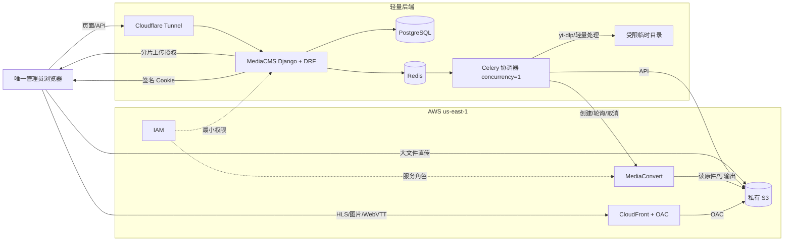
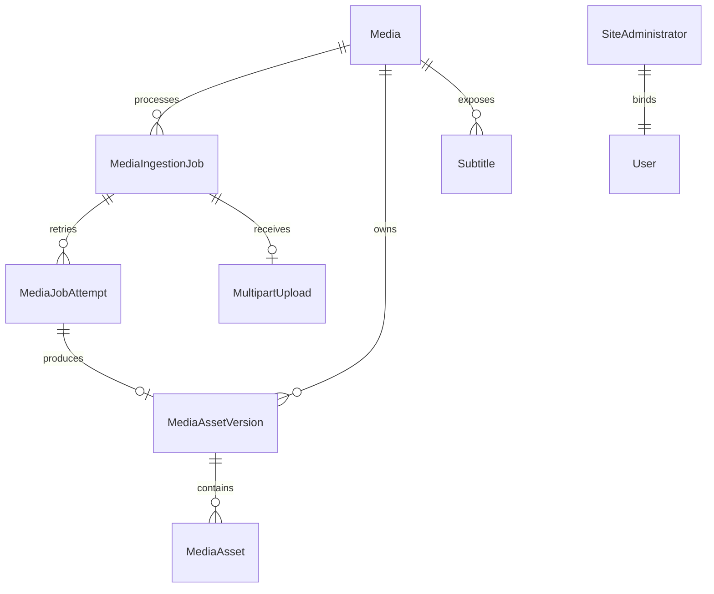
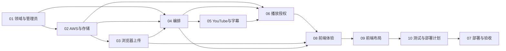

# MediaCMS AWS 后端整合规范

**日期：** 2026-08-01

**状态：** 已批准设计，待实施

**开发分支：** `feat/aws-backend-integration`

## 1. 目标

MediaCMS 是唯一业务系统和轻量控制面；浏览器、S3、MediaConvert 与 CloudFront 构成数据面。保留现有 Django、React、Video.js 和媒体元数据 CRUD 体验，不迁移旧数据库或旧媒体。

## 2. 权威模块

| 模块 | 权威内容 |
| --- | --- |
| [01-domain-and-single-admin.md](01-domain-and-single-admin.md) | 领域模型、三套状态、单管理员、现有 App 兼容策略 |
| [02-aws-infrastructure-and-storage.md](02-aws-infrastructure-and-storage.md) | S3、IAM、MediaConvert、CloudFormation、版本化资源 |
| [03-browser-upload-and-hls-import.md](03-browser-upload-and-hls-import.md) | 本地文件/HLS ZIP直传协议、安全约束、服务端恢复证据与上传租约 |
| [04-media-processing-orchestration.md](04-media-processing-orchestration.md) | 来源检查点、串行队列、原子发布、重试、取消与清理 |
| [05-youtube-and-subtitles.md](05-youtube-and-subtitles.md) | YouTube、cookies.txt、字幕发现/合并/上传 |
| [06-cloudfront-playback.md](06-cloudfront-playback.md) | 签名 Cookie Bootstrap、续期与私有媒体播放授权契约 |
| [07-deployment-and-acceptance.md](07-deployment-and-acceptance.md) | 部署、全新数据库、测试矩阵、上线与旧资源清理 |
| [08-frontend-experience.md](08-frontend-experience.md) | 添加媒体向导、上传客户端、全局任务中心、进度图标、播放器客户端与断点续播 |
| [09-frontend-layout.md](09-frontend-layout.md) | 兼容现有 MediaCMS 的 Header、Sidebar、页面、抽屉、播放器与响应式布局 |
| [10-test-and-deployment-plan.md](10-test-and-deployment-plan.md) | 基于实测机器资源的测试分层、生产容量、镜像交付、维护、部署与回滚 |

模块之间通过本文定义的公共模型和不变量协作；同一要求只在表中指定的模块内作权威定义。

## 3. 已批准的全局不变量

- Django/PostgreSQL 是媒体、任务、检查点和管理员的唯一业务数据源；Redis 仅作 Celery Broker。
- 页面和 API 通过 Cloudflare Tunnel；视频、音频、图片和字幕不经过 Tunnel 或 Django。
- 私有 S3 保存上传、原件、HLS、图片和字幕；CloudFront + OAC 是唯一读取出口。
- 浏览器直传本地视频/音频，或流式解包本地 HLS ZIP 后上传文件树；两者必须可暂停、恢复、刷新后续传和取消。
- MediaConvert 是新上传视频的唯一转码器；后端禁止本地视频转码和 HLS 打包，只允许探测、字幕处理与必要的单帧截取。
- MVP 使用固定 `360p/480p/720p/1080p` ABR 梯度和 QVBR；Automated ABR 与 Accelerated Transcoding 仅预留关闭状态的配置开关。
- MediaConvert 视频/音频 Job Template 必须版本化；数据库提交意图、供应商 Job ID 和 `ClientRequestToken` 共同提供提交幂等。
- 全系统重任务严格 FIFO 串行，任何时刻只允许一个处理链运行。
- 媒体通过完整资源版本一次性原子激活，不暴露半成品。
- 支持无字幕、仅中文、仅英文和中文/英文/双语三轨。
- 所有真实阶段均在前端显示阶段、总体、字节或项目进度；不得伪造定时递增进度。
- 单管理员运行；保留迁移所需 App 和模型关系，只关闭入口、副作用和写 API。
- 全新数据库开始 AWS 模式，不迁移旧用户、媒体或历史任务。

## 4. 总体架构

## 5. 公共领域关系

公共术语：`Media` 是元数据聚合根；`Job` 是一次逻辑导入；`Attempt` 是一次实际执行；`MediaAssetVersion` 是可整体校验和激活的输出集合；`MediaAsset` 是版本内一个精确 S3 对象。

## 6. 依赖与实施顺序

建议实施顺序为：模型与迁移 → AWS 基础设施 → 上传 → 编排与 MediaConvert → YouTube/字幕 → 播放授权 → 前端体验与布局 → 分环境测试与资源治理 → 端到端部署验收。

## 7. 范围外

- 不迁移 FastAPI、SQLAlchemy、Next.js、Vercel 或第二套业务数据库。
- MVP 不支持 YouTube 播放列表、加密 HLS/DRM、EventBridge 编排或并发处理。
- MVP 不启用 Automated ABR、Accelerated Transcoding、逐帧 VMAF/SSIM 质量报告或多 codec 输出。
- 旧 AWS 资源不在本次自动清理范围；开发测试完成后必须再次取得明确批准。
